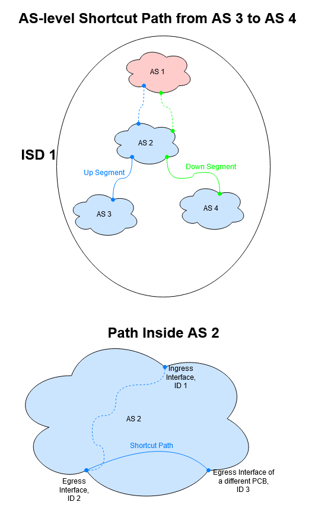
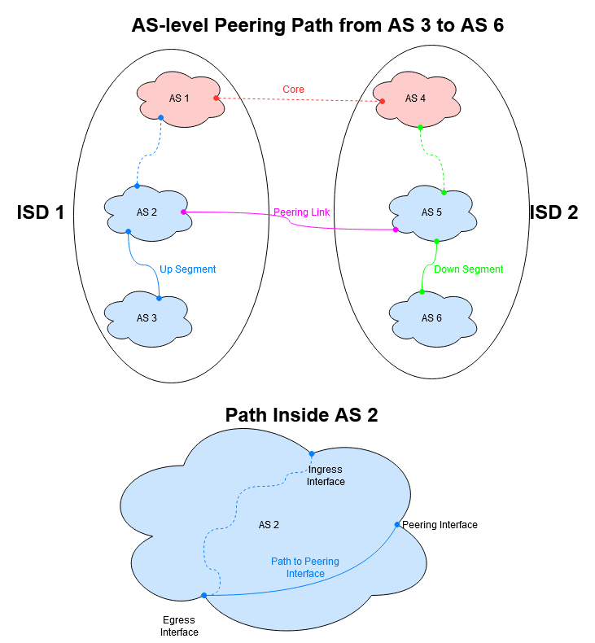

# Embedding Static Information in SCION Beacons

In order to estimate certain properties of a SCION path segment, static
information about that path can be embedded inside the path construction beacons
in the form of an extension.

## Table of Contents

- [Static Properties](#static-properties)
- [Format Overall](#format-overall)
- [Latency Information](#latency-information)
- [Geographic Information](#geographic-information)
- [Link Type](#link-type)
- [Maximum Bandwidth](#maximum-bandwidth)
- [Number of Internal Hops](#number-of-internal-hops)
- [Note](#note)
- [Config File Format](#config-file-format)
- [Concrete Implementation](#concrete-implementation)

## Static Properties

For the purpose of this document, we will adhere to the following definition:
A static property is any quantifiable piece of information describing a
property of a SCION path segment that remains unchanged over the entire
duration of the lifetime of that path segment.

The following assumptions are made:

- The Beacon Service, which is responsible for adding all this metadata, has
  reliable information about the infrastructure (such as the border routers
  and the interfaces attached to them)
- The Beacon Service has access to a blackbox (which could be the AS itself,
  a dedicated SCION service or any other entity), which provides information
  that characterizes the AS topology and the routing processes within the AS
- The AS topology remains stable throughout the lifetime of a path segment

When discussing static properties, we always need to distinguish between
inter-AS and intra-AS elements. Most properties will be comprised of both.
Using the diagram below, the concept of this difference between intra-AS
and inter-AS elements will be illustrated with the example of propagation
delay.


The PCB originates in AS 3, and is then propagated to AS 1, and then to
AS 2. In the AS Entry of AS 1, interface 1 is the ingress and inteface 2
the egress interface. In order to be able to calculate the end-to-end
propagation delay of a path starting in AS 2 and ending in AS 3, we need
both the delay inside each AS (intra-AS), as well as the delay on the
connections between ASes (inter-AS). Recall that in this scenario intra-AS
latency refers to the delays between an interface and the egress interface
(i.e. the egress interface is the "target" interface to which latency is
measured from any other interface). As the figure shows, interface 1 is
attached to both an intra-AS connection as well as an inter-AS connection.
We therefore need to store both the intra- and the inter-AS metrics.
As can be seen when looking at the diagram,
this means that for every AS we then have the delay inside the AS, and the
delay from the AS whose AS Entry we are extending (i.e. the current AS)
to the AS that the PCB will be propagated to next (i.e. the next AS). Using
this method, we can then calculate the end-to-end delay by simply combining intra-
and inter-AS delays. This concept applies similarly to many other properties.
We will now discuss the properties we will embed and the information that
needs to be provided for each of them.

## Format Overall

For the purpose of embedding static information in the SCION beacons, the
extension field in the AS Entry of the PCB will be used. Every extension
field starts with its type, encoded in 1 byte. After that comes the payload,
i.e. the actual contents of the extension. In order to keep things simple
while at the same time retaining as much versatility as possible,
we will introduce the new extension-type "Static Property". Inside the
payload of a Static Property extension a special "subtype" field will be
used, which denotes which property in particular is encoded in the rest
of the payload. The following chart illustrates the overall format of the
extension:

`Type` | `Latency` | `GeoInfo` | `LT` | `MBW` | `NIH` | `Note` | `ME` |
-------|-----------|-----------|------|-------|-------|--------|------|

Except for `Type` at the beginning, all of these fields are optional.


## Latency Information

Latency Information refers to the total propagation delay on an end to end
path, comprised of intra- and inter-AS delays and measured on the scale of
milliseconds.
Use cases of such information include:

- Allows to augment path selection policy in order to obtain low latency paths
- Shortening the duration it takes to fetch data and thus decreasing wait times
  for the user
- Time critical applications

### Conceptual Implementation Latency

The latency information will be comprised of  main parts:

- The subtype field, which identifies it
- The inter-AS latency between the egress interface and the ingress interface of
  the AS the PCB will be propagated to
- A variable number of non-peering latency clusters
- A variable number of peering latency clusters

In general, a latency cluster serves to pool all interfaces which have the same
propagation delay (within a 1 ms range) between them and the egress interface (i.e.
the interface the PCB will be sent out on). 
The difference between peering and non-peering latency clusters is that in peering
latency clusters, the latency of the link attached to the peering interface is also
included in the cluster for every such peering interface. In non-peering clusters
this information is omitted.
The clustering process is straightforward. When doing clustering, it will simply
pick the first value it comes across that can't be assigned to an already
existing cluster and, if it is not an integer, round it down to the nearest integer.
This value will then serve as the baseline for the newly created cluster, which will
include all interfaces with intra-AS delay values in the interval
(baseline, baseline+1(.
Each peering latency cluster is itself comprised of 3 types of elements:

- The intra-AS propagation delay for every interface in the cluster, in ms (1
  value per cluster)
- The interface ID for every interface in the cluster (1 value per interface)
- The inter-AS propagation delay for the connections attached to these
  interfaces, in ms (1 value per interface)

Non-peering latency clusters look almost exactly the same, with the one difference
being that the inter-AS propagation delays are omitted:

- The intra-AS propagation delay for every interface in the cluster, in ms (1
  value per cluster)
- The interface ID for every interface in the cluster (1 value per interface)

Information about the inter-AS latency, as well as the intra-AS latency from
every interface to the egress interface is required to deal with peering
paths (see diagram).


In the case of a "normal", the interfaces where traffic enters
and leaves correspond to the ingress and egress interfaces respectively, that are
saved in the AS Entry of the PCB. The terms ingress and egress interfaces refer to
the way these interfaces would be encoded in the PCB during the beaconing process,
therefore the lower interface is always labelled as the egress interface, even when it is in
the up segment and would thus technically be the interface on which traffic enters the AS.
Calculating end-to-end latencies can therefore be done by simply adding up the intra-AS
latency (from ingress to egress interface) as well as the inter-AS latency (from egress
interface to the next AS on the path) for every AS on the end to end path.

Knowing merely the inter-AS latency for the egress interface is also sufficient
in the case of shortcut paths. The interface where traffic will enter AS 2
is the egress interface saved in the AS Entry for AS 2 in the PCB which was directly
received by AS 3. The interface where traffic will leave AS 2 is the interface that
was saved in AS Entry of the PCB that was sent to AS 4 and was fetched by AS 3 in
the form of a path segment during the path lookup process. Thus AS 3 now has information
about both the inter-AS connection between AS 3 and AS 2, and the inter-AS connection
between AS 2 and AS 4. In the presence of information about intra-AS latencies, 
this information is sufficient to calculate the end-to-end latency betwen AS 3 and AS 4
(see figure below). Thus, for non-peering interfaces, we will only encode the inter-AS
latency for the egress interface in the latency information.

Peering connections need to be dealt with separately. A peering link may differ
from the egress interface encoded in any of the AS Entries of any of the path segments that
were received or fetched by AS 3. Therefore we need to make sure that the inter-AS latency
for every connection attached to a peering interface of the AS is also stored in the PCB
(this is done in the peering latency clusters) (see figure below).

Intra-AS delays present a problem in the presence of both shortcut-, or peering
paths. In those situations, merely 
storing the latency from the ingress to the egress interface will be insufficient.
This is because the interface on which traffic will leave the AS as it travels
along the path will no longer be the ingress interface encoded in the PCB that
was used to construct the up segment, but rather either the egress interface
stored in a different PCB (in the case of a shortcut connection) or a peering
interface (in the case of a peering conncetion). Therefore, it is necessary
that latencies (or other metrics when looking at a different property) be known
for the paths from the egress interface to such a non-ingress interface also
(see figure below).




In the case of non-peering connections, we will also make an additional assumption
in order to reduce the amount of data we need to include in the PCBs in total. That
assumption being that intra-AS latencies are symmetric. We can illustrate the use of
this assumption using the drawing of a shortcut path above. In the PCB sent to AS 3,
the latency between interface 2 (the egress interface for this PCB) and interface 3
is saved. Now is when the assumption comes into play. Since the latency between 
interfaces 2 and 3, and that between 3 and 2 is identical, we can omit the latency
between interface 3 and 2 in the PCB that is sent to AS 4. Let interface i be the
egress interface the PCB is sent out on. The this approach ultimately allows us to
always omit the latency between interfaces i and j, in the case that the interface ID
of j is smaller than that of i, or expressed as a formula, id(j)<id(i)

All these considerations also apply to other properties, such as maximum bandwidth
(see below).

### Concrete Format Latency

The format for latency information looks like this:

`SubType` | `NPLC_1` | ... | `NPLC_n` | `PLC_1`| ... | `PLC_n`|
----------|----------|-----|----------|--------|-----|--------|

Each `NPLC_i` field looks as follows:

`ClusterDelay_i` | `ID_i_0` | ... | `ID_i_m` | 
-----------------|----------|-----|----------|

Each `PLC_i` field looks as follows:

`ClusterDelay_i` | `ID_i_0` | `InterDelay_i_0` | ... | `ID_i_m` | `InterDelay_i_m` |
-----------------|----------|------------------|-----|----------|------------------|

The table below shows names, types and lengths (in bytes) of each value:

Name               | Type | Length |
-------------------|------|--------|
`SubType`          |UInt8 |1       |
`ClusterDelay_i`   |UInt16|2       |
`ID_i_j`           |UInt64|8       |
`Interdelay_i_j`   |UInt16|2       |

## Maximum Bandwidth

Maximum Bandwidth Information consists of 2 parts, Inter- and Intra-AS:

- Inter-AS Maximum Bandwidth Information describes the maximum bandwidth
  available on the inter-AS connections between each AS.
- Intra-AS Maximum Bandwidth Information describes the smallest maximum
  bandwidth available on any link that lies on the intra-AS routing path,
  i.e. the path from an interface to the egress interface.
  
Bandwidth is measured at the granularity of Kb/s.
Use cases of such information include:

- Allows to augment path selection policy, such that unsuitable paths can be
  excluded a priori
- Avoid connections that are prone to congestion due to a low-bandwidth
  bottleneck somewhere

### Conceptual Implementation Maximum Bandwidth

The maximum bandwidth information will be comprised of 3 main parts:

- The subtype field, which identifies it
- The inter-AS maximum bandwidth between the egress interface and the next
  AS the PCB will be propagated to
- A variable number of non-peering maximum bandwidth clusters
- A variable number of peering maximum bandwidth clusters

A maximum bandwidth cluster serves to pool all interfaces which have the
same maximum bandwidth between them and the egress interface. 
The difference between peering- and non-peering maximum bandwidth clusters is that
non-peering clusters do not include the inter-AS maximum bandwidth for every
interface in the cluster (see below).
When doing clustering, the system will simply pick the first value it comes across
that can't be assigned to an already existing cluster and, if it is not an integer,
round it down to the nearest integer. This value will then serve as the
baseline for the newly created cluster, which will include all interfaces with
delay values in the interval (baseline, baseline+10(.
Each peering cluster is itself formed of 3 types of elements:

- The intra-AS maximum bandwidth for all interfaces in the cluster (1 value per
  cluster)
- The interface IDs of all the interfaces in the cluster (1 value per interface)
- The maximum bandwidth of the inter-AS links attached to each of these interfaces
  (1 value per interface)
  
Each non-peering cluster is formed of 2 types of elements:

- The intra-AS maximum bandwidth for all interfaces in the cluster (1 value per
  cluster)
- The interface IDs of all the interfaces in the cluster (1 value per interface)

Here the inter-AS bandwidths are omitted. 

### Concrete Format Maximum Bandwidth

The format for maximum bandwidth information looks like this:

`SubType` | `NPMBC_1` | ... | `NPMBC_n` | `PMBC_1` | ... | `PMBC_n` |
----------|-----------|-----|-----------|----------|-----|----------|

Each `NPMBC_i` field looks as follows:

`ClusterBW_i` | `ID_i_0` | ... | `ID_i_m` |
--------------|----------|-----|----------|

Each `PMBC_i` field looks as follows:

`ClusterBW_i` | `ID_i_0` | `InterBW_i_0` | ... | `ID_i_m` | `InterBw_i_m` |
--------------|----------|---------------|-----|----------|---------------|

The table below shows names, types and lengths (in bytes) of each value:

Name               | Type | Length |
-------------------|------|--------|
`SubType`          |UInt8 |1       |
`ClusterBW_i`      |UInt32|4       |
`ID_i_j`           |UInt64|8       |
`InterBW_i_j`      |UInt32|4       |

## Geographic Information

Geographic Information is the full set of GPS coordinates identifying the
location of every SCION border router deployed by an AS, as well as a real
life address associated with the location of each such SCION border router.
Use cases of such information include:

- Can be used to augment path selection policies in order to ensure paths do not
  leave a particular area, or alternatively ascertain that they never cross
  territory that is considered "undesirable" by the user
- Can be used to provide users with information about the location of the entity
  they are communicating with (i.e. the endpoint on the other side of the path)
- Informing network admins about router locations

### Conceptual Implementation Geographic Information

The geographic information will be comprised of 2 main parts:

- The subtype field, which identifies it
- A variable number of location clusters

A location cluster serves to pool all interfaces which are located in the same
geographic location (i.e. same address). Each location cluster is itself formed
of 2 main types of elements:

- The location of the cluster, consisting of a pair of GPS coordinates
  describing latitude and longitude, as well as a civic address, in the format
  specified in RFC 4776 (found
  <a href = "https://tools.ietf.org/html/rfc4776#section-3.3"> here </a>)
  (1 value in total)
- The interface ID for every interface in the cluster (1 value per interface)

It is possible to use only the latititude and longitude pair, or the civic
address by simply omitting one of the two.


### Concrete Format Geographic Information

The format for geographic information looks like this:

`SubType` | `GC_1` | `GC_2` | ... | `GC_n` |
----------|--------|--------|-----|--------|

Each `GC_i` field looks as follows:

`ClusterLocation_i` | `ID_i_0` | ... | `ID_i_m` |
--------------------|----------|-----|----------|

A `ClusterLocation_i` field looks like this:

`GPS_i_0` | `GPS_i_1` | `CivAdd` |
----------|-----------|----------|

The table below shows names, types and lengths (in bytes) of each value:

Name               | Type  | Length |
-------------------|-------|--------|
`SubType`          |UInt8  |1       |
`GPS_i_0`          |Float32|4       |
`GPS_i_0`          |Float32|4       |
`CivAdd`           |Data   |Variable, max 500|
`ID_i_j`           |UInt64 |8       |


## Link Type

### Definition Link Type

Link Type information gives a broad classification of the different protocols
being used on the links between two entities.
For now it distinguishes four different types of links:

- Links that go over the open internet
- Direct links
- Multihop links
- Undisclosed

The option to have undisclosed link types allows ASes to withhold such
information should they deem it undesirable to make it available to the
public. Use cases of such information include:

- Mitigating security concerns
- Allowing users to select paths that e.g. avoid the open internet

### Conceptual Implementation Link Type

The Link type will be comprised of 2 parts:

- The subtype field, which identifies it
- The link type for the link attached to the egress interface
- A variable number of non-peering link type clusters
- A variable number of peering link type clusters

A link type cluster serves to pool all interfaces which are attached to the
same type of intra-AS link between them and the egress interface. 
The difference betwen peering- and non-peering link type clusters is that non-peering
link type clusters do not include the link type for the connections attached to the
interfaces in the cluster (see below).
Each peering link type cluster is itself comprised of 3 types of elements:

- The intra-AS link type for all interfaces in the cluster (1 value per cluster)
- The interface ID for every interface in the cluster (1 value per interface)
- The link type for each of the inter-AS connections attached to the interfaces
  in the cluster (1 value per interface)
  
Each non-peering link type cluster is itself comprised of 2 types of elements:

- The intra-AS link type for all interfaces in the cluster (1 value per cluster)
- The interface ID for every interface in the cluster (1 value per interface)

### Concrete Format Link Type

The format for the link type looks like this:

`SubType` | `NPLT_1` | ... | `NPLT_n` | `PLT_1` | ... | `PLT_n` |
----------|----------|-----|----------|---------|-----|---------|

Each `NPLT_i` field looks as follows:

`ClusterLinkType_i` | `ID_i_0` | ... | `ID_i_m` |
--------------------|----------|-----|----------|

Each `PLT_i` field looks as follows:

`ClusterLinkType_i` | `ID_i_0` | `InterLink_i_0` | ... | `ID_i_m` | `InterLink_i_m` |
--------------------|----------|-----------------|-----|----------|-----------------|

The table below shows names, types and lengths (in bytes) of each value:

Name                | Type | Length |
--------------------|------|--------|
`SubType`           |UInt8 |1       |
`ClusterLinkType_i` |Uint8 |1       |
`ID_i_j`            |UInt64|8       |
`InterLink_i_j`     |UInt8 |1       |

## Number of Internal Hops

The Number of Internal Hops describes how many hops are on the Intra-AS path.
Use cases of such information include:

- Can be used to exclude undesireable paths from the selection
- Obtain a selection of efficient, low latency paths (especially when combined
  with Latency Information)

### Conceptual Implementation Number of Internal Hops

The number of internal hops will be comprised of 2 main parts:

- The subtype field, which identifies it
- A variable number of hoplength clusters

A hoplength cluster serves to pool all interfaces which have the same number of
internal hops on the intra-AS path between them and the egress interface. Each
hoplength cluster is itself formed of 2 main elements:

- The number of internal hops for all interfaces in the cluster (1 value per
  cluster)
- The interface ID for every interface in the cluster (1 value per interface)

### Concrete Format Number of Internal Hops

The format for the number of internal hops looks like this:

`SubType` | `HC_1` | `HC_2` | ... | `HC_n` |
----------|--------|--------|-----|--------|

Each `HC_i` field looks as follows:

`ClusterHops_i` | `ID_i_0` | ... | `ID_i_m` |
----------------|----------|-----|----------|

The table below shows names, types
and lengths (in bytes) of each value:

Name               | Type | Length |
-------------------|------|--------|
`SubType`          |UInt8 |1       |
`ClusterHops_i`    |UInt8 |1       |
`ID_i_j`           |UInt64|8       |

## Note

A Note is simply a bit of plaintext.
Use cases of such information include:

- Tool for network engineers to communicate interesting/important information to
  their peers as well as users

### Conceptual Implementation Note

The Note subtype is comprised of 4 elements:

- The subtype field, which identifies it
- The "default" field, which contains a default note, which is always included for
  every PCB that is propagated by this AS.
- The "specific" field, which contains the contents of a note that is meant to only
  be attached when sending out a PCB over the particular interface mentioned in the
  egress interface field of the AS Entry that we are extending.
  
When constructing the extension from the config file (see below) the BS will check
the egress interface field in the AS Entry and attach the "specific" note accordingly.
If no such note is specified in the config file, then the contents of the "specific"
field will be set to null (it is also possible to do this for the "default" note as
well.

### Concrete Format Note

The format for the note looks like this:

`SubType` | `Default` | `Interface` | `Words` |
----------|-----------|-------------|---------|

The table below shows names, types and lengths (in bytes) of each value:

Name               | Type | Length |
-------------------|------|--------|
`SubType`          |UInt8 |1       |
`Default`          |Text  |Variable, max 2000     |
`Words`            |Text  |Variable, max 2000     |

## Config File Format

In order for the extension to work, a config file needs to be provided to a
specific location [tbd]. The config file comes in the form of a JSON file
and needs to have the format shown below. First of all, we have the
following value:

Name               | Type  | Description |
-------------------|-------|-------------|
`N`                |Integer|Number of interfaces in the AS|

Then, for every interface `i` the following values can be provided:

Name             | Type  | Description |
-----------------|-------|-------------|
`IntfID`         |Integer|Interface ID of the interface described by the data that follows|
`IntraLatency`   |List of N Integers|Intra-AS latency from interface `i` to every other interface in the AS, including itself (this entry is set to 0)|
`InterLatency`   |Integer|Inter-AS latency from interface `i` to AS on the other end of the link|
`C1`             |Decimal value|Longitude gps coordinates of interface `i`|
`C2`             |Decimal value|Latitude gps coordinate of interface `i`|
`CivAddr`        |String|Civic address of interface `i`|
`IntraLink`      |List of Integers |Describes link type between interface `i` and any other interface, including itself (this entry is set to 0), where 0 means direct link, 1 means multihop link and every other number means link that uses the open internet|
`InterLink`      |Integer  |Possible values of a list entry : `Multi`, `Direct`, `OpenNet`; Describes link type between interface `i` and the AS at the other end of the link|
`IntraBW`        |List of Integers|Intra-AS bandwidth from interface `i` to every other interface in the AS, including itself (this entry is set to 0)|
`InterBW`        |Integer|Inter-AS bandwidth from interface i to the AS at the other end of the link|
`SpecificNote`   |String |Note that should be used when this interface is the egress interface in the AS Entry that is being extended|
`Hops`           |List of Integers|Number of internal hops from interface `i` to every other interface in the AS, including itself (this entry is set to 0)|

Then, after every interface has been listed, follow a few final fields:

Name               | Type  | Description |
-------------------|-------|-------------|
`DefaultNote`      |String |Default Note|
`URLContents`      |String |URL for metadata endpoint|

Below is a simple example of how such a config file could look like (actual
values are abitrary, "asdf" is used as a placeholder for longer strings)
for an AS with three interfaces with IDs 1, 2 and 3:

````JSON
{
  "N": 3,
  "Interfaces": [{
    "IntfID": 1,
    "IntraLatency": [0, 10, 20],
    "InterLatency": 30,
    "C1": 45.7,
    "C2": 25.9,
    "CivAddr": "asdf",
    "IntraLink": [0,1,0],
    "InterLink": 2,
    "IntraBW": [0, 200000000, 100000000],
    "InterBW": 150000000,
    "SpecificNote": "asdf",
    "Hops": [0, 2, 4]
  },{
    "IntfID": 2,
    "IntraLatency": [10, 0, 20],
    "InterLatency": 40,
    "C1": 34.7,
    "C2": 27.2,
    "CivAddr": "asdf",
    "IntraLink": [1,0,2],
    "InterLink": 2,
    "IntraBW": [200000000, 0, 100000000],
    "InterBW": 450000000,
    "Hops": [1, 0, 4]
  },{
    "IntfID": 3,
    "IntraLatency": [10, 40, 0],
    "InterLatency": 10,
    "C1": 66.2,
    "C2": 37.0,
    "CivAddr": "asdf",
    "IntraLink": [1,1,0],
    "InterLink": 1,
    "IntraBW": [200000000, 300000000, 0],
    "InterBW": 50000000,
    "SpecificNote": "asdf",
    "Hops": [1, 0, 0]
  }],
  "DefaultNote": "asdf",
  "URL": "asdf"
}
````

## Concrete Implementation

Cap'nProto will be used for the wire formats of the extension[??? Ask in slack
about this]. The following section is devoted to looking at the implementation
of each property in detail.


