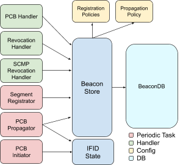
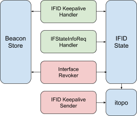
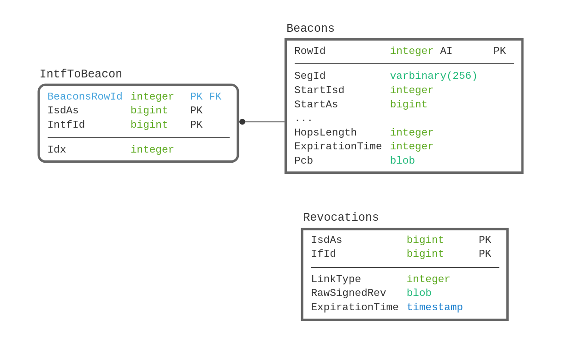

# Beacon Service Design

​

---
⚠️  **NOTE** ⚠️<br/>
Outdated contents! This document is kept for historical purpose.

---

## Overview

The beacon server (BS) does path exploration and registration in the scion network. It sends out
path construction beacons (PCBs) to all neighboring core and child interfaces. The BS periodically
selects a set of PCBs to propagate and a set of PCBs to register at a path server. The sets of
PCBs to propagate or register are selected according to an AS-level policy.

Additionally, the BS is also responsible for determining the state of all interfaces in the AS. For this,
each BS pings the neighboring AS' BS over each interface. If a ping isn't received for a certain
amount of time on an interface, the BS assumes the interface is down and sends a revocation to
all border routers (BRs) in the AS, to the local [path server (PS)](PathService.md), and to all core
PSes.

## General Structure

The BS is structured similar to the existing go infra services.
It reuses the existing building blocks for go services:

* [go/lib/env](https://github.com/scionproto/scion/tree/master/go/lib/env):
  Is used for configuration and setup of the service.
* [go/pkg/trust](https://github.com/scionproto/scion/tree/master/go/pkg/trust):
  Is used for TRCs and other crypto material.
* [go/lib/infra](https://github.com/scionproto/scion/tree/master/go/lib/infra):
  Is used for the messenger to send and receive messages.
* [go/lib/periodic](https://github.com/scionproto/scion/tree/master/go/lib/periodic):
  Is used for periodic tasks.
* etc. ...

The main parts of the BS are

* **handlers** to handle incoming PCBs, revocations, and interface state keeping,
* **periodic tasks** for PCB propagation, segment registration, interface keepalive and revocation,
* **beacon storage**.

Each part is described in a separate chapter below. These parts can be grouped together into two
subjects: *beaconing* and *interface state keeping*.

The beaconing part takes care of handling beacons and registering them.
The following diagram shows an overview of the components related to beaconing and their dependency
relation.

.

The interface-state-keeping part takes care of IfId state of the AS and issuing revocations as
needed. The diagram shows an overview of the components related to IfId state and their dependency
relation.



### Beacon Store

The beacon store is the heart of the BS.
It stores the received verified beacons according to the configured path policies.
Also, it handles the verified revocations.
The interface definition for handlers and periodic tasks to interact with the store is listed below.

```go
// BeaconStore allows the various handlers and periodic tasks to interact
// with the store. The interface abstracts all of the complexity of how
// beacons are selected.
type BeaconStore interface {
    // BeaconsToPropagate returns a channel that provides all beacons to
    // propagate at the time of the call. The selection is based on the
    // configured propagation policy.
    BeaconsToPropagate(ctx context.Context) (<-chan beacon.BeaconOrErr, error)
    // SegmentsToRegister returns a channel that provides all beacons to
    // register at the time of the call. The selections is based on the
    // configured registration policy for the requested segment type.
    SegmentsToRegister(ctx context.Context, segType proto.PathSegType) (
        <-chan beacon.BeaconOrErr, error)
    // InsertBeacons adds verified beacons to the store. Beacons that
    // contain revoked interfaces are not added and do not cause an error.
    InsertBeacons(ctx context.Context, beacon ...beacon.Beacon) error
    // InsertRevocations inserts the revocation into the BeaconDB.
    // The provided revocation must be verified by the caller.
    InsertRevocations(ctx context.Context, revocations ...*path_mgmt.SignedRevInfo) error
    // DeleteRevocation deletes the revocation from the BeaconDB.
    DeleteRevocation(ctx context.Context, ia addr.IA, ifid common.IFIDType) error
    // UpdatePolicy updates the policy. Beacons that are filtered by all
    // policies after the update are removed.
    UpdatePolicy(ctx context.Context, policy beacon.Policy) error
    // DeleteExpired deletes expired Beacons from the store.
    DeleteExpiredBeacons(ctx context.Context) (int, error)
    // DeleteExpired deletes expired Revocations from the store.
    DeleteExpiredRevocations(ctx context.Context) (int, error)
}
```

### Policy

A policy contains the parameters for the selection heuristic and the filters for inserting the
beacon into the BeaconDB. BSes have multiple policies for different purposes. Beacons that
are filtered by all policies are not added to the BeaconDB.

* In a non-core BS, there is a policy for propagation, up-segment registration and
  down-segment registration.
* In a core BS, there is a policy for propagation and for core-segment registration.

### BeaconDB



The BeaconDB consists of three tables:

* `Beacons`: This table stores the raw beacons with some additional metadata used to select the
  beacons.
* `IntfToBeacons`: This table maps the (ISD-AS, IfId) pair to all beacons containing that IfId.
* `Revocations`: This table contains all revocations that are not expired.

#### Beacon Insertion

Before inserting, the beacon store checks that at least one policy does not filter the beacon
(i.e., the beacon does not contain a blacklisted AS or ISD and the `HopsLength` does not exceed
`MaxHopsLength`).
If that is not the case, the beacon is discarded.
Otherwise, the beacon and the `IntfToBeacon` mappings are inserted.

#### Beacon Selection

Beacon selection is done in-memory and ad-hoc.
The heuristic is as follows:

1. Select at most *n* beacons with the least amount of hops that do not contain a revoked interface
   and are not expired.
1. Choose the *k-1* paths with the least amount of hops from the set.
1. Choose the maximum disjoint path compared to the shortest path from the set.

#### Policy Updates

On a policy update, the BS ejects all beacons that are filtered by all new policies.

#### Beacon/Revocation Expiration

Expired beacons/revocations are periodically removed from the database.
The necessary deletions are cascaded to the other tables.

#### Beacon Eviction

The BS periodically evicts beacons that contain revoked interfaces.

### Interfaces State

The interfaces state keeps track of the state of all interfaces of an AS in the BS.
It is used by the BS to issue revocations and decide where to propagate new beacons to.

```go
// Interfaces keeps track of all interfaces of the AS.
type Interfaces interface {
    // Update updates the interface mapping. Interfaces no longer present in
    // the topology are removed. The state of existing interfaces is preserved.
    // New interfaces are added as inactive.
    func Update(ifInfomap topology.IfInfoMap)
    // Reset resets all interface states to inactive.
    func Reset()
    // All returns a copy of the map from interface id to interface.
    func All() map[common.IFIDType]Interface
    // Get returns the interface for the specified id, or nil if not present.
    func Get(ifid common.IFIDType) Interface
}

// Interface keeps track of the interface state.
type Interface interface {
    // Activate activates the interface the keep alive is received from when
    // necessary, and sets the remote interface id. The return value indicates
    // the previous state of the interface.
    func Activate(remote common.IFIDType) State
    // Revoke checks whether the interface has not been activated for a certain
    // amount of time. If that is the case and the current state is active, the
    // state changes to Revoked. The times for last beacon origination and
    // propagation are reset to the zero value. The return value indicates, whether
    // the state is revoked when the call returns.
    func Revoke() bool
    // SetRevocation sets the revocation for this interface. This can only be
    // invoked when the interface is in revoked state. Otherwise it is assumed that
    // the interface has been activated in the meantime and should not be revoked.
    // This is indicated through an error.
    func SetRevocation(rev *path_mgmt.SignedRevInfo) error
    // Revocation returns the revocation.
    func Revocation() *path_mgmt.SignedRevInfo
    // TopoInfo returns the topology information.
    func TopoInfo() topology.IFInfo
    // State returns the current state of the interface.
    func State() State
}

// State is the state of an interface.
type State string

const (
    // Active indicates that the interface is active.
    Active State = "Active"
    // Revoked indicates that the interface is revoked.
    Revoked State = "Revoked"
)
```

### Trust Handlers

#### TRC/Chain Request

Use existing handler from trust module.

### Beaconing Handlers

#### PCB Handler

*(uses: `BeaconStore.InsertBeacon`).*

When receiving a PCB, the BS first checks if it has the required TRC and chain to verify it; if not,
it will fetch it from the beaconing AS. In the initial version, the beaconing BS is contacted to be
compatible with the python version of the code. In a second stage, we will move to requesting the
crypto from the CS. (This requires message acks for infra messages to ensure crypto is registered
with the certificate server before a beacon is propagated). If the BS is not able to fetch the
crypto material (with retries on timeout), the PCB is discarded.

The BS then verifies the PCB and passes it to the beacon store.

#### Revocation Handler

*(uses: `BeaconStore.InsertRevocation`).*

Under some circumstances, the BR extracts revocations from SCMP errors and pushes them to
the BS. The BS stores verified revocations in the beacon store, which adds the revocation to the
shared BeaconDB.

### Interface-State-Keeping Handlers

#### IFStateInfoRequest Handler

*(uses: `Interfaces.All`).*

The reply contains the state of the interfaces from the in-memory interface state seen by the BS.
Currently, BRs send those requests periodically to cover lost IFStateInfo pushes by the BS. Once we
have acks for infra messages, we can change the model to BRs only requesting the information at the
start-up. This is possible as, in regular operation, the state is then reliably pushed with IfStateInfo
messages by the BS.

#### IfId Keepalive Handler

*(uses: `Interface.Activate`, `Interfaces.All`, `BeaconStore.DeleteRevocation`).*

Update the interface state of the given IfId. If it changes, send IfStateInfo to all BRs, remove
associated revocations from the BeaconDB (if any), and immediately beacon on that interface (in a
core AS this also includes sending an origination beacon). The associated revocations include both
the local and the remote interface.

## Periodic Tasks

### Beaconing

#### PCB Propagator

*(uses: `BeaconStore.BeaconsToPropagate`, `Interfaces.All`).*

This periodic task propagates the PCBs provided by the beacon store.
The periodic task has an interval that is less than the `PropagateTime`.
Beacons are propagated on all interfaces that do not have a propagation in the last `PropagateTime`.
This ensures that beacons are propagated quickly after a stale period.

##### Non-core BSes

1. Get beacons to propagate from beacon store.
1. For each PCB and non-revoked child interface:
    1. Copy the PCB.
    1. Add AS entry for the current AS with the appropriate external interface.
    1. Sign the new PCB.
    1. Anycast the new PCB to a BS in the child AS.

##### Core BSes

1. Get core beacons to propagate from beacon store and propagate to neighboring core ASes. (similar
   to step 2. above)

#### PCB Initiator

*(uses: `Interfaces.All`).*

Core BSes originate new beacons to child and neighboring core ASes.
The periodic task has an interval that is less than the `OriginateTime`.
Beacons are originated on all interfaces that do not have an origination in the last `OriginateTime`.

1. Create a new PCB using the local IA and the current timestamp.
1. Propagate the PCB on all core and child interfaces.

#### Segment Registration

*(uses: `BeaconStore.SegmentsToRegister`).*

This periodic task registers the best PCBs as path segments with the appropriate PS. Note that once
we have app-level acks in place, segment registration should use them and retry registering the
segments until it an ack is received (or a specified timeout is hit). Similar to beacon propagation,
the interval is less than `RegisterTime`. Whenever no path has been registered in the last
`RegisterTime`, paths are registered immediately. This ensures that segments are registered quickly
after a stale period.

##### Non-core BSes

1. Get PCBs for up and down direction from the beacon store.
1. Remove non signed fields to create a path segment.
1. Add current AS entry as terminal AS for all segments.
1. Add peering links to all segments.
1. Sign the segments.
1. Send up-segments to local PS, down-segments to core PS.

##### Core BSes

1. Get PCBs towards each core AS observed so far from the beacon store.
1. Remove non signed fields to create a path segment.
1. Set current AS entry as terminal AS for all segments.
1. Sign the segments.
1. Share all segments with any local PS.

### Interface State Keeping

#### Interface Revocation

*(uses: `Interfaces.All`, `Interface.Revoke`, `Interface.SetRevocation`,
 `BeaconStore.InsertRevocation`).*

Each BS instance keeps track of the interface state in an in-memory structure. When a configurable
amount of keepalive messages for a given interface is not received, the interface is revoked by the
BS.

1. Call `Interface.Revoke` on all infos.
1. Revoke all revoked interfaces in `InterfaceState`, update the revocation if necessary (certain
   amount of previous revocation period has passed).
1. Insert revocation in beacon store.
1. Send revocation to all BRs in the local AS.
1. Send revocation to local PS as `SignedRevInfo`.
1. Send revocation to PS in all core ASes, if in non-core AS.

#### IfId Keepalive Sender

*(uses: `itopo.Get`).*

Periodically send an IfId Keepalive message to the neighboring BS for each interface in the
topology. This is done by using a one hop path extension.

### Delete Expired Data From DB

*(uses: `BeaconStore.DeleteExpired`).*

Periodically delete data that is no longer relevant. That includes

* PCBs that are expired,
* Revocations that are expired.

## Events

### Topology Reload

*(uses: `InterfaceState.Update`).*

Update the interface states according to the changes in the new topology.
The BS then immediately sends IfStateInfos to all BRs.
