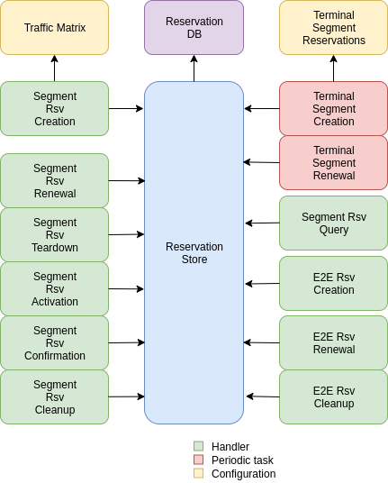
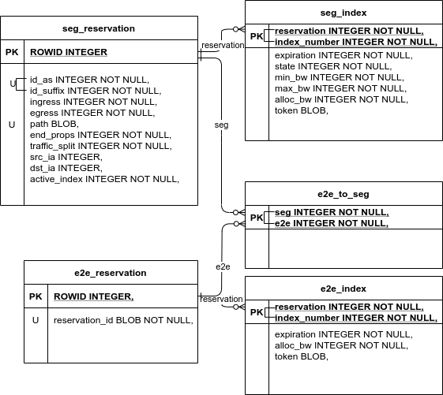

**************
COLIBRI Design
**************

About this document
===================
COLIBRI is a QoS system for SCION. This brief design document is based
on the thesis by Dominik Roos with title 
"COLIBRI: A Cooperative Lightweight Inter-domain Bandwitdh
Reservation Infrastructure". In this document we will explain
the differences from that thesis.

This document will briefly discuss how the COLIBRI packets are forwarded,
and how the same type of COLIBRI packets are used to transport the
control plane traffic.
This document will dig deeper in the COLIBRI service itself, given a more
detailed view of the operations it will perform for the control plane
to work.

Components
==========
There are four main components that need to be modified or created: the
colibri service itself, the border router, a monitoring system, and
``sciond`` in the endhost:

* **COLIBRI Service**: Enables the COLIBRI control plane. Used to negotiate
  both segment and end to end reservations.
* **Border Router**: Needs to forward the COLIBRI traffic with higher
  priority than best effort.
* **monitoring** Does the accounting and policing. It monitors per flow
  packets when originating in this AS, or stateless when they are only transit.
* **sciond** Needs to expose a COLIBRI *API*. Needs to manage end to end
  reservations in behalf of the applications.

Data & Control Plane Transport
==============================
Nomenclature:

* Reservation index: for any reservation (whether segment or end to end) to
  be used, it is necessary to have one (and only one) active index.
  An index is just a "version" of the reservation, that **cannot** modify
  its path. However, it can modify the reserved bandwidth, as well as other
  properties of the reservation.
* Segment reservation: a reservation between to ASes. This is a "tube" that
  allows to communicate control plane traffic directly, or to embed one
  ore multiple end to end reservations inside. There is only one segment
  reservation possible per path. Not all paths can have a segment reservation.
  All segment reservations have a unique ID.
  A segment reservation can be of type up, down, core, peering-up or
  peering-down, in a similar way to regular SCION segments.
  All segment reservations have a maximum set of 16 indices.
* End to end (E2E) reservations: a reservation between two end hosts. It is
  used to send data traffic. It uses from one to three segment reservations to
  reach the destination endhost (similar to regular SCION paths). The E2E
  reservation "stitches" these segment reservations to conform its reservation.
  Each E2E reservation has its own unique ID. There is only one possible E2E
  reservation per path.
  An E2E reservation has a maximum set of 16 indices.

There is only one type of COLIBRI packet. It is mainly used by the data plane
to transport user data in E2E reservations, between end host machines.
But this COLIBRI packet is also used by the COLIBRI service when it needs to 
transport requests and responses between COLIBRI services in different ASes.
The advantage of this decision is the simplicity of the treatment of the 
COLIBRI packets in the border router.

Design Requirements
-------------------
#. The monitoring computes the bandwidth usage per segment reservation.
   It relies on deriving the segment reservation ID for each packet without
   keeping any state.
#. The border router must validate and forward the packets very quickly.
   For this, as mentioned before, we have only one COLIBRI packet type,
   and no hop by hop extensions. This means that the control plane traffic
   uses the same transport mechanism.
#. The border router must be able to check the validity of each packet without
   keeping state. This means being able to compute the MACs with a small set
   of private keys (typically one) and no other state.

Design Decisions
----------------
According to the requirements exposed above, here are some of the decisions
taken to fulfill them:

#. Each packet contains at least one reference to a segment reservation ID.
   We will then include the lengths of the (possibly) three stitched segments,
   alongside with their reservations IDs.
   The monitoring (or any other) system can then deduce which is the current
   segment reservation being used. E.g. :math:`[2,3,2]` means we
   expect 2 ASes in the up segment, 3 in the core one, and 2 in the down
   segment. Note that the last AS in the up segment is the same as the
   first in the core one, and that the last AS of the core segment is the
   same as the first AS of the down one.
#. A COLIBRI path is composed of one mandatory *InfoField* and a sequence of
   *HopFields*. This applies to both segment and E2E reservations. The
   *InfoField* controls what the border router can do with the packet:

    - Each COLIBRI packet can be used as if it had a hop-by-hop extension
      inside. This allows control traffic, that must always stop at each
      COLIBRI service, to be sent using COLIBRI packets.
      This is done via a ``Control (C)`` flag.
      These packets are always delivered to the local COLIBRI anycast address
      by the border router.
    - Each packet distinguishes the type of reservation via a flag in its
      *InfoField*. This allows a packet to have either a segment or an E2E
      reservation. This is the ``Segment (S)`` flag. It forces the ``C`` to
      be also set.
    - A COLIBRI packet can reverse its path, via the ``Reverse (R)`` flag.
      This flag forces the ``R`` flag to be set.
      Via this flag, we can always send the responses to the requests that
      the COLIBRI services receive. The responses always travel in the
      reverse direction, and must always stop at each COLIBRI service.
#. The MAC field computation will rely only on a private key derived from
   secret AS values (e.g. the master key), and fields present in the packet.

MAC Computation
---------------
The MAC is used in the validation of a packet when it is being forwarded.
It protects the path in two ways:

    - Values of the InfoField and HopFields cannot be altered.
    - Hop Fields must be used in the right order they were provided.
      I.e. a Hop Field that was obtained in a path as the `i` th one,
      must always be used in the `i` th position.

.. Note::
    The ``R`` flag we chose at the `design decisions`_
    alters the order of appearance of the hop fields, but not the 
    computation of the MAC. Since ``R`` implies ``C``, each COLIBRI service
    can (and possibly will) check that the ingress/egress pair they observe
    in their hop field corresponds to that stored in their DB for the
    reservation ID of the packet.

To achieve the protection we want against changes in the relevant parts
of the *InfoField* and *HopField*, we will include the following in the
MAC computation:

- Reservation ID: because at most we can have one reservation per path, and
  each reservation is identified by an ID, the ID also identifies the path.
  This means that we will no longer need to onion the hop fields or include
  any type of index to protect their order.
- Reservation fields: fields that came from the reservation setup, and that
  should not be altered otherwise, must be included in the MAC computation.
  This prevents malicious clients from tampering with the reservation and
  claiming more reserved bandwidth than what they were granted.
  These fields are:

    - Expiration time.
    - Granted bandwidth.
    - Request latency class.
    - Index number.
    - Reservation path type (up, core, etc.)
    - The lengths of the (up to three) stitched segments.
    - The segment IDs of the (up to three) stitched segments.
- Finally the ingress and egress interface IDs of the particular AS computing
  the MAC.

We also want to protect ASes from being wrongly blamed for consuming over their
granted bandwidth by other malicious ASes that pursue to have them blacklisted.
To do this we will use a per packet MAC computation approach.
This is done by computing two different MAC flavors: the static MACs, and the
per packet ones.

Let's call *A* the source of the reservation, and *B* an
AS in the path of said reservation. :math:`K_B` is a secret key that only
*B* knows. *MAC* is the function used to compute the MAC. *InputData* are
all the fields specified above, that will be part of the MAC computation.
The **static MAC** is computed as:
.. math::
\sigma_B = MAC_{K_B}(InputData)

That static MAC does not change with the payload of the packet. We will
communicate each of the :math:`\sigma_B` for each *B* part of the path to
the source of the reservation *A*, in the reservation setup process. The AS *A*
will store these static MAC results as keys to use in the per packet MAC
computation.

Every time a new packet is sent using that COLIBRI reservation,
the per packet MACs have to be computed. Let's call HFV (Hop Field Validation)
the per packet MAC, and *TS* the high precision time stamp of the packet.
The **per packet MAC** HFV is computed as follows:
.. math::
\text{HFV}_B = \text{MAC}_{\sigma_B}(TS)

Note that the key used to compute the HFV is :math:`\sigma_B`, the static
MAC computed by *B* and that only *B* and *A* know.
Thus if in a later moment, the HPV computed for a packet while in transit
at *B* is correct, *B* know that only *A* could have actually computed it.

TODO: do we really need the index number included in the MAC ?

Forwarding
----------
TODO

Control Plane General Overview
==============================

- What does a setup/renewal look like?

TODO

Operations
----------

- Segment Reservations:
    - Setup
    - Renewal
    - Index Confirmation
    - Cleanup
    - Index Activation
    - Teardown
- E2E Reservation
    - Setup
    - Renewal
    - Cleanup

COLIBRI Service
===============
The COLIBRI Service manages the reservation process of the COLIBRI QoS
subsystem in SCION. It handles both the segment and end to end reservations
(formerly known as steady and ephemeral reservations).

The COLIBRI service is structured similarly to
other existing Go infrastructure services. It reuses the following:

- `go/lib/env`: Is used for configuration and setup of the service.
- `go/pkg/trust`: Is used for crypto material.
- `go/lib/infra`: Is used for the messenger to send and receive messages.
- `go/lib/periodic`: Is used for periodic tasks.

The COLIBRI service is differentiated into these parts:

* **configuration** specifying admission and reservation parameters for this AS,
* **handlers** to handle incoming reservation requests (creation,
  tear down, etc.),
* **periodic tasks** for segment reservation creation and renewal,
* **reservation storage** for partial and committed reservations.

Operations for Segment Reservations
-----------------------------------
In general, all the requests travel from :math:`\text{AS}_i`
to :math:`\text{AS}_{i+1}`, where :math:`\text{AS}_{i+1}` is the next AS
to :math:`\text{AS}_i` in the direction of the reservation.

Responses travel in the reverse direction: from :math:`\text{AS}_{i+1}` to
:math:`\text{AS}_i`.

Setup a Segment Reservation
***************************
The configuration specifies which segment reservations should be created from
this AS to other ASes. Whenever that configuration changes, the service
should be notified.

#. The service triggers the creation of a new segment reservation at
   boot time and whenever the segment reservation configuration file changes.
#. The service reads the configuration file and creates a segment reservation
   request per each entry.

    - The path used in the request must be obtained using the *path predicate*
      in the configuration.
#. The store in the COLIBRI service saves the intermediate request and
   sends the request to the next AS in the path.
#. If there is a timeout, this store will send a cleanup request to the
   next AS in the path.

Handle a Setup Request
**********************
#. The COLIBRI service store is queried to admit the segment reservation.
#. The store decides the admission for the reservation (how much bandwidth).
   It uses the *traffic_matrix* from the configuration package.
#. The store saves an intermediate reservation entry in the DB.
#. If this AS is the last one in the path, the COLIBRI service store saves the
   reservation as final and notifies the previous AS in the path with a
   reservation response.
#. The store forwards the request with the decided bandwidth.

Handle a Setup Response
***********************
#. The store saves the reservation as final.
#. If this AS is the first one in the reservation path (aka
   *reservation initiator*), the store sends an index confirmation request
   to the next AS in the path.
#. If this AS is the not the first one in the reservation path, the store
   sends a response message to the previous AS's COLIBRI service.

Handle an Index Confirmation Request
************************************
#. The store in the COLIBRI service checks that the appropriate reservation
   is already final.
#. The store modifies the reservation to be confirmed
#. The COLIBRI service forwards the confirmation request.

Handle a Cleanup Request
************************
#. The COLIBRI service removes the referenced reservation from its store.
#. The COLIBRI service forwards the cleanup request.

Handle a Teardown Request
*************************
#. The COLIBRI service checks the reservation is confirmed but has no
   allocated end to end reservations.
#. The COLIBRI service checks there are no telescoped reservations using
   this segment reservation.
#. The store removes the reservation.
#. The COLIBRI service forwards the teardown request.

Handle a Renewal Request
************************
The renewal request handler is the same as the `handle a setup request`_.
The renewal is initiated differently (by adding a new index to an existing
reservation), but handled the same way.

Renew a Segment Reservation
***************************
#. The service triggers the renewal of the existing segment reservations
   with constant frequency.
#. The store in the COLIBRI service retrieves each one of the reservations
   that originate in this AS.
#. Per reservation retrieved, the store adds a new index to it and
   pushes it forward.

Handle a Reservation Query
**************************
#. The store in the COLIBRI service receives the query and returns the
   collection of segment reservations matching it.

Operations for E2E Reservations
-------------------------------

Handle an E2E Setup Request
***************************
#. The COLIBRI service queries the store to admit the reservation
#. The store computes the allowed bandwidth (knowing the current segment
   reservation and the existing E2E reservations in it).
#. The store pushes forward the setup request.

Handle an E2E Renewal Request
*****************************
The renewal request handler is the same as the `handle an e2e setup request`_.

Handle an E2E Cleanup Request
*****************************
#. The COLIBRI service removes the request from its store.
#. The COLIBRI service forwards the cleanup request.

Interfaces of the COLIBRI Service
---------------------------------
Main interfaces of the service.

The Reservation Store in the COLIBRI service keeps track of the reservations
created and accepted in this AS, both segment and E2E.
The store provides the following interface:

.. code-block:: go

    type ReservationStore {
        GetSegmentReservation(ctx context.Context, id SegmentReservationID) (SegmentReservation, error)
        GetSegmentReservations(ctx context.Context, validTime time.Time, path []InterfaceId]) ([]SegmentReservation, error)

        AdmitSegmentReservation(ctx context.Context, req SegmentReservationReq) error
        ConfirmSegmentReservation(ctx context.Context, id SegmentReservationID) error
        CleanupSegmentReservation(ctx context.Context, id SegmentReservationID) error
        TearDownSegmentReservation(ctx context.Context, id SegmentReservationID) error

        AdmitE2EReservation(ctx context.Context, req E2EReservationReq) error
        CleanupE2EReservation(ctx context.Context, id E2EReservationID) error
    }

The `sciond` endhost daemon will expose the *API* that enables the use
of COLIBRI by applications:

.. code-block:: go

    type sciond {
        ...
        AllowIPNet(ia IA, net IPNet) error
        BlockIPNet(ia IA, net IPNet) error
        WatchSegmentRsv(ctx context.Context, pathConf PathConfiguration) (WatchState, error)
        WatchE2ERsv(ctx context.Context, resvConf E2EResvConfiguration) (WatchState, error)
        // WatchRequests returns a WatchState that will notify the application of any COLIBRI e2e request ending here.
        WatchRequests() (WatchState, error)
        Unwatch(watchState WatchState) error
    }

Reservation DB
--------------
There are two main parts in the DB: the segment reservation entities, and the
end to end entities.
To link the end to end reservations to the appropriate segment ones,
a table is used.

There are no restrictions of cardinality other than uniqueness and non
null-ness for some fields, but nothing like triggers on insertion are used.
E.g. it is technically possible to link more than three segment reservations
with a given end to end one. These cardinality restrictions are enforced
by code.

Furthermore, there are some indices created to speed up lookups:

* seg_reservation
    * id_as,suffix
    * ingress
    * egress
    * path
* seg_index
    * reservation,index_number
* e2e_reservation
    * reservation_id
* e2e_index
    * reservation,index_number
* e2e_to_seg
    * e2e
    * seg

