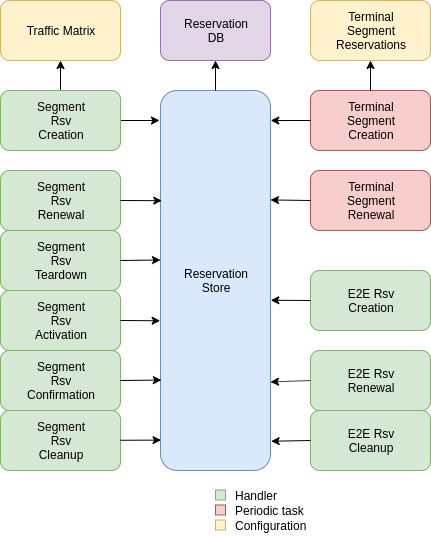

**************
COLIBRI Design
**************

About this document
===================
COLIBRI is a QoS system for SCION. This brief design document is based
on the thesis by Dominik Roos with title 
"COLIBRI: A Cooperative Lightweight Inter-domain Bandwitdh
Reservation Infrastructure". In this document we will explain
the differences from that thesis.

Components
==========
There are four main components that need to be modified or created: the colibri service itself,
the border router, a monitoring system per AS, and ``sciond`` in the endhost:

* **COLIBRI Service** Enables the COLIBRI control plane. Used to negotiate both segment and end to
  end reservations.
* **Border Router** Needs to forward the COLIBRI traffic with higher priority than best effort.
  Needs to monitor COLIBRI traffic.
  **monitoring** Does the accounting and policing. It monitors per flow packets when originating
  in this AS, or stateless when they are only transit.
* **sciond** Needs to expose a COLIBRI *API*. Needs to manage end to end reservations in behalf
  of the applications.

The components necessary for COLIBRI do not change:
    - COLIBRI Service: The service in charge of handling the control plane.
    - Border Router: Handles the data plane.
    - Monitoring: Does the accounting and policing.

Data & Control Plane Transport
==============================
There is only one type of COLIBRI packet. It is mainly used by the data plane
to transport user data in E2E reservations, between end host machines.
But this COLIBRI packet is also used by the COLIBRI service when it needs to 
transport requests and responses between COLIBRI services in different ASes.
The advantage of this decision is the simplicity of the treatment of the 
COLIBRI packets in the border router.

Forwarding
----------------
- Segment Reservation
- E2E Reservation

MAC Computation
---------------

Control Plane General Overview
==============================

- What does a setup/renewal look like?

Operations
----------

- Segment Reservations:
    - Setup
    - Renewal
    - Index Confirmation
    - Cleanup
    - Index Activation
    - Teardown
- E2E Reservation
    - Setup
    - Renewal
    - Cleanup

COLIBRI Service
===============
The COLIBRI Service manages the reservation process of the COLIBRI QoS subsystem
in SCION. It handles both the segment and end to end reservations (formerly known as steady and
ephemeral reservations).

The COLIBRI service is structured similarly to
other existing Go infrastructure services. It reuses the following:

- `go/lib/env`: Is used for configuration and setup of the service.
- `go/pkg/trust`: Is used for crypto material.
- `go/lib/infra`: Is used for the messenger to send and receive messages.
- `go/lib/periodic`: Is used for periodic tasks.

The COLIBRI service is differentiated into these parts:

* **configuration** specifying admission and reservation parameters for this AS,
* **handlers** to handle incoming reservation requests (creation, tear down, etc.),
* **periodic tasks** for segment reservation creation and renewal,
* **reservation storage** for partial and committed reservations.

Operations for Segment Reservations
-----------------------------------
In general, all the requests travel from :math:`\text{AS}_i`
to :math:`\text{AS}_{i+1}`, where :math:`\text{AS}_{i+1}` is the next AS
to :math:`\text{AS}_i` in the direction of the reservation.

Responses travel in the reverse direction: from :math:`\text{AS}_{i+1}` to
:math:`\text{AS}_i`.

Setup a Segment Reservation
***************************
The configuration specifies which segment reservations should be created from this AS to other
ASes. Whenever that configuration changes, the service should be notified.

#. The service triggers the creation of a new segment reservation at boot time and whenever
   the segment reservation configuration file changes.
#. The service reads the configuration file and creates a segment reservation request per each entry.
    - The path used in the request must be obtained using the *path predicate* in the configuration.
#. The store in the COLIBRI service saves the intermediate request and sends the request to the next AS
   in the path.
#. If there is a timeout, this store will send a cleanup request to the next AS in the path.

Handle a Setup Request
**********************
#. The COLIBRI service store is queried to admit the segment reservation.
#. The store decides the admission for the reservation (how much bandwidth).
   It uses the *traffic_matrix* from the configuration package.
#. The store saves an intermediate reservation entry in the DB.
#. If this AS is the last one in the path, the COLIBRI service store saves the
   reservation as final and notifies the previous AS in the path with a
   reservation response.
#. The store forwards the request with the decided bandwidth.

Handle a Setup Response
***********************
#. The store saves the reservation as final.
#. If this AS is the first one in the reservation path (aka
   *resevation initiator*), the store sends an index confirmation request
   to the next AS in the path.
#. If this AS is the not the first one in the reservation path, the store
   sends a response message to the previous AS's COLIBRI service.

Handle an Index Confirmation Request
************************************
#. The store in the COLIBRI service checks that the appropriate reservation is already final.
#. The store modifies the reservation to be confirmed
#. The COLIBRI service forwards the confirmation request.

Handle a Cleanup Request
************************
#. The COLIBRI service removes the referenced reservation from its store.
#. The COLIBRI service forwards the cleanup request.

Handle a Teardown Request
*************************
#. The COLIBRI service checks the reservation is confirmed but has no allocated end to end reservations.
#. The COLIBRI service checks there are no telescoped reservations using this segment reservation.
#. The store removes the reservation.
#. The COLIBRI service forwards the teardown request.

Handle a Renewal Request
************************
The renewal request handler is the same as the `handle a setup request`_.
The renewal is initiated differently (by adding a new index to an existing reservation),
but handled the same way.

Renew a Segment Reservation
***************************
#. The service triggers the renewal of the existing segment reservations with constant frequency.
#. The store in the COLIBRI service retrieves each one of the reservations that originate in this AS.
#. Per reservation retrieved, the store adds a new index to it and pushes it forward.

Handle a Reservation Query
**************************
#. The store in the COLIBRI service receives the query and returns the collection of segment reservations
   matching it.

Operations for E2E Reservations
-------------------------------

Handle an E2E Setup Request
***************************
#. The COLIBRI service queries the store to admit the reservation
#. The store computes the allowed bandwidth (knowing the current segment reservation and
   the existing E2E reservations in it).
#. The store pushes forward the setup request.

Handle an E2E Renewal Request
*****************************
The renewal request handler is the same as the `handle an e2e setup request`_.

Handle an E2E Cleanup Request
*****************************
#. The COLIBRI service removes the request from its store.
#. The COLIBRI service forwards the cleanup request.

Interfaces of the COLIBRI Service
---------------------------------
Main interfaces of the service.

The Reservation Store in the COLIBRI service keeps track of the reservations created and accepted in this AS, both segment and E2E.
The store provides the following interface:

.. code-block:: go

    type ReservationStore {
        GetSegmentReservation(ctx context.Context, id SegmentReservationID) (SegmentReservation, error)
        GetSegmentReservations(ctx context.Context, validTime time.Time, path []InterfaceId]) ([]SegmentReservation, error)

        AdmitSegmentReservation(ctx context.Context, req SegmentReservationReq) error
        ConfirmSegmentReservation(ctx context.Context, id SegmentReservationID) error
        CleanupSegmentReservation(ctx context.Context, id SegmentReservationID) error
        TearDownSegmentReservation(ctx context.Context, id SegmentReservationID) error

        AdmitE2EReservation(ctx context.Context, req E2EReservationReq) error
        CleanupE2EReservation(ctx context.Context, id E2EReservationID) error
    }

The `sciond` endhost daemon will expose the *API* that enables the use of COLIBRI by applications:

.. code-block:: go

    type sciond {
        ...
        AllowIPNet(ia IA, net IPNet) error
        BlockIPNet(ia IA, net IPNet) error
        WatchSegmentRsv(ctx context.Context, pathConf PathConfiguration) (WatchState, error)
        WatchE2ERsv(ctx context.Context, resvConf E2EResvConfiguration) (WatchState, error)
        // WatchRequests returns a WatchState that will notify the application of any COLIBRI e2e request ending here.
        WatchRequests() (WatchState, error)
        Unwatch(watchState WatchState) error
    }

Reservation DB
--------------
There are two main parts in the DB: the segment reservation entities, and the end to end entities.
To link the end to end reservations to the appropriate segment ones, a table is used.

There are no restrictions of cardinality other than uniqueness and non null-ness for some fields,
but nothing like triggers on insertion are used. E.g. it is technically possible to link more than three
segment reservations with a given end to end one. These cardinality restrictions are enforced by code.

.. image:: fig/colibri_srv/DB.png

Furthermore, there are some indices created to speed up lookups:

* seg_reservation
    * id_as,suffix
    * ingress
    * egress
    * path
* seg_index
    * reservation,index_number
* e2e_reservation
    * reservation_id
* e2e_index
    * reservation,index_number
* e2e_to_seg
    * e2e
    * seg

