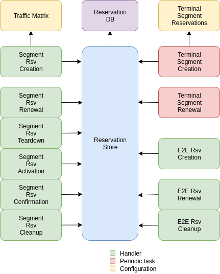

# COLIBRI Service Design

This document specifies the design of the COLIBRI service. It aims for correctness not completeness,
and some parts of the design are deliberately not yet specified.

This document will be reviewed and amended when necessary as the implementation of the COLIBRI
service matures.

## Overview

The COLIBRI Service (*COS*) manages the reservation process of the COLIBRI QoS subsystem
in SCION. It handles both the segment and end to end reservations (formerly known as steady and
ephemeral reservations).

The border router is also modified so it understands COLIBRI type packets in the data plane.

**This document doesn't include the border router design and implementation changes yet.**

## Design

There are three main components that need to be modified or created: the colibri service itself,
the border router and `sciond` in the endhost:

* **COS** Enables the COLIBRI control plane. Used to negotiate both segment and end to
  end reservations.
* **Border Router** Needs to forward the COLIBRI traffic with higher priority than best effort.
  Needs to monitor COLIBRI traffic.
* **sciond** Needs to expose a COLIBRI *API*. Needs to manage end to end reservations in behalf
  of the applications.

The COS is structured similarly to other existing Go infrastructure services. It reuses the
following:

* [go/lib/env](https://github.com/scionproto/scion/tree/master/go/lib/env):
  Is used for configuration and setup of the service.
* [go/pkg/trust](https://github.com/scionproto/scion/tree/master/go/pkg/trust):
  Is used for crypto material.
* [go/lib/infra](https://github.com/scionproto/scion/tree/master/go/lib/infra):
  Is used for the messenger to send and receive messages.
* [go/lib/periodic](https://github.com/scionproto/scion/tree/master/go/lib/periodic):
  Is used for periodic tasks.

The COS is differentiated into these parts:

* **configuration** specifying admission and reservation parameters for this AS,
* **handlers** to handle incoming reservation requests (creation, tear down, etc.),
* **periodic tasks** for segment reservation creation and renewal,
* **reservation storage** for partial and committed reservations.

.

## Sequence Diagrams

### Segment Reservations

Note: we use "forward the request" with the following meaning: if the current AS is not
the last AS in the reservation path, send the request to the next AS in the reservation path.
If the current AS is the last one, do nothing.

#### Handle a Setup Response

The response message originated from another AS's *COS* handling a request.
The request is forwarded from AS<sub>i</sub> to AS<sub>i+1</sub>, where AS<sub>i+1</sub> is the
next AS after AS<sub>i</sub> in the path of the reservation.

1. The store saves the reservation as final.
1. If this AS is the first one in the reservation path (aka *reservation initiator*),
   the store sends an index confirmation request to the next AS in the path.
1. If this AS is the not the first one in the reservation path, the store sends a
   response message to the previous AS's *COS*.

#### Handle a Setup Request

(the reservation message originated from another AS nearer to the origin of the path in the reservation)

1. The *COS* store is queried to admit the segment reservation.
1. The store decides the admission for the reservation (how much bandwidth). It uses the
   _traffic_matrix_ from the configuration package.
1. The store saves an intermediate reservation entry in the DB.
1. If this AS is the last one in the path, the *COS* store saves the reservation as final
   and notifies the previous AS in the path with a reservation response.
1. The store forwards the request with the decided bandwidth.

#### Setup a Segment Reservation

The configuration specifies which segment reservations should be created from this AS to other
ASes. Whenever that configuration changes, the service should be notified.

1. The service triggers the creation of a new segment reservation at boot time and whenever
   the segment reservation configuration file changes.
1. The service reads the configuration file and creates a segment reservation request per each entry.
    * The path used in the request must be obtained using the _path predicate_ in the configuration.
1. The store in the *COS* saves the intermediate request and sends the request to the next AS
   in the path.
1. If there is a timeout, this store will send a cleanup request to the next AS in the path.

#### Handle an Index Confirmation Request

1. The store in the *COS* checks that the appropriate reservation is already final.
1. The store modifies the reservation to be confirmed
1. The *COS* forwards the confirmation request.

#### Handle a Cleanup Request

1. The *COS* removes the referenced reservation from its store.
1. The *COS* forwards the cleanup request.

#### Handle a Teardown Request

1. The *COS* checks the reservation is confirmed but has no allocated end to end reservations.
1. The *COS* checks there are no telescoped reservations using this segment reservation.
1. The store removes the reservation.
1. The *COS* forwards the teardown request.

#### Handle a Renewal Request

The renewal request handler is the same as the [setup request](#handle-a-setup-request).
The renewal is initiated differently (by adding a new index to an existing reservation),
but handled the same way.

#### Renew a Segment Reservation

1. The service triggers the renewal of the existing segment reservations with constant frequency.
1. The store in the *COS* retrieves each one of the reservations that originate in this AS.
1. Per reservation retrieved, the store adds a new index to it and pushes it forward.

#### Handle a Reservation Query

1. The store in the *COS* receives the query and returns the collection of segment reservations
   matching it.

### End to End Reservations

All end to end reservation requests should be authenticated.

#### Handle a E2E Setup Request

1. The *COS* queries the store to admit the reservation
1. The store computes the allowed bandwidth (knowing the current segment reservation and
   the existing E2E reservations in it).
1. The store pushes forward the setup request.

#### Handle a Renewal Request

The renewal request handler is the same as the [setup request](#handle-a-e2e-setup-request).

#### Handle a Cleanup Request

1. The *COS* removes the request from its store.
1. The *COS* forwards the cleanup request.

## Interfaces

Interfaces of the main classes.

The Reservation Store in the COS keeps track of the reservations created and accepted in this AS,
both segment and E2E.
The store provides the following interface:

```go
type ReservationStore {
    GetSegmentReservation(ctx context.Context, id SegmentReservationID) (SegmentReservation, error)
    GetSegmentReservations(ctx context.Context, validTime time.Time, path []InterfaceId]) ([]SegmentReservation, error)

    AdmitSegmentReservation(ctx context.Context, req SegmentReservationReq) error
    ConfirmSegmentReservation(ctx context.Context, id SegmentReservationID) error
    CleanupSegmentReservation(ctx context.Context, id SegmentReservationID) error
    TearDownSegmentReservation(ctx context.Context, id SegmentReservationID) error

    AdmitE2EReservation(ctx context.Context, req E2EReservationReq) error
    CleanupE2EReservation(ctx context.Context, id E2EReservationID) error
}
```

The `sciond` endhost daemon will expose the *API* that enables the use of COLIBRI by applications:

```go
type sciond {
    ...
    AllowIPNet(ia IA, net IPNet) error
    BlockIPNet(ia IA, net IPNet) error
    WatchSegmentRsv(ctx context.Context, pathConf PathConfiguration) (WatchState, error)
    WatchE2ERsv(ctx context.Context, resvConf E2EResvConfiguration) (WatchState, error)
    // WatchRequests returns a WatchState that will notify the application of any COLIBRI e2e request ending here.
    WatchRequests() (WatchState, error)
    Unwatch(watchState WatchState) error
}
```

## Class Diagrams

Main classes, arity and relationships.

```go
type InterfaceIdPair struct
    Ingress uint64
    Egress  uint64
}
type SegmentReservationID struct {
    Ifids   []InterfaceIdPair
    Index   byte
}

type E2EReservationID uint16
```

## ReservationDB

There are two main parts in the DB: the segment reservation entities, and the end to end entities.
To link the end to end reservations to the appropriate segment ones, a table is used.

There are no restrictions of cardinality other than uniqueness and non null-ness for some fields,
but nothing like triggers on insertion are used. E.g. it is technically possible to link more than three
segment reservations with a given end to end one. These cardinality restrictions are enforced by code.

.

Furthermore, there are some indices created to speed up lookups:

* seg_reservation
    * id_as,suffix
    * ingress
    * egress
    * path
* seg_index
    * reservation,index_number
* e2e_reservation
    * reservation_id
* e2e_index
    * reservation,index_number
* e2e_to_seg
    * e2e
    * seg
