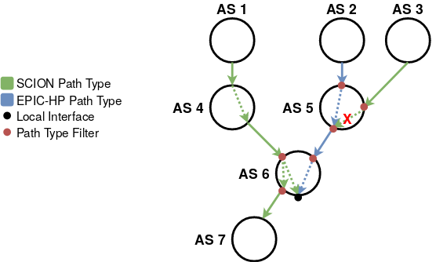

# EPIC Design

This file introduces EPIC and documents the design rationales and best
practices for EPIC-HP.

## Introduction

One important security property of SCION is that end hosts are not
allowed to send packets along arbitrary paths, but only along paths
that were advertised by all on-path ASes.
This property is called *path authorization*.
The ASes only advertise paths that serve their economic interests,
and path authorization protects those routing decisions against
malicious end hosts.

In SCION, this is implemented by having the ASes create
authenticators during beaconing, which end hosts then have to
include in the MAC field of their packets. Those MAC fields prove to
the ASes, that the packets are allowed to traverse them.
The MAC fields are static, meaning that they are the same for every
packet on that path.

However, this implementation of path authorization is insufficient
against adversaries that are able to observe the MAC fields in data
plane packets of other hosts. Because the MACs are static, once
observed MACs for some path can be reused by the adversary to send
arbitrarily many other packets (until the authenticators expire).

The EPIC (Every Packet Is Checked) protocol [[1]](#1) solves this
problem by introducing per-packet MACs.
Even if an adversary is able to discover the MACs for one packet, he
cannot reuse the MACs to send any other traffic.
The improved path authorization provided by EPIC is especially
important for hidden paths [[2]](#2). Hidden paths are paths which
are not publicly announced, but only communicated to a group of
authorized sources. If one of those sources sends traffic on the
hidden path using SCION path type packets, an on-path adversary can
observe the MACs and reuse them to send traffic on the hidden path
himself. This allows the adversary to reach services that were meant
to be hidden, or to launch DoS attacks directed towards them.
EPIC precludes such attacks, making hidden paths more secure.

## EPIC-HP Overview

EPIC-HP (EPIC for Hidden Paths) provides the improved security
properties of EPIC on the very last inter-AS link of a path. It is
meant as a lightweight EPIC version and is specifically designed to
better protect hidden paths. We will refer to ASes and hosts
protected by a hidden path as "being behind a hidden link".

With EPIC-HP, the last two ASes on a path extend the SCION
authenticators to 16 bytes (instead of only 6 bytes).
ASes and end hosts that want to send EPIC-HP traffic on such a path
need to be in the possession of those extended authenticators.
If they are, they can use the authenticators to calculate two
per-packet MACs (for the last and penultimate ASes), which they add
to the EPIC-HP packet header.
The forwarding of EPIC-HP traffic at the on-path ASes is the same as
for SCION path type traffic, which is possible because the EPIC-HP
path type header contains the complete SCION path type header.
In addition to the normal SCION forwarding operations, the last two
ASes on the path recompute and validate the per-packet MACs.
If the validation succeeds, the packet is forwarded, otherwise it is
dropped.

Furthermore, the last two ASes on the path need to either filter out
non-EPIC-HP traffic or prioritize EPIC-HP over other path type
traffic. For this, the last AS on the path needs cooperation from
its upstream provider.

### Assumptions

EPIC-HP makes the following assumptions necessary to provide a
meaningful level of security:

- The AS protected by the hidden path is the last AS.
  By "last AS" we mean that the beacon which defined the hidden path
  ends in this AS. Or stated differently: the
  AS reachable through the hidden path does not forward the beacon
  defining the hidden path to further downstream/peering ASes.
- On the interface-pairs (ingress/egress pair) that affect the
  hidden path, the last two ASes employ one of two different
  strategies in the data plane:

    - Only allow EPIC-HP path type traffic. See use case "Highly
      Secure Hidden Paths" [here](#HighlySecureHiddenPaths). The path
      type filtering is further explained [here](#PathTypeFiltering).
    - Prioritize EPIC-HP path type traffic. See use case "DOS-Secure
      Hidden Paths" [here](#DOSSecureHiddenPaths).

- The last two ASes of the hidden path have a duplicate-suppression
  system in place [[3]](#3). This prohibits DOS attacks based on replayed
  packets.

### Example

.

Here, AS 6 is the AS protected by the hidden path (blue lines). The
hidden path terminates at AS 6 (represented by black dot), so AS 6
did not forward the beacon that defines the hidden path further down
to AS 7.
This is however still allowed for SCION path type traffic (green
lines): there are SCION paths that enter AS 6 from AS 4. One of the
two paths ends in AS 6, while the other one is extended further to
AS 7.

In this example, the border routers of AS 6 and AS 5 (the last and
penultimate ASes on the hidden path) further implement path type
filtering (red dots). For example, AS 5 will block (red "X" in the
figure) SCION path type traffic from AS 3 that is destined towards
AS 6, as it would affect the hidden path. Instead of blocking
non-EPIC-HP path type traffic, ASes could also prioritize EPIC-HP
traffic, which would still satisfy the assumptions above.

Of course the ASes can always decide to be more restrictive, for
example AS 6 could additionally disallow SCION path type traffic
from AS 4, so that it is reachable through the hidden path only.

### SCION Path Type Responses

EPIC-HP path type packets contain the full SCION path type header
plus a timestamp and verification fields for the penultimate and
last ASes on the path.

The included SCION path type header allows the destination behind a
hidden link to directly respond with SCION path type packets. The
destination only has to extract the SCION path type header from the
EPIC-HP header and reverse the path.
If the source is protected by a hidden path itself, the destination
needs to respond with EPIC-HP traffic. This means that the
destination is responsible to configure or fetch the necessary
authenticators.

## Procedures

### Control Plane

In the control plane, the ASes do not only append 6 bytes of the hop
authenticators to the beacon, but also the remaining 10 bytes (the
authenticator is the 16 byte long output of a MAC function).

### Data Plane

The data plane operations for EPIC-HP path type packets are the same
as for SCION path type packets, but the source additionally computes
two per-packet validation fields for the penultimate and last ASes
on the path.
The last two ASes need to validate the fields accordingly.
A more concise description can be found in the EPIC-HP path type
specification.

### Distributing the Authenticators

The last AS on the path needs to distribute the authenticators to
the set of trusted sources that should be able to send EPIC-HP
traffic over the hidden link. This can be done over any secure
channel, for example using secure end-to-end protocols, out-of-band
communication, or the dedicated hidden path infrastructure [[2]](#2).

###  Path Type Filtering

Network operators should be able to clearly define which kind of
traffic (SCION, EPIC-HP, COLIBRI, and other protocols) they want to
allow.
Therefore, for each AS and every interface pair, it should be
configurable to allow only certain types of traffic.
The path type filtering between two interfaces can be different
depending on the direction of the traffic. We might for example only
allow EPIC-HP traffic from some interface 1 to some interface 2, but
not apply any filtering for traffic from interface 2 to interface 1.

## Best Practices

There are two main applications for EPIC-HP:

### Highly Secure Hidden Paths

The last and penultimate ASes on the hidden path only allow EPIC-HP
traffic on the interface pairs that affect the hidden path.
With such a setup it is not possible for unauthorized sources to
reach the services in the last AS. Therefore, EPIC-HP effectively
prevents adversaries from running attacks like denial of service, or
attack preparations like scanning the services for vulnerabilities.

If some host H1 inside an AS with such a setup wants to communicate
with a host inside another AS that is also behind a hidden link,
both hosts need to have valid authenticators to send traffic over
the corresponding hidden paths - the hosts can exclusively
communicate using EPIC-HP.

Note that hosts behind a hidden link can send SCION path type
packets towards hosts in other ASes, but that those hosts can not
send a response back if they do not have the necessary
authenticators.

### DoS-Secure Hidden Paths

The last and penultimate ASes on the hidden path allow EPIC-HP and
other path types simultaneously, but prioritize traffic using the
EPIC-HP path type over the SCION path type.
This has the advantage that the link can still be used as a normal
SCION path type access link.
DOS attacks are not possible in this case, because an adversary is
limited to sending low-priority SCION path type packets. However, an
adversary can still reach the services behind the hidden link.

In this scenario hosts behind a hidden link can send SCION path type
packets towards hosts in other ASes, and those hosts can reply
with SCION path type traffic when they do not have the necessary
authenticators to send back EPIC-HP traffic.

## References

<a id="1">[1]</a>
M. Legner, T. Klenze, M. Wyss, C. Sprenger, A. Perrig. (2020)  
EPIC: Every Packet Is Checked in the Data Plane of a Path-Aware Internet  
Proceedings of the USENIX Security Symposium
[[Link]](https://netsec.ethz.ch/publications/papers/Legner_Usenix2020_EPIC.pdf)

<a id="2">[2]</a>
Design Document for the Hidden Path Infrastructure
[[Link]](hidden-paths)

<a id="3">[3]</a>
T. Lee, C. Pappas, A. Perrig, V. Gligor, and Y. Hu. (2017)  
The Case for In-Network Replay Suppression  
Proceedings of the ACM Asia Conference on Computer and Communications Security
[[Link]](https://netsec.ethz.ch/publications/papers/replay2017.pdf)
