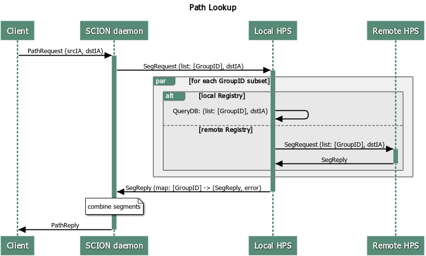

# Hidden Paths

This file documents the design for the Hidden Paths infrastructure.

## Naming

| Name                                     | Explanation                                                     |
| ---------------------------------------- | --------------------------------------------------------------- |
| Hidden Path Group (HPG)                  | Group within which hidden path information is shared            |
| Hidden Path Group Configuration (HPGCfg) | Configuration defining a Hidden Path Group                      |
| Hidden Path Server (HPS)                 | Server caching hidden segments / answering hidden path requests |

## Overview

Hidden path communication enables the hiding of specific path segments, i.e. certain path segments
are only available for authorized ASes. In the common case, path segments are publicly available to
any network entity. They are fetched from path servers and used to construct forwarding paths. In a
Hidden Path communication setting, certain down-segments are not registered at the public path
servers. Instead, they are registered at a dedicated Hidden path server (HPS) which enforces access
control, such that only authorized entities can fetch and use these segments to create forwarding
paths.

  
*Hidden Path communication scheme:*  
*1: Group Owner creates a HPG and shares the configuration out-of-band*  
*2: Writer ASes register down-segments at Registries of their group*  
*3: Reader ASes query local HPS for hidden segments*  
*4: Reader ASes can communicate with Writer ASes based on hidden path segments*

## Design

### Hidden Path Group

A hidden path group is defined as a group of ASes within which hidden path
information is shared. A hidden path group consists of:
- GroupID: Unique 64bit identification of the group:
OwnerAS<sub>48bit</sub>||GroupID<sub>16bit</sub>
- Version: A version indicating the version of the configuration
- Owner: AS ID of the owner of the hidden path group. The Owner AS is responsible for maintaining
the hidden path group configuration and keeping the group's HPS up-to-date with the latest
version, Access: Read/Write
- Writers: All ASes in the group which are allowed to register hidden paths,
Access: Read/Write
- Readers: All ASes in the group which are allowed to read hidden path
information, Access: Read
- Registries: All ASes in the group at which writers register hidden paths

The HPGCfg is shared amongst the members of the group out-of-band. It
is the group owner's responsibility to disseminate updated versions to all
members. An online way to initially share and update the HPGCfg might be added in the future.

(See an example group configuration in the [Implementation](#Hidden-Path-Group-Configuration) section)

### Hidden Path Service

Each AS in the hidden path group runs a Hidden Path Server as a service. While at first it seems
that HPS and PS serve a similar purpose, a closer look justifies why HPS should run as a dedicated
service: The segment lookup on an HPS is simple compared to the lookup done by a PS since only
down-segments need to be returned. Not much of the PS logic could be re-used. Furthermore, an HPS
needs to perform ACL checks on requesters based on HPGCfgs. This logic is not needed by a regular
PS. Merging the two services would unnecessarily complicate both designs and harm the development of
future, more sophisticated accesss control mechanisms on HPS.

Each HPS is of one of two types:
- `Registries` contain the Hidden Path segment information and serve this information to `Forwarders`
- `Forwarders` forward hidden path requests on behalf of sciond to `Registries` of the group

Hidden Path Servers are listed as
`HiddenPathService` in the topology file. The corresponding service address is
`SvcHPS`.

### Segment Registration

The Beacon Server needs to distinguish between segments to be registered at the
Path Server and the ones to be registered at the Hidden Path Server. This
decision is based on a policy defined in the Beacon Server's configuration file.
The policy maps from interface ID to:
- MaxExpiration:  The time interval after which the segment becomes invalid
- RemoteHidden: Whether the segment is hidden from remote Path Servers
(not usable as down-segment for non-authorized ASes)
- LocalHidden: Whether the segment is hidden from the local Path Server
(not usable as up-segment)

By default, Beacon Servers assume no policy and register all segments publicly.

Note that a hidden segment registered as hidden and the same segment registered publicly need to be
distinguishable. This is achieved by adding an extension to the `ASEntry` of the final AS in the segment.

(See an example policy in the [Implementation](#Segment-Registration-Policy) section)

### Path Lookup

Additional to up-, core- and down-segments, sciond is responsible for
fetching hidden down-segments. sciond periodically queries the local HPS to fetch all HPGCfgs of
which it is a member. Clients of sciond have to explicitly ask sciond for hidden paths. Clients can
include a specific `GroupID` in their request; otherwise sciond checks all HPGCfgs and extracts the HPG
`GroupID`s of all those groups where the destination is a Writer (or Owner) of that group. With the
obtained `GroupID`s and the given destination, sciond then requests hidden down-segments from its local HPS.
The local HPS selects a Registry for each `GroupID`, partitioning the `GroupID`s
into disjoint subsets based on shared Registries. HPS then resolves the request
by applying one of two cases for each subset:
1. The local HPS is a Registry of the groups in the subset, and thus resolves the request by
   querying its database
2. The local HPS is *not* a Registry of the groups in the subset. The request is
   resolved by querying the shared Registry of the given groups.

The HPS then replies to sciond with a map of `GroupID` -> (`SegReply`,
`error`).



## Implementation

### Hidden Path Group Configuration

Below is an example of a Hidden Path Group configuration file (`HPGCfg_281474977720757.json`):

```json
{
	"GroupID": 281474977720757,
	"Version": 1,
	"Owner": "1-ff00:0:110",
	"Writers": [
		"1-ff00:0:111",
		"1-ff00:0:112"
	],
	"Readers": [
		"1-ff00:0:113",
		"1-ff00:0:114"
	],
	"Registries": [
		"1-ff00:0:110",
		"1-ff00:0:111",
		"1-ff00:0:113"
	]
}
```

### Segment Registration Policy

Below is an excerpt of an example `bs.toml` configuration. A new `hpGroups`
section is added, with subsections for every HPG the AS is a member of. These
subsections contain the path to the corresponding HPGCfg and a
list of segments which are registered at the HPS.

```toml
[general]
ConfigDir = "gen/ISD1/ASff00_0_111/bs1-ff00_0_111-1"
ReconnectToDispatcher = true
ID = "bs1-ff00_0_111-1"

#...

[hpGroups]
[hpGroups.281474977720757]
CfgFilePath = "path/to/HpCfg_281474977720757.json"

[hpGroups.281474977720757.segments.5]
maxExpiration = "10m"
remoteHidden = true
localHidden = false

[hpGroups.281474977720757.segments.8]
maxExpiration = "60s"
remoteHidden = true
localHidden = true 

[hpGroups.xxxxx]

#...

[hpGroups.yyyyy]

#...
```

### Message Definitions

(TBD)

### Hidden Path Server

#### General Structure

The HPS is structured similar to existing go infra services. It uses:
- go/lib/env (for configuration and setting up the service)
- go/lib/infra (for sending messages)
- go/lib/pathdb (for storing hidden segments)

#### Handlers

The HPS has the following handlers:
- `HPSegRegHandler`: Handler accepting a `GroupID` and a list of segments to be
registered as hidden down-segments for that group  
Access: Owner/Writers
- `HPSegReqHandler`: Accepting a list of `GroupID`s, responding with hidden
down-segments corresponding to those groups  
Access: Owner/Readers
- `HPGCfgReqHandler`: Returns a list of all `HPGCfg`s the requester is a member of  
Access: Owner/Writers/Readers
