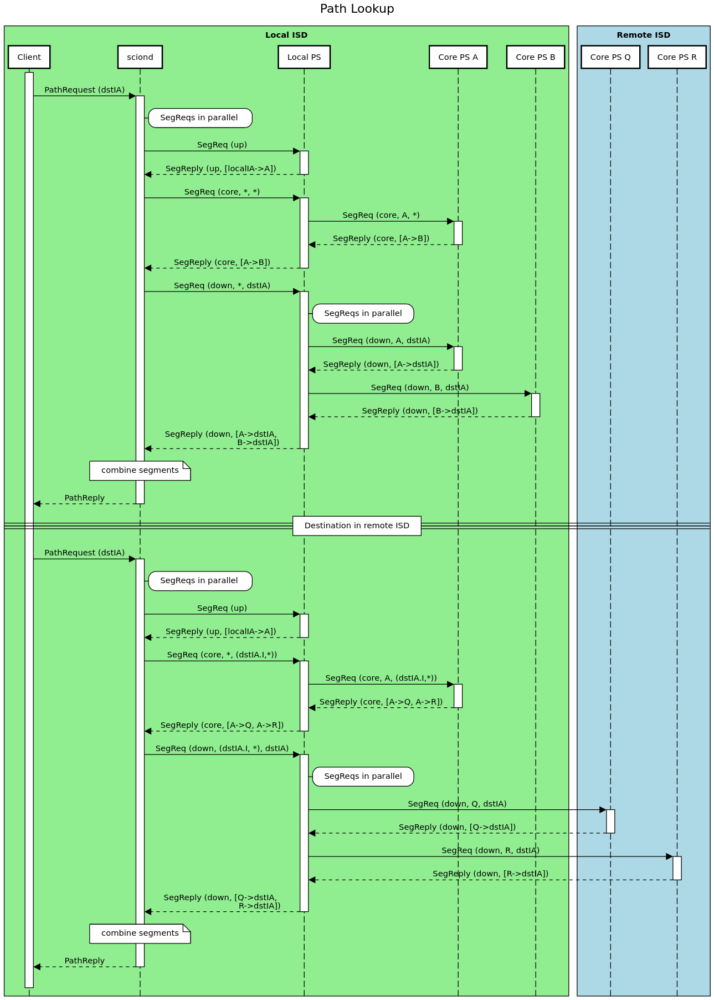

# Path Service

​

---
⚠️  **NOTE** ⚠️ 
Outdated contents! This document is kept for historical purpose.

---

The path service is implemented as part of the control server.

## Request Handlers

We use the messenger to register request handlers. The following requests are handled:

* __Path Registration:__ A handler for the path-registration request, only in core ASes.
* __Path Requests:__ Two different types of `SegReq` are handled by separate handlers:
    * local requests, coming over TCP.
    * requests from other path servers, over SCION/QUIC, only in core ASes.
* __Path Revocation:__ A handler for the path-revocation message

## Deletion of Expired Path Segments and Revocations

The PS should periodically delete expired path segments and revocations in its DB.

## Path Lookup

### Overview

An application resolves paths with a sequence of segment requests (`SegReq`) to
the AS-local path server. Typically this is orchestrated by sciond.
The AS-local path server answers directly, or forwards these requests to the
responsible core path servers. Replies of forwarded requests are cached in the
local path server.

| SegReq segment type  | Responsible PS(s)            |
| ---------------------| ---------------------------- |
| up                   | Local PS                     |
| core                 | Core PSs in local ISD        |
| down                 | Core PSs in destination ISD  |

The overall sequence to resolve a path is:

* request up segments
* request core segments starting at core ASes reachable with up segments, to
  the core ASes in the destination ISD.
  If the destination ISD is the local ISD, this step requests segments to core
  ASes that are not directly reachable with an up segment.
* request down segments starting at (reachable) core ASes in the destination ISD

Wildcard addresses (of the form `I-0` for some ISD `I`) for core ASes are
expanded at the local path server:

* destination in up-segment requests
* source for core-segment requests: expands to all provider core ASes (i.e.
  cores for to which an up segment exists)
* source for down-segment requests: expands to all core ASes of the specified ISD

In this process, the resolver (i.e. sciond) can employ different strategies:

* Breadth-first search, attempt to resolve _all_ paths.
  Request all up segments, then request all core segments, then request all down segments.

  Using wildcards, the requests for all three segment types become independent
  and can be queried concurrently.
  This is the approach currently implemented in sciond (via
  `segfetcher.MultiSegmentSplitter` and `segfetcher.Pather`).

* Depth-first search, attempt to resolve _a_ path.
  Pick a local core AS; see what remote core ASes are reachable; pick one; see if
  the remote destination AS is reachable; if unreachable, track back and pick
  another remote core-AS; see if the remote destination AS is reachable; etc.

### Example sequence diagram

In the diagram below, we show entities in five ASes; the local AS, and four
core ASes; `A` and `B` are in the local ISD, `Q` and `R` are in a remote ISD.
Core AS `A` is a provider of the local AS, but the core AS `B` is not, i.e.
there is no up-segment from the local AS to `B`.

### Logic flow

In the following pseudo code snippets, we use `HasCached(src, dst addr.IA)` to
denote the check whether the path DB has a recently cached entry for a segment
`src` to `dst`.
In the source code, this is implemented in terms of `pathdb.Read.GetNextQuery()`.

#### sciond/application

* Application requests path from sciond, with a `PathReq` request `pathReq`.
* Check destination IA `pathReq.Dst`:
    * If the destination IA is not set or invalid (i.e., ISD is 0) or represents the local IA,
      immediately return an error/empty reply
* Split the path request into segment requests; different strategies available, as described above.
* For each `SegReq` request `segReq`:
    * If `!pathReq.Refresh && HasCached(segReq.Src, segReq.Dst)`, return the cached segments.
    * Else, request `segReq` from the local path service, (via TCP).
      Validate retrieved segments and add to cache.
* Combine all segments into a set of paths
* Filter paths with revoked on-path interfaces
* Return paths to application as a `PathReply`

#### Local SegReq handler

* Determine requested segment type and validate request
* If up segment request, load matching up segments from path DB and return
* If core segment request:
    * expand `Src` wildcard into separate requests for each reachable core AS in local ISD.
    * for each `SegReq` request `segReq`:
        * If `segReq.Src == localIA`, load matching core segments from path DB
        * Else If `HasCached(segReq.Src, segReq.Dst)`, return cached segments
        * Else, request `segReq` from the core path server at `segReq.Src`.
          Validate retrieved segments and add to cache.
* If down segment request:
    * expand `Src` wildcard into separate request for every core AS in ISD `Src.I`
    * for each `SegReq` request `segReq`:
        * If `segReq.Src == localIA`, load matching down segments from path DB
        * Else If `HasCached(segReq.Src, segReq.Dst)`, return cached segments
        * Else, request `segReq` from the core path server at `segReq.Src`.
          Sending the request may require looking up core segments to `segReq.Src`.
          Validate retrieved segments and add to cache.
* Filter revoked segments

#### Core PS SegReq handler

* Validate request:
    * request source must be this core AS
    * request must be for a core segment or a down segment to an AS in this ISD
* If `isWildcard(segReq.Dst) || isCore(segReq.Dst)`, load matching core segments from path DB and return
* Else, load matching down segments from path DB and return

### Cache Refresh Interval

If there are paths available for a certain destination an interval of, e.g. 5 min would be fine.
However if no paths are available we should retry more frequently, e.g. each second (maybe with
back-off). Also if there are less that k paths available in the cache we should also query the PS
again sooner than if enough paths are available.

### DoS / High-Load Prevention

A client could request paths to random (non-existing) ASes and with this put a lot of load on the
Path Service Infra. To prevent this we need caching of which ASes exist.
[scion#1486](https://github.com/scionproto/scion/issues/1486) Describes how we can find out if an AS
exists. A core PS that receives a path request for a non existing AS can reply with an error (AS
does not exist), the local PS can then cache this result, so it can immediately reply if the same
request is received again.

Also we should consider: [scion#1725](https://github.com/scionproto/scion/issues/1725)

### Policy

Path lookup should have policy support. Currently it is not yet clear what policies we might want.
For sure there has to be support for AS black-/white-listing. But the interface should be generic
enough to support more policies.

A note on caching: If we refresh the cache we might need to remember which policy was used for
updating the cache. It could be that for two policies we get a disjoint set of segments. Saving a
policy might impose a strong limitation on the expressionism of a policy.

## Revocations

Revocations can come from inside the ISD in form of a CtrlPld.PathMgmt.SRevInfo from the border
router, beacon service, or from the PS, or from anywhere in the form of an SCMP revocation, or if a
core PS requests down-segments of a core PS in another ISD the response should contain the relevant
revocations.

Note that, differing from the book, a revocation should no longer result in the deletion of a path
segment. Instead we only filter when using path segments.

### Logic Flow

* Receive revocation R
* If R is a CtrlPld.PathMgmt.SRevInfo && source is not in same ISD
    * Ignore R // SRevInfo should only come from within the same ISD.
* Verify R, if invalid drop it and return.
* Save R in the revocation cache
* Forward revocation in non-core PS:
    * If revoked interface belongs to this AS OR revocation is from a different ISD:
        * Inform all core PSes in the local ISD
* Forward revocation in core PS:
    * If revoked interface belongs to this AS OR Revocation is from a BR and it originated from a
      different ISD
        * Inform all other core ASes.
    * Note that if a cPS queries a cPS of another ISD for down-segments it should also get the
      relevant revocations for the segments. These revocations do not need to be forwarded to other
      cPSes.
