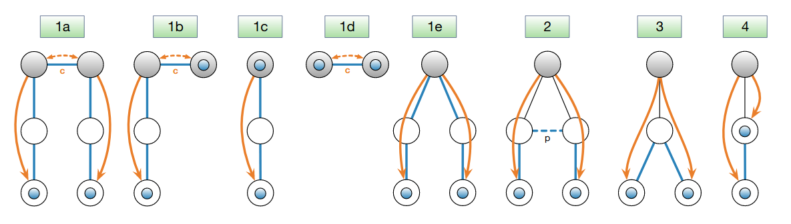
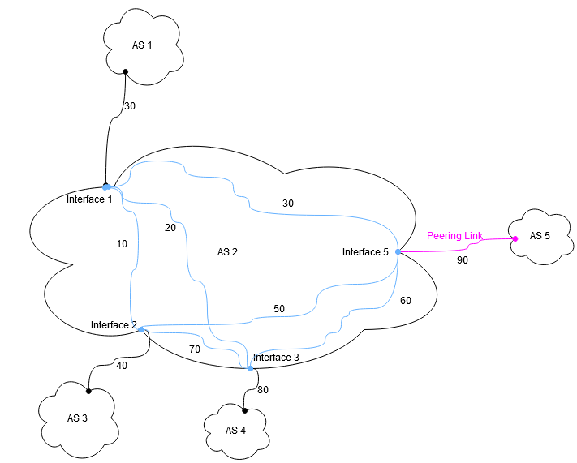

************************
Path Metadata in Beacons
************************

Introduction
============

When selecting end-to-end SCION paths, it is useful to have information
about the properties of the available paths, such as information about the
expected latency or the "type" of the traversed links.

This document describes how metadata can be included in an optional extension
of the Path Construction Beacons (PCBs), called ``StaticInfoExtension``, so
that it can be used by applications on the end hosts in the path selection
process.

Static properties
-----------------

We distinguish between *static* and *dynamic* properties of a path. Static
properties remain valid over the course of its announced lifetime. The lifetime
of a path typically is on the order of minutes to hours. Properties that can
vary more quickly are considered *dynamic*.

As an example, the maximum possible bandwidth on each link of a path is
*static*, as it will not change unless the underlying network infrastructure is
modified. On the other hand, the bandwidth available to an application over
this path is *dynamic*, as it depends on the current load on the network
infrastructure along the path.

In the PCBs, we can naturally only include information about the *static*
properties of a path.

Symmetry
--------

SCION paths and path segments are reversible. The system described here does
not allow representing values differing depending on the usage direction.
Instead, we require that all metadata items represent quantities that are
symmetric. If a path hop has e.g. different latency in the two directions we
can just pick the more conservative estimate.

Path Segments with Metadata
===========================

SCION end-to-end paths are obtained by combining up to three (up, core and down)
*path segments* which correspond directly to a PCB. A path segment consists
of a series of ``ASEntry``\s, one for each AS. An ``ASEntry`` describes the
traversal of an AS for a specific pair of "ingress" and "egress" interfaces
(where ingress/egress refer to the dissemination direction of the beacon).

To describe the properties of all hops of a path, we will have to include
information about the links between the ASes (**inter**-AS hops), and also for
the hops from the ingress to the egress inside an AS (**intra**-AS hops). For
the intra-AS hops, it is however not enough to include only information about
the hop between the beacon ingress and egress interfaces -- where two path
segments can be "joined" together, we have to ensure that the information about
the resulting intra-AS hop is contained in (at least) one of the ``ASEntry``\s.

The figures below illustrate the various ways in which segments can be combined
to form end-to-end paths:

   Combination of path segments to paths: the blue circles represent the end
   hosts; the shaded gray circles represent core ASes, possibly in different
   ISDs; blue lines without arrow heads denote hops of created forwarding
   paths; the dashed blue line denotes a peering link (labeled "p"); orange
   lines with arrows stand for PCBs and indicate their dissemination direction;
   dashed orange lines represent core beacons exchanged over core links
   (labeled "c"). All created forwarding paths in cases 1a-1e traverse the ISD
   core(s), whereas the paths in cases 2-4 do not enter the ISD core.

Representation in StaticInfoExtension
-------------------------------------

We use the following scheme, to ensure that each hop is described by (at least) one ``ASEntry``.
We rely on symmetry_ and avoid some redundancy.
Each ``ASEntry`` includes information about:

- the inter-AS hop at the egress interface
- the intra-AS hop between egress and any (other) ``CHILD``-link interface
  *with ID smaller than the egress interface*, for shortcuts.
- the intra-AS hop between egress and any (other) ``CORE``-link interface,
  for up-core or core-down segment cross-over
- the intra-AS hop between egress and any ``PEER``-link interface, and
  the inter-AS hop at any ``PEER``-interface

.. list-table:: Illustration of the information included in the individual ``ASEntry``\s in path segments and how this information is used in path segment combinations. The black circles represent ASes, the shaded circles are core ASes. Solid black lines connecting the ASes represent parent-child or core links, the dashed black line is a peering link. Each color represents an ``ASEntry``. Entries in the up segments are **blue**, core segments are **red** and down segments **green**. Dotted lines represent information about links that is included in the PCBs, but not used in this path segment combination.

   * - .. figure:: fig/beacon_metadata/beacon-metadata-up-core-down.png
         :width: 100%

       Path from 111 to 211, through core.

       Case 1a, above.

     - .. figure:: fig/beacon_metadata/beacon-metadata-peer.png
         :width: 100%

       Path from 111 to 211, via peering link.

       Case 2, above.

   * - .. figure:: fig/beacon_metadata/beacon-metadata-shortcut.png
         :width: 100%

       Path from 111 to 112, with shortcut at 110.

       Case 3, above.
     -

Wire format
^^^^^^^^^^^

In the PCBs, the per-hop information is represented using the following
structure (extracted from `proto/control_plane/v1/seg_extensions.proto
<https://github.com/scionproto/scion/blob/master/proto/control_plane/v1/seg_extensions.proto>`_):
This is the generalized Protocol Buffers-like description for a per-link
metadata item of type ``T`` (but Protocol Buffers does not actually have a
templates).

.. code:: protobuf

    message HopMetadata<T> {
        // Information about the hop between construction-egress interface and the relevant other
        // interfaces. These are:
        // - construction-ingress interface (if any)
        // - sibling child interfaces,
        // - core interfaces, at start or end of a segment
        // - peer interfaces
        // The key is the interface identifier of the other interface.
        map<uint64, T> intra = 1;
        // Information about the hop between the local interface and the interface in the neighbor AS
        // for the relevant links. These are:
        // - link at construction-egress interface (if any)
        // - peer links
        // The key is the interface identifier of the local interface associated
        // with the link.
        map<uint64, T> inter = 2;
    }

Note that some of the metadata types discussed below do not describe per-hop
information but e.g. per-AS notes. These are much simpler to represent in the
PCBs and don't need to be discussed here.

Conflicts
---------

When combining the information from all the path segments, information may be
available from more than one ``ASEntry``. Therefore, it is possible to have
conflicting information, which must be considered when combining path segments.

The conflicts are resolved by selecting the most conservative value.

This conflict resolution procedure allows an AS to announce a more conservative
value for the metadata of inter-AS links if it disagrees with the value
announced by the upstream AS.

Authenticity, Integrity and Accuracy
------------------------------------

The responsibility for providing all of this metadata lies with the individual
ASes. There is no mechanism to enforce that this information is complete or
accurate.

The beacon extensions are signed/verified based on the control plane PKI. This
provides integrity and accountability for the provided metadata.

-  No AS can tamper with the metadata included in a beacon
-  The source of the metadata is visible and non-repudiable. Thus, if an AS was
   detected to be including false information, it can be held accountable by
   e.g. being added to a block list.

Metadata types
==============

Latency
-------

Latency describes the propagation delay between any two hops on the path.
The advertised information describes the latency for an ideal idle state of the
network infrastructure, i.e. it does not account for any variable delay due to
queuing or processing.

Use cases of such information include:

-  Augment path selection policy in order to obtain low latency paths.

Bandwidth
---------

Bandwidth describes the maximum bandwidth between any two hops on the path.
The advertised information describes the bandwidth for an ideal idle state of
the network infrastructure, i.e. it does not account for congestion.

Use cases of such information include:

-  Augment path selection policy, such that unsuitable paths can be excluded a
   priori.
-  Avoid connections that are prone to congestion due to a low-bandwidth
   bottleneck somewhere.

Geographic information
----------------------

This describes the geographic position of each router on the path. The position
is described as a GPS coordinate (latitude/longitude pair, in the WGS 84 datum)
as well as an optional free-form civic address.

Use cases of such information include:

-  Can be used to augment path selection policies in order to ensure
   paths do not leave a particular area, or alternatively ascertain that
   they never cross territory that is considered "undesirable" by the
   user.
-  Can be used to provide users with information about the location of
   the entity they are communicating with (i.e. the endpoint on the
   other side of the path).
-  Informing network admins about router locations.
-  Cross-check or enhance latency information

Link Type
---------

Link Type information gives a broad classification of the different
underlying infrastructure used by inter-AS links.

For now it distinguishes three different types of links:

-  ``DIRECT``: direct physical connection
-  ``MULTI_HOP``: connection with local routing/switching
-  ``OPEN_NET``: connection overlayed over publicly routed Internet

Use cases of such information include:

-  Mitigating security concerns.
-  Allowing users to select paths that e.g. avoid the open internet.

Internal Hops
-------------

The Number of AS-internal hops counts the internal hops (e.g. internal IP
routers) between the ingress and egress routers of any AS on the path.

Use cases of such information include:

-  Can be used to exclude undesirable paths from the selection.
-  Obtain a selection of efficient, low latency paths (especially when
   combined with Latency Information).

Note
----

A Note is simply a bit of plain text. Use cases of such information
include:

-  Tool for network engineers to communicate interesting/important
   information to their peers as well as users.

Application Programming Interface
=================================

Applications will typically not interact with the raw information in the
``StaticInfoExtension`` in the ``ASEntry``\s.
The path combinator (``go/lib/infra/modules/combinator``) is used to
extract (only) the relevant information from the individual ``ASEntry``\s
when combining path segments to a path.

The ``snet.PathMetadata`` struct contains the resulting path metadata.

Command Line Interface
======================

``scion showpaths`` displays the available extended path metadata if the
``--extended``/``-e`` flag is provided.
The following values will be displayed in human readable form, provided they
are available:

+-------------------+---------------------------------------------------------------------------------+
| Name              | Description                                                                     |
+===================+=================================================================================+
| Latency           | Total latency                                                                   |
+-------------------+---------------------------------------------------------------------------------+
| Bandwidth         | Bottleneck bandwidth                                                            |
+-------------------+---------------------------------------------------------------------------------+
| Geo               | Sequence of geographical coordinates of routers along path, separated by ``>``  |
+-------------------+---------------------------------------------------------------------------------+
| LinkType          | The link type of each inter-AS connection along the path                        |
+-------------------+---------------------------------------------------------------------------------+
| InternalHops      | Number of internal hops, per AS, in order of appearance on the path             |
+-------------------+---------------------------------------------------------------------------------+
| Notes             | The notes for each AS on the path                                               |
+-------------------+---------------------------------------------------------------------------------+

Configuration File Format
=========================

The control service obtains the information for the ``StaticInfoExtension``
for the PCBs it sends out from a JSON configuration file, ``staticInfoConfig.json``.

There is one top-level entry for each type of metadata. All entries are optional.

-  ``Latency`` is a map where the key is Interface ID ``i`` and the values are:

   +-------------+-------------------------------------------+-------------------------------------------------+
   | Name        | Type                                      | Description                                     |
   +=============+===========================================+=================================================+
   | ``Inter``   | Duration                                  | Latency from interface ``i`` to remote AS       |
   +-------------+-------------------------------------------+-------------------------------------------------+
   | ``Intra``   | Map: Interface ID ``j`` : Duration        | Latency from interface ``i`` to interface ``j`` |
   +-------------+-------------------------------------------+-------------------------------------------------+

-  ``Bandwidth`` is a map where the key is Interface ID ``i`` and the values are:

   +-------------+-------------------------------------------+-----------------------------------------------------------------+
   | Name        | Type                                      | Description                                                     |
   +=============+===========================================+=================================================================+
   | ``Inter``   | Integer                                   | Bandwidth in Kbit/s between interface ``i`` and the remote AS   |
   +-------------+-------------------------------------------+-----------------------------------------------------------------+
   | ``Intra``   | Map: Interface ID ``j`` : Integer         | Bandwidth in Kbit/s between interface ``i`` and interface ``j`` |
   +-------------+-------------------------------------------+-----------------------------------------------------------------+

-  ``Geo`` is a map where the key is Interface ID ``i`` and the values are:

   +-----------------+-----------------+-----------------------------------------------+
   | Name            | Type            | Description                                   |
   +=================+=================+===============================================+
   | ``Latitude``    | Decimal value   | Longitude GPS coordinates of interface ``i``  |
   +-----------------+-----------------+-----------------------------------------------+
   | ``Longitude``   | Decimal value   | Latitude GPS coordinate of interface ``i``    |
   +-----------------+-----------------+-----------------------------------------------+
   | ``Address``     | String          | Address of interface ``i``                    |
   +-----------------+-----------------+-----------------------------------------------+

-  ``LinkType`` is a map where the key is Interface ID ``i`` and the value is one of

   -  ``"direct"``
   -  ``"multihop"``
   -  ``"opennet"``

-  ``Hops`` is a map where the key is Interface ID ``i`` and the values are:

   +-------------+------------------------------------+----------------------------------------------------------------------+
   | Name        | Type                               | Description                                                          |
   +=============+====================================+======================================================================+
   | ``Intra``   | Map: Interface ID ``j`` : Integer  | Number of internal hops between interface ``i`` and interface ``j``  |
   +-------------+------------------------------------+----------------------------------------------------------------------+

-  ``Note`` is a string.

Example Configuration
---------------------

Let us look at an AS with three interfaces with IDs 1, 2, 3 and 5 which
looks like the diagram below. The values attached to the connections
represent the latency in milliseconds between interfaces.

The configuration file for this AS could then look like this:

.. code:: JSON

    {
      "Latency": {
        "1":{
          "Inter": "30ms",
          "Intra": {
            "2": "10ms",
            "3": "20ms",
            "5": "30ms"
          }
        },
        "2":{
          "Inter": "40ms",
          "Intra": {
            "1": "10ms",
            "3": "70ms",
            "5": "50ms"
          }
        },
        "3":{
          "Inter": "80ms",
          "Intra": {
            "1": "20ms",
            "2": "70ms",
            "5": "60ms"
          }
        },
        "5":{
          "Inter": "90ms",
          "Intra": {
            "1": "30ms",
            "2": "50ms",
            "3": "60ms"
          }
        }
      },
      "Bandwidth": {
        "1":{
          "Inter": 400000000,
          "Intra": {
            "2": 100000000,
            "3": 200000000,
            "5": 300000000
          }
        },
        "2":{
          "Inter": 4000000000,
          "Intra": {
            "1": 5044444,
            "3": 6555555550,
            "5": 75555550
          }
        },
        "3":{
          "Inter": 80,
          "Intra": {
            "1": 9333330,
            "2": 10444440,
            "5": 133333310
          }
        },
        "5":{
          "Inter": 120,
          "Intra": {
            "1": 1333330,
            "2": 155555540,
            "3": 15666660
          }
        }
      },
      "Linktype": {
        "1":"direct",
        "2":"opennet",
        "3":"multihop",
        "5":"direct"
      },
      "Geo": {
        "1":{
          "Latitude": 48.858222,
          "Longitude": 2.2945,
          "Address": "Eiffel Tower\n7th arrondissement\nParis\nFrance"
        },
        "2": {
          "Latitude": 48.8738,
          "Longitude": 2.295,
          "Address": "Place Charles de Gaulle\n8th arrondissement\nParis\nFrance"
        },
        "3":{
          "Latitude": 47.22,
          "Longitude": 42.23,
        },
        "5":{
          "Latitude": 48.2,
          "Longitude": 46.2,
        }
      },
      "Hops": {
        "1":{
          "Intra": {
            "2": 2,
            "3": 3,
            "5": 0
          }
        },
        "2":{
          "Intra": {
            "1": 2,
            "3": 3,
            "5": 1
          }
        },
        "3":{
          "Intra": {
            "1": 4,
            "2": 6,
            "5": 3
          }
        },
        "5":{
          "Intra": {
            "1": 2,
            "2": 3,
            "3": 4
          }
        }
      },
      "Note": "GNU Terry Pratchett"
    }
