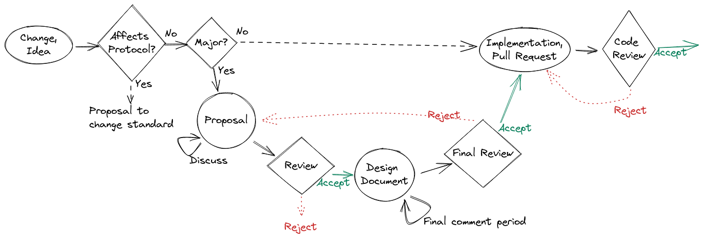

.. _contribution-guide:

***********************************
Contributing to the SCION code base
***********************************

Welcome to the SCION contribution guide! If you are interested in contributing to
the project, this page will help you out on your journey to your first SCION commit.

.. _slack:

Before starting out, just one thing: if you have any questions, you can always
find us on our `Slack workspace <https://scionproto.slack.com>`__ or on our
`Github project page <https://github.com/scionproto/scion>`__. Do not hesitate to
ask us anything, or feel free to just drop by and say "Hi".
Please use this invite link to `join scionproto Slack workspace <https://join.slack.com/t/scionproto/shared_invite/zt-1gtgkuvk3-vQzq3gPOWOL6T58yu45vXg>`__.

.. note:: Note for Anapayans

   This section contains general rules about how to contribute to the
   open-source SCION project. If you are an Anapaya employee, some additional
   rules may apply. Please see the internal Contribution Guide for more
   information.

What skills do you need to contribute?
======================================

SCION is a complex project, and uses a lot of different technologies. If you are unfamiliar
with some of them, we have compiled a list containing some great resources to get you started.

+----------------+----------------------------+------------------------------------------+
|     Language   |    Contribution area       |    Tutorials                             |
+----------------+----------------------------+------------------------------------------+
|       Go       |   SCION Control-plane      |    :ref:`resources-for-learning-go`      |
|                |   SCION Data-plane         |                                          |
|                |   SCION Tools              |                                          |
+----------------+----------------------------+------------------------------------------+
|   Python       |   Acceptance testing       | Coming soon                              |
|                |   Helper scripts           |                                          |
+----------------+----------------------------+------------------------------------------+
|  Starlark      |   Bazel build/test system  | Coming soon                              |
+----------------+----------------------------+------------------------------------------+

Contributing to the Python and Starlark code bases is a bit trickier, so if you're just now
starting out, we recommend going for Go first.

You might also see some Bash and Makefile code in the code base. While this code changes from
time to time, we strongly discourage contributions to these areas. Code in these languages also
has a high chance of getting deleted completely in a refactoring pass.

For version control, we use Git and GitHub. For more information about using Git (including
links to resources to get you started if you've never used before), please visit :ref:`how-to-use-git-and-github`.

No matter what language you want to contribute to, one of the first steps to take is to set
up a development environment. See :ref:`setting-up-the-development-environment` for the needed steps.
If you encounter issues, please visit our :ref:`Slack <slack>` and ask for help.

Finding an issue to contribute to
=================================

We use GitHub labels to categorize issues in the SCION tracker. The two most interesting categories
when searching for something to contribute to are:

- `Help wanted issues <https://github.com/scionproto/scion/labels/i%2Fhelp%20wanted>`__.
  These are issues that nobody is working on at the moment, and are up for grabs.
- `Good first issue issues <https://github.com/scionproto/scion/labels/i%2Fgood%20first%20issue>`__.
  These are usually **Help wanted** uses that are somewhat simpler. These are a good place to start if you've
  never contributed to the project before.

Once you find something you like, post a comment on the issue announcing that
you're interested in working on it. This initial message signals to others that
somebody is already working on it (and thus avoids duplicate work), and also is
the first step in gathering more information about the issue from the SCION team.

From this point on, somebody from the SCION maintainers team will reach out to
you and guide you for the rest of the process. If you have any questions, please
remember to shoot us a question on our :ref:`Slack <slack>`.

Finally, make sure that the code you write adheres to the SCION project
:ref:`language-style-guides`.

.. _governance:

Governance: TC Implementation
=============================

The `Technical Committee (TC) Implementation <https://scion.org/development>`_
of the SCION Association are the custodians of the open-source SCION
implementation projects.

.. rubric:: People

The current members of the TC Implementation are:

.. |span-github| raw:: html

   

.. |span-slack| raw:: html

   

* Dominik Roos (|span-github| `@oncilla <https://github.com/oncilla>`_, |span-slack| @roosd)
* François Wirz (|span-github| `@FR4NK-W <https://github.com/FR4NK-W>`_, |span-slack| @frank)
* Lukas Vogel (|span-github| `@lukedirtwalker <https://github.com/lukedirtwalker>`_, |span-slack| @luke)
* Marc Frei (|span-github| `@marcfrei <https://github.com/marcfrei>`_, |span-slack| @marcfrei)
* Matthias Frei (|span-github| `@matzf <https://github.com/matzf>`_, |span-slack| @matzf)

.. rubric:: Responsibilities and Tasks

The TC Implementation has the following main responsibilities, as defined in its
`charter <https://www.scion.org/assets/docs/SCION-Association-Charter-TC-Implementation.pdf>`_:

* Coordination with the Association Board and other bodies of the SCION
  Association. In particular, coordinate with the TC Standardisation to
  synchronise the evolution of the SCION standards, specifications, and their
  implementation. Consult with the Advisory Board on strategic planning.
* Steering strategic direction of the open source SCION project(s); planning
  projects aligned with priorities of SCION Association members and the open
  source developer community.
* Deciding on cross-cutting issues such as development processes, guidelines,
  tooling, etc.

The TC may define technical teams and work groups and delegate tasks.
No technical teams or work groups are currently defined.

Where not delegated to technical teams, the TC Implementation members
participate in the day-to-day operations to implement the
:ref:`change-proposal-process` defined below, in particular by

* Participating in change proposal discussions and moderating discussions
* Reviewing and deciding over individual change proposals and pull requests

.. _change-proposal-process:

Change Proposal Process
=======================

Many changes, including bug fixes and documentation improvements, can be
implemented and reviewed via the normal GitHub pull request workflow.

More **substantial changes** must be submitted as a **proposal**
in the form of a GitHub issue, in order to create a consensus among the SCION community.
Typical examples for substantial change proposals include:

* Adding, changing, or removing compontents or functionality
* Changing interfaces between components

Proposals for changes to the SCION protocol (e.g., header format, processing
rules, cryptography) are currently following the same process. This may,
however, change in the near future when a formal specification or standard for
the SCION protocol is established.

.. hint:: It is recommended to discuss proposals with other (senior) developers
   before submitting them, for example on our :ref:`Slack <slack>`.

.. warning:: Pull requests for substantial features that did not go through the
   proposal process will be rejected or put on hold.

Formal Process
--------------

:Creation: To open a proposal, the author submits a GitHub issue following the
  proposal template.
:Review: The proposal may receive feedback from the community, which should be
  incorporated by the author. Moreover, the assigned technical team triages the
  proposal and assigns one of its members to manage the process. The technical
  team discusses the proposal and provides feedback. To increase transparency,
  the results of these discussions are summarised publicly.
:Decision:
  The technical team decides to **accept**, **postpone**, or **reject** the
  proposal based on the outcomes of the discussion and feedback from the
  community.
:Design:
  If the proposal has been accepted, the authors submit a design document and
  submit it to the repository (`doc/ <https://github.com/scionproto/scion/tree/master/doc>`__)
  in the form of a pull request.
:Final review:
  The design document will be reviewed by the assigned technical team. Since
  all major points should already be agreed upon in the proposal review, this
  final review is expected to be lightweight. After this review, the technical
  team may start the final comment period, together with a proposition to
  **merge**, **close**, or **postpone** the proposal.

  The **final comment period** lasts **ten calendar days** and is advertised, such that
  stakeholders have a chance to lodge any final objections before a decision is
  reached. If no major comments are raised during the final comment period, the
  proposed action (close, merge, or postpone) is accepted; otherwise, the
  proposal goes back to the review step and is discussed further.
:Implementation:
  If the final comment period ends with the decision to merge the proposal, it
  becomes active. The proposal can now be implemented (typically, but not
  necessarily by the authors). The implementation is submitted as a pull
  request. The implementation will be reviewed; acceptance of the proposal does
  not automatically imply that its implementation will be accepted.

Learning resources
==================

.. toctree::
   :maxdepth: 1

   contribute/go-learn.rst
   contribute/git.rst

.. _language-style-guides:

Language style guides
=====================

.. toctree::
   :maxdepth: 1

   contribute/bazel-style
   contribute/go-style
   contribute/json-style
   contribute/python-style
   contribute/rst-style
   contribute/toml-style
