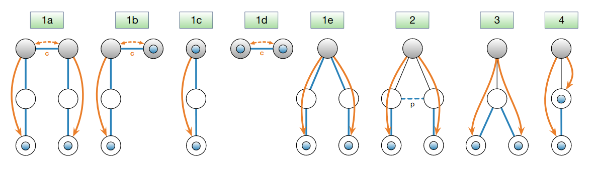

*************
Control Plane
*************

.. toctree::
   :hidden:
   :maxdepth: 1

   hidden-paths
   beacon-metadata

Introduction
============

The SCION control plane is responsible for discovering path segments and making them available to
endpoints. This includes path-segment exploration (also called "beaconing"), registration, lookup,
and finally the combination of path-segments to end-to-end paths.

The control-plane protocol is specified in the `IETF SCION Control Plane draft
<https://www.ietf.org/archive/id/draft-dekater-scion-controlplane-18.html>`_.

The **control service** is responsible for the path exploration and registration processes in the
control plane.
It is the main control-plane infrastructure component within each SCION :term:`AS`.
The control service of an AS has the following tasks:

- Generating, receiving, and propagating :term:`Path Construction Beacons (PCBs) <PCB>`.
- Selecting and registering the set of path segments via which the AS wants to be reached.
- Managing certificates and keys to secure inter-AS communication.

Path Segments
-------------

SCION distinguishes the following types of path segments:

- A path segment from a non-core AS to a core AS is an *up-segment*.
- A path segment from a core AS to a non-core AS is a *down-segment*.
- A path segment between core ASes is a *core-segment*.

So each path segment either ends at a core AS, or starts at a core AS, or both.

.. note::

   There are no SCION path segments that start and end at a non-core AS. However, when combining
   path segments into an end-to-end SCION path, shortcuts and peering-links can be used.

All path segments are reversible: A core-segment can be used bidirectionally, and an up-segment can
be converted into a down-segment, or vice versa, depending on the direction of the end-to-end path.
This means that all path segments can be used to send data traffic in both directions.

.. _control-plane-beaconing:

Path Exploration (Beaconing)
============================

**Path exploration** is the process where an AS discovers paths to other ASes. In SCION, this
process is referred to as *beaconing*.

In SCION, the *control service* of each AS is responsible for the beaconing process.
The control service generates, receives, and propagates *path-segment construction beacons (PCBs)*
on a regular basis, to iteratively construct path segments.
The beaconing process itself is divided into routing processes on two levels, where *inter-ISD* or
core beaconing is based on the (selective) sending of PCBs without a defined direction, and
*intra-ISD* beaconing on top-to-bottom propagation.
This division of routing levels is a key architectural decision of SCION and important for achieving
a better scalability.

Every core AS originates PCBs at regular intervals over its core and child links.
When PCBs are received, they are not propagated immediately, but put into temporary storage
until the next propagation event, where each AS selects the best PCBs, extends them with its own
signed *AS entry*, and sends them on: core ASes over their core links, non-core ASes over their
child links.

The origination, propagation, and selection of PCBs, and the PCB message format, are specified in
`Path Exploration or Beaconing
<https://www.ietf.org/archive/id/draft-dekater-scion-controlplane-18.html#name-path-exploration-or-beaconi>`_.

AS Entries
----------

Every AS adds a signed *AS entry* to the PCBs it originates, propagates or :ref:`registers <control-plane-registration>`.

This AS entry includes the relevant network topology information for this AS-hop
defined by the ingress and egress :term:`interface IDs <Interface ID>` of the beacon.
The so-called *hop field* includes a MAC that authorizes the use of this hop in the path
segment defined by the PCB, until it expires.
See the description of the :ref:`SCION Path <path-type-scion>` in the data plane section for more
details on the hop field format and the MAC chaining mechanism.

Additionally, an AS entry can contain :doc:`metadata <beacon-metadata>` such as the link MTU,
geographic locations of the AS routers, latencies, etc.

See `AS Entry
<https://www.ietf.org/archive/id/draft-dekater-scion-controlplane-18.html#name-as-entry>`_
for the message format and signature inputs, or :file-ref:`proto/control_plane/v1/seg.proto` for the
raw protocol definitions used in this project.

Peering Links
-------------

PCBs do not traverse peering links.
Instead, available peering links are announced along with a regular path in the individual AS
entries of PCBs.
If both ASes at either end of a peering link have registered path segments that include a specific
peering link, then it can be used during segment combination to create an end-to-end path.
See `Peering Links
<https://www.ietf.org/archive/id/draft-dekater-scion-controlplane-18.html#name-peering-links>`_.

.. _control-plane-registration:

Registration of Path Segments
=============================

**Path registration** is the process where an AS transforms selected PCBs into path segments,
"terminating" them by adding a final AS entry with a zero egress interface,
and adds these segments to the relevant path databases, thus making them available for the path
lookup process.

Up-segments are registered in the local path database of the AS.
Down-segments are registered, via a remote-procedure call, with the control service of the core AS
that originated the PCB.
Core-segments are added to the local path database of the core AS that created the segment; there is
no need to register them with other core ASes, as each core AS receives PCBs originated by every
other core AS.
The `intra-ISD <https://www.ietf.org/archive/id/draft-dekater-scion-controlplane-18.html#name-intra-isd-path-segment-regi>`_
and `core <https://www.ietf.org/archive/id/draft-dekater-scion-controlplane-18.html#name-core-path-segment-registrat>`_
registration procedures are specified in the draft.

Path Lookup
===========

An endpoint (source) that wants to start communication with another endpoint (destination), needs
up to three path segments:

- an up-segment to reach the core of the source ISD,
- a core-segment to reach a core AS in the destination ISD (either the source ISD or a remote one), and
- a down-segment to reach the destination AS.

The source AS's control service serves up-segments from its own path database, fetches core-segments
from the reachable core ASes in the source ISD, and fetches down-segments from the core ASes in the
destination ISD; it returns the segments to the endpoint, which combines them into end-to-end paths.
All remote path-segment lookups by the control service are cached.
The lookup sequence and message formats are specified in `Path Lookup
<https://www.ietf.org/archive/id/draft-dekater-scion-controlplane-18.html#name-path-lookup>`_.

On SCION end hosts, a :doc:`SCION daemon <manuals/daemon>` is usually employed to do the
path-lookup on behalf of applications. This SCION daemon also caches path-segment lookup results.

.. table:: Control services responsible for different types of path segments

   ============ ===========================
   Segment Type Responsible control service(s)
   ============ ===========================
   Up-segment   Control service of the source AS
   Core-segment Control service of core ASes in source ISD
   Down-segment Control service of core ASes in destination ISD (either the local ISD or a remote ISD)
   ============ ===========================

.. _control-plane-segment-combination:

Path-Segment Combination
========================

The last step of the path-resolution process is to combine the available up, core and down
path segments to end-to-end forwarding paths.
This path-segment combination process is done by each endpoint separately.
Typically, end hosts run the :doc:`SCION daemon <manuals/daemon>` which centralizes the
path-resolution process and returns fully formed end-to-end paths to applications.
However, applications could also choose to bypass the daemon and perform the path-resolution
directly.

The figures below illustrate the various ways in which segments can be combined
to form end-to-end paths.
See the description of the :ref:`SCION Path<path-type-scion>` for the specifics on how these
end-to-end paths are encoded in the packet header.

   Combination of path segments to paths: the blue circles represent the end
   hosts; the shaded gray circles represent core ASes, possibly in different
   ISDs; blue lines without arrow heads denote hops of created forwarding
   paths; the dashed blue line denotes a peering link (labeled "p"); orange
   lines with arrows stand for PCBs and indicate their dissemination direction;
   dashed orange lines represent core beacons exchanged over core links
   (labeled "c"). All created forwarding paths in cases 1a-1e traverse the ISD
   core(s), whereas the paths in cases 2-4 do not enter the ISD core.

.. seealso::

   :doc:`overview`
      Introduction to the SCION architecture and core concepts.

   :doc:`data-plane`
      Description of SCION packet header formats and processing rules for packet forwarding based
      the packed-carried forwarding state.

   `IETF Draft SCION Control Plane <https://datatracker.ietf.org/doc/draft-dekater-scion-controlplane/>`_
      Formal description and specification of the SCION control plane.
