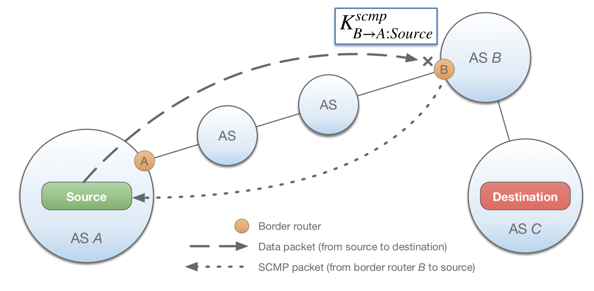

********************
Dynamically Recreatable Key (DRKey) Infrastructure
********************

This document presents the design for the Dynamically Recreatable Key (DRKey)
infrastructure.

Overview
=================
The DRKey protocol enables routers and end hosts to derive cryptographic
symmetric keys on the fly from a single local secret.

DRKey is used for the following systems:

- SCMP
- SIBRA / COLIBRI
- Security Extension
- PISKES
- OPT
- EPIC

Notation
=================

.. code-block:: text

    |                     bitstring concatenation
    ^                     superscript
    _                     subscript

    KDF_K (X)             key derivation function using key K and taking X as an input
    PRF_K (X)             pseudorandom function using key K and taking X as an input

    A                     autonomous system
    H_A                   end host identified by their IP address
    CS_A                  certificate server located in AS A

    SV_A                  AS A's local secret value

Note that the arrow notation does *not* refer to the communication direction of the key, but
rather states for which entity the key derivation must be efficient. For example,
`K_{A→B:H_B}` can be used in both directions of communication, but is directly
derivable by AS A, whereas host `H_B` might be required to fetch a key from its
local CS.

Design
=================

In the DRKey protocol, the key establishment is offloaded to the certificate server
(CS). The certificate server leverages efficient key derivation and
pseudorandom functions to derive keys in the hierarchy from top
to bottom. 

The first secret in the hierarchy (``SV_A``) is derived from a long-term ``master_secret``.
How often the ``master_secret`` must be rotated is up for discussion.

Derivation scheme
=================

We define two types of derivation the :ref:`drkey-specific-derivation` derivation and 
the :ref:`drkey-generic-derivation`. Both of them leverage the 4-level derivation scheme.

4-level derivation
--------------------

.. list-table::
   :widths: 50 50 50
   :header-rows: 1

   * - Identifier
     - Derivation
     - Name
   * - ``SV_A^{proto}`` 
     - ``KDF(input)``
     - Level 0 key, secret value
   * - ``K_{A->B}``
     - ``PRF_{SV_A^{proto}}(B)``
     - Level 1 key, AS-to-AS
   * - ``K_{A->B:H_B}``
     - ``PRF_{K_{A->B}}(H_B)``
     - Level 2 "to" key, AS-to-host
   * - ``K_{A:H_A->B}``
     - ``PRF_{K_{A->B}}(H_A)``
     - Level 2 "from" key, host-to-AS
   * - ``K_{A:H_A->B:H_B}``
     - ``PRF_{K_{A:H_A->B}}(H_B)``
     - Level 3 key, host-to-host
     

The ``input`` in ``KDF(input)`` can be defined as 
``input = "len(master_secret) || master_secret || proto || epoch_begin || epoch_end"``.

`proto` can be defined as a fixed-size value, e.g. a 2-byte identifier.

The PRF derivation for every key includes the *type* ("AS-to-AS", ""AS-to-host", 
"host-to-AS" and "host-to-host"). This is useful to avoid deriving the same values 
for intended different keys. For instance, it outputs (with high probability) 
``K_{A:H_A->B} != K_{A->B:H_B}`` when ``H_A==H_B``. 

**0th level key**

Each AS locally derives one ``SV_A^{proto}`` per protocol and epoch. This secret value 
is renewed at every epoch and it is only shared with trustworthy entities that require
to derive keys on the fly for the specified protocol.

**1st level key**

These keys are derived locally in the AS_A certificate server (CS_A) and exchanged
with remote certificate servers (e.g. ``K_{A->B}`` is shared with the CS_B).

**2nd level "from" key**

The "from" keys are derived in the certificate servers using the 1st level symmetric keys. 
It is intended to be used as an intermediate derivation 
allowing the node holding this key to derive 3rd level keys locally.
For instance, the key ``K_{A:H_A->B}`` is only available to A:H_A and trusted 
infrastructure.

**2nd level "to" key**

The "to" keys are also derived in the certificate servers using the 1st level 
symmetric keys, however these keys are intended to be used for communication. 
For example, the key ``K_{A->B:H_B}`` is shared between AS_A trusted nodes and B:H_B.

**3rd level key**

The 3rd level is derived in H_A and CS_B using the 2nd "from" level key. This key
is available to both hosts H_A and H_B.

.. _drkey-specific-derivation:

Protocol-specific derivation
--------------------

.. code-block:: text
    
    SV_A^{proto}          (0th level)
    | 
    |
    K_{A→B}^{proto}           (1st level)
    | 
    +-------------------------------------+
    |                                     |
    K_{A:H_A->B}^{proto}           K_{A->B:H_B}^{proto}         (2nd level)
    |   
    K_{A:H_A->B:H_B}^{proto}                                (3rd level) 

.. _drkey-generic-derivation:

Generic-protocol derivation
--------------------

.. code-block:: text

    SV_A          (0th level)
    | 
    |
    K_{A→B}           (1st level)
    | 
    +-----------------------------------------+
    |                                         |
    K_{A:H_A->B}^{protocol}           K_{A->B:H_B}^{protocol}         (2nd level)
    |   
    K_{A:H_A->B:H_B}^{protocol}                                (3rd level) 

The generic-protocol derivation can be thought of as a special case of the 
protocol-specific derivation for the 0th and 1st level keys. 
For instance, using a special `proto` value in the protocol-specific scheme, e.g. 0 or "". 

This derivation scheme allows applications to define "niche" protocols. 
`protocol` is a (variable or fixed size) value identifying this "niche" protocol.

Key Validity time
=================

Epochs
-----------------
An epoch is an interval between a starting and ending point in time. The epoch
length can be chosen by a given AS and can change over time, however, epochs
must not overlap. Thus, a secret value is associated with exactly one epoch.

In the design, every AS can define different epoch lengths for each 
protocol-specific 0th level key.

Defining a reasonable lower bound for the epoch length used in DRKey to avoid 
nonsensical scenarios is up for discussion.

Grace period
-----------------
We define a short overlapping period in which the protocol accepts packets with the key 
for the previous epoch *i-1* and also for the current one *i*. This period should be 
ideally as short as possible, although long enough to allow using the same key for 
single packet request/response use cases (e.g. a few seconds).

Validity periods
----------------
ASes will be allowed to prefetch keys some time before the key for the current epoch expires.
This period must be long enough to allow every remote AS to attempt the key prefetching
enough times to be succesful even in the presence of failures. However, this period
should not be too long, since the issuer AS is not assumed to carry out any changes
once it has issued keys for a given epoch (e.g. modifying SV epoch duration, 
rotating the master secret, etc.).

We suggest establishing a global fixed period of 15 minutes.

Whether ASes are allowed to request/serve keys for past epochs is up for discussion.

Key establishment
=================

1st level key establishment
^^^^^^^^^^^^^^^^^^^^^^^

The 1st level key establishment occurs between certificate servers located in different ASes.
The subject-AS on the slow side (i.e. the AS requesting the key) will establish a TLS secure connection with
the issuer-AS  on the fast side (i.e. the AS serving the key). Both parties identify each other by using
the CP-PKI infrastructure.

The 1st level key request message contains the `validTime` for which the key must be active 
and the protocol. The 1st level key response includes the symmetric key along with the epoch
for which this key will be valid.

0th/2nd/3rd level key establishment 
^^^^^^^^^^^^^^^^^^^^^^^

Even though 0th/2nd/3rd level key exchange happens within the same AS (i.e. intra-AS communication),
the protocol should establish a secure channel. This would avoid that unintended hosts in the 
AS can eavesdrop on symmetric keys that are not intended to them.

The certificate server will only respond to the specific request if the requesting host
is authorized to receive the requested key. This is especially important in the 0th level key 
case since only trustworthy nodes should be authorized to receive this key.

The 0th level key request contains the `validTime` and the specific protocol. The certificate 
server responds with the SV and the epoch for which this key will be valid.

The 2nd/3rd level key request includes the precise key type, the `validTime` and 
the necessary host and AS information (depending on the key type).
The server responds with the symmetric key and the epoch.

Key rollover
=================

Shared symmetric keys are short-lived to avoid explicit key revocation. However,
letting all keys expire at the same time would lead to peaks in key requests.
Such peaks can be avoided by spreading out key expiration, which in turn will
lead to spreading out the fetching requests. To this end, we introduce the
following deterministic mapping:

.. code-block:: text
  
  offset : (A, B) → [0, t)

that uniformly maps the AS identifiers of the source in AS A and the destination
in AS B to a range between 0 and `t`. `t` should be carefully chosen so that gaps cannot
exist even if the epoch duration for a given SV changes. 
The offset is used to determine the validity period of a key by determining the 
secret value ``SV_A^j`` that is used to derive ``K_{A→B}`` at the current sequence j such that:

.. code-block:: text

  [ start(SV_A^j) + offset(A, B), start(SV_A^j+1) + offset(A, B) )

.. image:: fig/offset.png

The offset function is AS-specific. By default, we suggest to use a function
that uniformly distributes the offset values in the following interval:

.. code-block:: text

  [0, minimum epoch length / 2 )

Key exchange message format
=================

.. code-block:: text

    message DRKeySVRequest{
      // Point in time when the requested SV is valid.
      Timestamp val_time = 1;
      // Protocol-specific value.
      Enum protocol_id = 2;
    }

    message DRKeySVResponse{
      // Begin of the SV validity period.
      Timestamp epoch_begin = 1;
      // End of the SV validity period.
      Timestamp epoch_end = 2;
      // SV Key.
      bytes drkey = 3;
    }
    
    message DRKeyLvl1Request{
      // Point in time when the requested DRKey is valid.
      Timestamp val_time = 1;
      // Protocol-specific value.
      Enum protocol_id = 2;
    }

    message DRKeyLvl1Response{
      // Begin of validity period.
      Timestamp epoch_begin = 1;
      // End of validity period.
      Timestamp epoch_end = 2;
      // Lvl1 DRKey.
      bytes drkey = 3;
    }

    // DRKeyLvl2Request encompasses 2nd and 3rd level key requests
    message DRKeyLvl2Request{
      // Protocol value. 
      Enum protocol_id = 1;
      // Requested DRKeyType.
      Enum req_type = 2;
      // Point in time where requested DRKey is valid.
      Timestamp val_time = 3;
      // Src ISD-AS of the requested DRKey.
      uint64 src_ia = 4;
      // Dst ISD-AS of the requested DRKey.
      uint64 dst_ia = 5;
      // Src Host of the request DRKey (optional).
      bytes src_host = 6;
      // Dst Host of the request DRKey (optional).
      bytes dst_host = 7;
      // Additional information (optional).
      bytes misc = 8;
    }

    message DRKeyLvl2Response{
      // Derived DRKey.
      bytes drkey = 1;
      // Begin of validity period of DRKey.
      Timestamp epoch_begin = 2;
      // End of validity period of DRKey.
      Timestamp epoch_end = 3;
      // Additional information (optional).
      bytes misc = 4;
    }

DRKey use cases
=================

Key selection in DRKey is based on which entity requires fast key derivation
(without querying the required key at the certificate server). In the following,
we discuss an example usage of DRKey where key derivation is performed on border
routers (BR).

Key Derivation by AS Infrastructure
-----------------

In the case where key derivation is performed by BRs (e.g., SCMP), the BR must be
able to directly derive the key without requiring to fetch an additional key.

For example, a host in AS_A sends a data packet to a host in AS_C, but forwarding
fails (e.g., due to an expired hop field) at the ingress interface of AS B’s border
router ``BR_B``. The router creates an SCMP message, which describes the problem. When
the packet is created, then ``BR_B`` derives a key for authenticating packets destined
for the source based on the key shared with AS A and calculates a MAC over the
packet. Theoretically either ``K_{B→A:Source}`` or ``K_{A:Source→B}`` could be used to
authenticate the packet. However, as AS B shares its secret value ``SV_B`` with
``BR_B``, ``BR_B`` can directly derive all first- and second-level keys ``K_{B→*}``. 
Thus, ``K_{B→A:Source}`` must be used for authenticating the SCMP message. 
On the source side, the host either has the same key already cached, or it 
contacts its CS and queries the missing key.

The keys in this use case example are SCMP protocol-specific keys. 
The superscript ``SCMP`` is omitted for brevity. 

