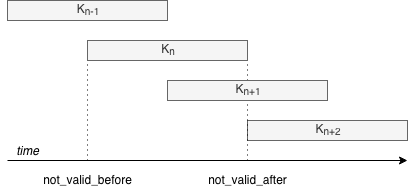
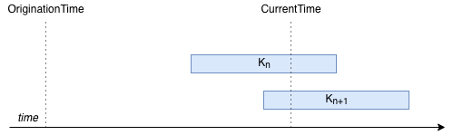
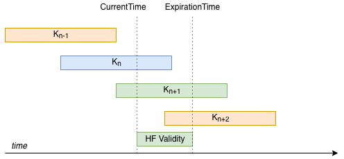
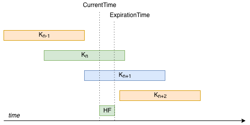
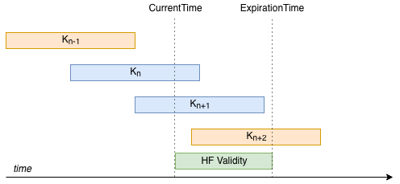

******************************
Forwarding key rollover design
******************************

This document describes an implementation for key rollover in a SCION AS.

Because key rollover is an AS-local concept (the same AS does both MAC
computation and verification), it is not a part of the SCION protocol. Every AS
is free to implement these aspects however it sees fit, and this document
presents one possible implementation.

Notation
========

``ExpirationField``: The value of the 1-byte HopField **ExpTime** field inserted
by the local beacon server. The linear scale as defined in the SCION book is
used. This is unknown, and must be computed by the beacon server during
beaconing (subject to AS policy).

``MACField``: The value of the 3-byte HopField **MAC** field inserted by the local
beacon server. This is unknown, and must be computed by the beacon server during
beaconing.

``OriginationTime``: The timestamp when a beacon is created. This is the timestamp
that is included in the Info Field of the segment. This is hardcoded in the
segment and cannot be changed.

``ExpirationTime``: The absolute point in time when the hop field expires. This is
defined as ``OriginationTime + (1 + ExpirationField) * 337s``, where ``s`` refers to
seconds.

``MasterKey``: The key used to derive forwarding keys.

This document explains how, given ``OriginationTime``, the CS should compute
``ExpirationField`` and ``MACField`` to maximize the lifetime of the segment, in a
way that the border router can later successfully verify the MAC if and only if
it was created by the CS.

Design
======

Properties
----------

Each key has two attributes:

- ``NotValidBefore``: the absolute time before which the key MUST NOT be used to
  compute or verify MACs;
- ``NotValidAfter``: the absolute time after which the key MUST NOT be used to
  compute or verify MACs;

If at a point of reference the current time is greater or equal to
``NotValidBefore`` and less than ``NotValidAfter``, a key is said to be
**valid**.

**Property 1**: A constant number of keys must be valid at any time.

Let ``KeyLifetime`` be defined as ``NotValidAfter - NotValidBefore``.

**Property 2**: ``KeyLifetime`` must be constant for all keys.

**Property 3**: A key rollover sequence is defined as a sequence of keys with
the following constraints:

- Properties 1 and 2 must hold
- ``NotValidBefore`` values need to be monotonically increasing and equally
  spaced in time

The diagram below shows a well formed key rollover sequence of size 4, with 2
keys valid at the same time: ``K_n`` and ``K_(n+1)``.

For simplicity, for the rest of this document we assume the following sizes:

- exactly 2 keys are valid at any time
- the rollover sequences size is 4

``OriginationTime`` is problematic because it is rarely decided by the local AS.
Depending on how beaconing happens upstream, ``OriginationTime`` can be so far in
the past that no forwarding key can be valid for the whole lifetime of the path.
However, assuming somewhat comparable clocks between CSes and routers, it is
irrelevant if the key is valid for any point in time prior to the moment when
the MAC is computed.

Refer to the diagram below. In this diagram, a CS must propagate an old beacon,
and must thus choose which of the two currently valid keys, ``K_n`` and ``K_(n+1)``,
to use for the computation of the MAC. The beacon is still valid, but its
``OriginationTime`` is very far in the past, so far that no currently valid key is
valid for both. The question the CS must ask itself is: what is the remaining
lifetime of this path going to be, according to my security policy?
``OriginationTime`` is irrelevant to the answer, which leads to the next property.

**Property 4**: ``OriginationTime`` must not be used directly for key selection;
``ExpirationTime`` should be used instead.

If ``OriginationTime`` is not used by the CS when deciding to compute the MAC, it
also cannot be used by the router when verifying the MAC (note that it *will* be
used by the router when deciding if the HF is still within its predefined lifetime).

The CS must choose between ``K_n`` and ``K_(n+1)``. The only value it can publish about
its decision is the ``ExpirationTime`` (which it does via the ``ExpirationField`` in
the HF). The router will later need to decide which key to use based only on the
``ExpirationTime``; therefore, the choice must be unambiguous.

We remove the ambiguity by always choosing the key that is valid at
``ExpirationTime`` and expires last. We showcase this with two examples.

In the diagram below, a beacon must be constructed, and at ``CurrentTime`` keys
``K_n`` and ``K_(n+1)`` are valid. The CS wants to build a HF with a desired remaining
lifetime of half of ``KeyLifetime``. Because ``K_n`` is not valid for the desired
remaining lifetime, ``K_(n+1)`` must be chosen.

In the diagram below, the CS wants to construct a HF with a much shorter
lifetime. Both keys are valid for the remaining lifetime. For the router to later
choose a key unambiguously, it must select ``K_n``.

The router does the same computation to determine the key.

**Property 5**: Given the restrictions established in this section (exactly 2
keys valid), MAC computation is always done by selecting the key with the
smallest ``NotValidAfter`` value that is strictly greater than the desired
``ExpirationTime`` (the strict here is important, because key lifetime is an open
interval on right).

There are situations where the desired remaining lifetime is impossible to
satisfy. This might be always incompatible with key policy (the desired
remaining lifetime is greater than key lifetime), or no valid key might exist at
current time.

The latter situation is described in the diagram below. Desired remaining
lifetime is 3/4 of ``KeyLifetime``. Thus, no valid key can be found.

To avoid this, we add the constraint that desired remaining lifetime be at
smaller or equal to 1/2 of ``KeyLifetime``. If an AS wants paths to have maximum
lifetime while having constant remaining lifetime, then desired remaining
lifetime can be set to 1/2 ``KeyLifetime``.

Implementing the CS
-------------------

The CS needs to compute two values:

- ``ExpirationField``
- ``MACField``

ExpirationField
^^^^^^^^^^^^^^^

The ``ExpirationField`` depends on the policy of desired remaining HF lifetime.
Taking into account **Property 5**, we select a constant desired remaining HF
lifetime of half of ``KeyLifetime``.

Let ``DesiredRemainingLifetime`` be the time the HF is going to be valid for,
relative to current time. This is a value chosen by AS security policy; the
policy will usually specify a ``MaxRemainingLifetime``, which is the upper bound
on acceptable ``DesiredRemainingLifetime``.

We add the constraint that the HF MUST NOT be valid for longer than a
``DesiredRemainingLifetime``, but CAN be valid for less. This leads to a cleaner
intuition of the security offered by the parameter, where stricter is better.

``ExpirationField`` is computed as follows:

.. code-block:: text

   ExpirationField = floor((CurrentTime - OriginationTime + DesiredRemainingLifetime) / 337s) - 1

If ``ExpirationField`` is negative, then the ``DesiredRemainingLifetime`` is too
short and not supported by the SCION protocol.

If ``ExpirationField`` is more than 255, then the ``DesiredRemainingLifetime`` is
too long and not supported by the SCION protocol *for this specific beaconing attempt*.
Because the value depends on ``CurrentTime``, and can be the case that
the ``DesiredRemainingLifetime`` can be satisfied for only certain beacons.

Note that an increase of 1 in the value of ``ExpirationField`` leads to an
increase of 337 seconds in the lifetime of the HF. This means that the actual
remaining lifetime of the HF is an approximation of the initial
``DesiredRemainingLifetime``.

For CSes that originate the beacon, ``CurrentTime - OriginationTime`` SHOULD be 0.

MACField
^^^^^^^^

First, the secret key needs to be computed from the ``MasterKey``. The function we
recommend is:

.. code-block:: text

   Key = HKDF(pad128(2*ExpirationTime//KeyLifetime - 1) || MasterKey)

where ``pad128`` is a left padding function to a bit-length of 128, ``||`` is the bit
concatenation operator, ``//`` is integer division with integer quotient, and
``MasterKey`` is a shared secret of the AS. How to disseminate ``MasterKey`` is up
for discussion, with the solution of storing it in a file on-disk being the
simplest option for now. Other systems like
`Vault <https://www.vaultproject.io/>`__ might be useful in this scenario, if
storing it on disk is undesirable. ``MasterKey`` should be refreshed periodically
(e.g., once every 6 months).

Then, the ``MACField`` is computed as defined in the SCION protocol.

Implementing the router
^^^^^^^^^^^^^^^^^^^^^^^

When the router receives a path for processing, it must verify the HF. The first
step in this process is computing the MAC verification key. To compute the key,
first the `ExpirationTime` must be computed:

.. code-block:: text

   ExpirationTime = OriginationTime + (1 + ExpirationField) * 337s

If ``ExpirationTime < CurrentTime``, the router SHOULD return an error stating as
such. If the check is successful, then the same function as in the CS can be
used to compute the key:

.. code-block:: text

   Key = HKDF(pad128(2*ExpirationTime//KeyLifetime - 1) || MasterKey)

If ``Key`` is not valid at ``CurrentTime``, then HF verification MUST fail.

Fast key lookup
^^^^^^^^^^^^^^^

It is expensive to compute the ``Key`` for every MAC. A key rollover sequence
could be used instead. We show how a rollover sequence of size 2 can be used and
updated. Let ``KeyContext`` be this rollover sequence. The sequence has the
following fields:

- ``Key0``, the first valid key;
- ``Key1``, the second valid key;
- ``ExpirationTimeKey0``, the expiration time of the first key;
- ``ExpirationTimeKey1``, the expiration time of the second key;

Let ``K_n`` be the sequence of forwarding keys, with ``n`` an integer value greater
or equal to 0. ``K_0`` is active from moment 0 (beginning of unix time) to
``KeyLifetime`` (excluding ``KeyLifetime``, so open interval on ``KeyLifetime``),
``K_1`` is active from ``KeyLifetime//2`` to ``3*KeyLifetime//2``, and so on and so
forth. Key ``K_n`` is thus valid from ``n*KeyLifetime//2`` to
``(n+2)*KeyLifetime//2``. Whenever a new key becomes valid, the following procedure runs:

.. code-block:: python

   set_new_key(NewKey, ExpTimeNewKey)
       NewKeyCtx.Key0 = CurrentKeyCtx.Key1
       NewKeyCtx.ExpirationTimeKey0 = CurrentKeyCtx.ExpirationTimeKey1
       NewKeyCtx.Key1 = NewKey
       NewKeyCtx.ExpirationTimeKey1 = ExpirationTimeNewKey
       update_key_ctx(NewKeyCtx)

For each packet, the router must first compute the expiration time of the HF, similarly to the CS:

.. code-block:: text

   ExpirationTime = OriginationTime + (1 + ExpirationField) * 337s

.. code-block:: python

   get_key(ExpirationTime)
       if ExpirationTime < CurrentKeyCtx.ExpirationTimeKey0
           return CurrentKeyCtx.Key0
       else
           return CurrentKeyCtx.Key1

The key can then be used by the router to verify the MAC.

Recommended values
------------------

.. code-block:: text

   MaxDesiredRemainingLifetime: 3 days
   KeyLifetime: 6 days
   MasterKey bit length: 128 bits
   Representation of pad(n) for HKDF: 128-bit unsigned int representation of n, in big endian
   HKDF HMAC function: HMAC-SHA256
   MasterKey lifetime: 6 months
