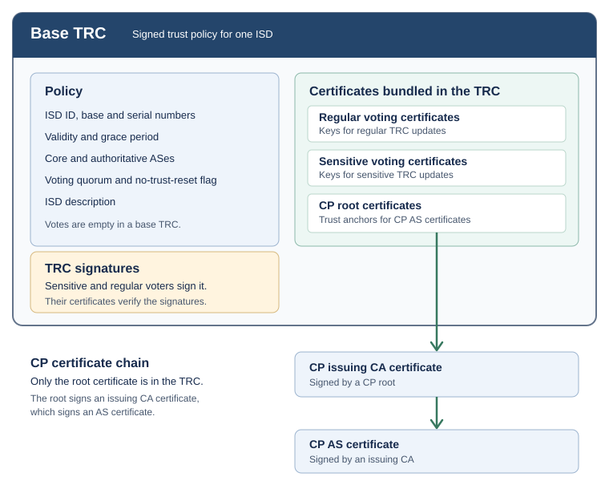

********************************************
Trust Root Configuration (TRC)
********************************************

The **Trust Root Configuration (TRC)** is a signed collection of `X.509 v3
certificates
<https://www.ietf.org/archive/id/draft-dekater-scion-pki-15.html#section-2-2>`__
and ISD policy information that establishes the trust anchors of an ISD.
It contains the **CP Root Certificates** that root the verification path for
**CP AS Certificates**, together with the **Sensitive Voting Certificates** and
**Regular Voting Certificates** and the policy used to vote on the next TRC.

The TRC payload is a SCION-defined ASN.1 structure, signed with CMS
[RFC5652]_. The certificates it carries follow [RFC5280]_ and [X509]_ with more
restrictive SCION constraints. The `SCION PKI draft
<https://www.ietf.org/archive/id/draft-dekater-scion-pki-15.html>`_ defines the
ASN.1 module, fields, signing, updates and certification paths.

.. _trc-format:

TRC Format
==========

The TRC payload is a DER-encoded container holding the ISD's policy fields and the
set of self-signed certificates that anchor trust for the ISD. Its ``iD``
identifies the ISD and the TRC's base and serial numbers.

A TRC whose base number equals its serial number is a `base TRC
<https://www.ietf.org/archive/id/draft-dekater-scion-pki-15.html#name-id>`_. The
initial TRC has base number 1 and serial number 1. A `trust reset
<https://www.ietf.org/archive/id/draft-dekater-scion-pki-15.html#name-trust-reset>`_
starts a new update chain. Its base number should be one more than the serial
number of the last TRC produced by a non-compromised update. `Table 6
<https://www.ietf.org/archive/id/draft-dekater-scion-pki-15.html#table-6>`_
shows an example.

The ``validity`` and ``gracePeriod`` fields govern when the TRC can be used and
how long its predecessor may remain active. The ``noTrustReset`` field controls
whether the ISD permits a trust reset, while ``description`` describes the ISD.

The remaining fields identify the parties that operate and update the ISD's
trust infrastructure:

- ``coreASes`` lists the ASes in the ISD core, which initiate path discovery.
- ``authoritativeASes`` lists the core ASes that keep the latest TRC and start
  announcing TRC updates. Every authoritative AS is also a core AS.
- ``certificates`` holds the self-signed **CP Root Certificates** and the
  **Regular** and **Sensitive Voting Certificates**. The root certificates
  anchor the certificate chains for CP ASes. The voting certificates identify
  the voters authorized to sign TRC updates; a voter need not be a core AS or
  even have an AS number.
- ``votingQuorum`` specifies how many votes are required for an update.
  ``votes`` identifies the voting certificates in the predecessor TRC whose
  holders signed this TRC; it is empty in a base TRC.

   A base TRC and its certificate hierarchy, simplified from `Figure 2 of the SCION PKI
   draft <https://www.ietf.org/archive/id/draft-dekater-scion-pki-15.html#figure-2>`_.

The field definitions and certificate-set constraints are specified in `TRC Fields
<https://www.ietf.org/archive/id/draft-dekater-scion-pki-15.html#name-trc-fields>`_,
and the ASN.1 module in `TRC in ASN.1 Syntax
<https://www.ietf.org/archive/id/draft-dekater-scion-pki-15.html#name-trc-in-asn1-syntax>`_.

.. _signed-trc-format:

Signed TRC Format
-----------------

The TRC payload is signed as a CMS *SignedData* content and encapsulated in a CMS
*ContentInfo*, following [RFC5652]_ with SCION-specific restrictions (an empty
``certificates`` field, ``id-data`` content type, and ``IssuerAndSerialNumber``
signer identifiers). The exact CMS profile is specified in `TRC Signature Syntax
<https://www.ietf.org/archive/id/draft-dekater-scion-pki-15.html#name-trc-signature-syntax>`_.
In the `open-source SCION implementation <https://github.com/scionproto/scion>`__,
each *SignerInfo* also carries signed attributes with a message-digest attribute
([RFC5652]_, Section 11.2) computed over the DER-encoded TRC payload.

.. _trc-update:

TRC Update
==========

A **regular update** keeps the voting quorum, the core ASes, the authoritative ASes,
the number and distinguished names of all root and voting certificates,
and the set of **Sensitive Voting Certificates**. It may replace **Regular
Voting Certificates** and **CP Root Certificates**. Each replaced regular voting
certificate must vote, and each replaced root certificate must sign.
All votes come from **Regular Voting Certificates**. Every other update is a
**sensitive update**, and all its votes come from **Sensitive Voting Certificates**.
No update changes the ISD, the base number or ``noTrustReset``.
Every update increments the serial number by one.

The update rules and verification algorithm are specified in `TRC Updates
<https://www.ietf.org/archive/id/draft-dekater-scion-pki-15.html#name-trc-updates>`_.

.. _sensitive-voting-certificate:

.. _regular-voting-certificate:

Both voting certificate types are self-signed end-entity certificates. Their
recommended maximum validity period is `5 years
<https://www.ietf.org/archive/id/draft-dekater-scion-pki-15.html#section-2.4-4>`__.
`Voting Certificates
<https://www.ietf.org/archive/id/draft-dekater-scion-pki-15.html#name-voting-certificates>`_
describes their role. `X.509 Certificate Profiles and Constraints
<https://www.ietf.org/archive/id/draft-dekater-scion-pki-15.html#name-x509-certificate-profiles-a>`_
and `Extensions
<https://www.ietf.org/archive/id/draft-dekater-scion-pki-15.html#name-extensions>`_
specify their profile.

.. _trc-equality:

TRC Equality
============

The signer information in a signed TRC is an unordered set ([RFC5652]_) and can
be reordered without affecting verification. Two signed copies of one TRC can
therefore differ byte for byte. For this reason, two TRCs are equal if and only
if their payloads are byte-equal. This is sufficient because the payload
determines exactly which signatures must be attached. See `TRC Equality
<https://www.ietf.org/archive/id/draft-dekater-scion-pki-15.html#name-trc-equality>`_.

In the open-source SCION implementation, the trust database compares TRCs by
the SHA-256 hash of their payload and skips a received TRC whose payload it
already stores.

.. _trc-selection:

CP Certification Path
=====================

The certification path of a **CP AS Certificate** starts in a **CP Root
Certificate**. To validate a path, the relying party builds the trust anchor pool
of **CP Root Certificates** from the applicable TRCs (selected by verification
time, accounting for validity and grace periods) and verifies candidate paths
against it. The selection algorithm and the construction of the trust anchor pool
are specified in `Certification Path: Trust Anchor Pool
<https://www.ietf.org/archive/id/draft-dekater-scion-pki-15.html#name-certification-path-trust-an>`_.

.. _supported-algorithms:

Supported Algorithms
====================

The signature algorithms for TRCs are the same as for certificates
(see :ref:`certificate-signature`).
