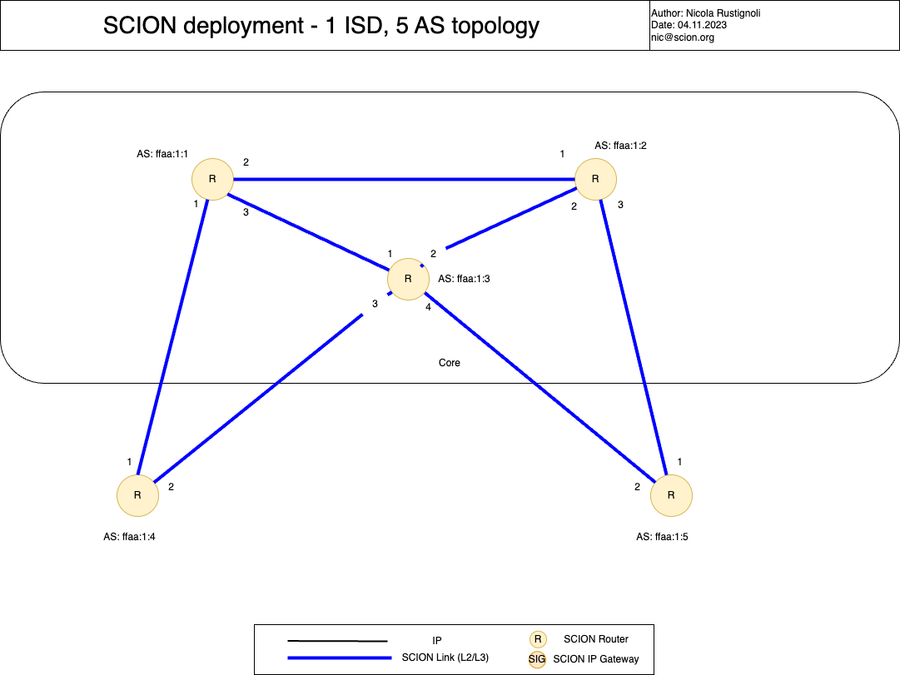

.. _deployment-guide:

Deployment Tutorial
===================

This document helps you set up a SCION demo configuration, which consists of a stand-alone full-scale SCION environment distributed among five computers. The demo environment consists of one SCION Isolation Domain (ISD), with three core ASes and two non-core, leaf ASes.

- If you want to go deep and help develop SCION, use the development environment. See https://docs.scion.org/en/latest/dev/setup.html
- If you want to use SCION in a large environment, use the SCIONLab. For more information, see https://www.scionlab.org/

Setup
-----

This first section provides an overview of the setup and topology of the sample demo environment.

Infrastructure
..............

The sample SCION demo setup consists of one ISD with three core ASes and two non-core, leaf ASes. The following table lists some details of the sample ISD and each AS in it, such as the DNS names, the ISD- and AS numbers, the kind of AS (core or leaf) and the IP addresses. This infrastructure could be virtual machines or bare metal.

======== ==== ========= ======== =========== =============== ====================== ======== ====
Hostname ISD  AS        Purpose  Notes       IP Address      OS                     Disk     RAM
======== ==== ========= ======== =========== =============== ====================== ======== ====
scion01  42   ffaa:1:1  Core     Voting      10.0.1.1        **Ubuntu** 22.04.3 LTS 4 GB     1 GB
scion02  42   ffaa:1:2  Core     Non-Voting  10.0.1.2        **Ubuntu** 22.04.3 LTS 4 GB     1 GB
scion03  42   ffaa:1:3  Core     Non-Voting  10.0.1.3        **Ubuntu** 22.04.3 LTS 4 GB     1 GB
scion04  42   ffaa:1:4  Leaf                 10.0.1.4        **Ubuntu** 22.04.3 LTS 4 GB     1 GB
scion05  42   ffaa:1:5  Leaf                 10.0.1.5        **Ubuntu** 22.04.3 LTS 4 GB     1 GB
======== ==== ========= ======== =========== =============== ====================== ======== ====

*Table 1: Required Infrastructure*

Sample SCION Demo Topology
..........................

The topology of the ISD includes the inter-AS connections to neighboring ASes, and defines the underlay IP/UDP addresses of services and routers running in this AS. This is specified in topology files - this guide later explains how to configure these files. A following graphic depicts the topology on a high level.

   *Figure 1 - Topology of the sample SCION demo environment. It consists of 1 ISD, 3 core ASes and 2 non-core ASes.*

.. _prerequisites:

Infrastructure Prerequisites
----------------------------

This deployment requires five virtual machines (VMs) - one for each AS. 
, one per AS in our ISD/demo environment. We recommend using Ubuntu VMs for this.

- 5 VMs - **Ubuntu** 22.04.3 LTS (Jammy Jellyfish). For more information, see `Ubuntu Jammy Jellyfish <https://releases.ubuntu.com/jammy/>`_. These 5 virtual machines resemble the ASes shown in the setup overview above - each machine is one AS.

.. note::

   It is useful to give each VM a name that fits/suits the setup of your demo environment.

Tasks to Perform
----------------

To create the sample ISD environment, you need to perform the following tasks, in this order:

- Task 1: Installation (:ref:`step1`)
- Task 2: Configuration (:ref:`step2`)
- Task 3: Testing your environment (:ref:`step3`)

The following sections explain the required tasks, one section per task.

.. _step1:

Installation
............

This section guides you through the installation of the SCION software.
Here is where you can get the software:

- Install from packages (coming later in 2024).
- Install from binaries. The latest software can be found at:

  - `Latest official release <https://github.com/scionproto/scion/releases/>`_
  - `Latest nightly build <https://buildkite.com/scionproto/scion-nightly/builds/latest/>`_

In this example, we install software with the following release version:
*scion_v0.9.1_amd64_linux.tar.gz*

Note that we have to install the software five times: Once per virtual machine we created previously. Proceed as described in the following sections.

Downloading and Installing the SCION Software
~~~~~~~~~~~~~~~~~~~~~~~~~~~~~~~~~~~~~~~~~~~~~

To download the software and install it on your virtual machines, execute the following commands in your shell/terminal:

.. note::

   These steps are the same for each virtual machine. So you have to repeat these steps five times, once per virtual machine.

.. code-block::

   sudo -i

   cd /tmp

   wget https://github.com/scionproto/scion/releases/download/v0.9.1/scion_v0.9.1_amd64_linux.tar.gz

   mkdir /usr/local/scion

   cd /usr/local/scion

   tar xfz /tmp/scion_v0.9.1_amd64_linux.tar.gz

As each virtual machine represents an AS in your demo environment, we will now refer to the VMs as ASes.

.. _step2:

Configuration
.............

To configure your demo SCION environment, perform the following steps.

Step 1 - Configure the Topology (Files)
~~~~~~~~~~~~~~~~~~~~~~~~~~~~~~~~~~~~~~~

First, you have to configure the topology files for your demo environment.
You have to create one "global" topology file which describes the setup of the entire ISD environment, as well as one specific AS topology file per AS in your demo ISD. The topology file of an AS specifies all the inter-AS connections to neighboring ASes, and defines the underlay IP/UDP addresses of services and routers running in this AS. This implies that the topology file will be different for each AS in your demo environment.

The topology information is needed by Router and Control Service instances, and also by end-host applications. For more information on the topology files, see `<https://docs.scion.org/en/latest/manuals/common.html#topology-json>`_

1. First, create a "global" topology file with the name *GlobalDeploymentTopology.topo*.

2. Fill this file with the following content:

   .. code-block::

      ASes:
        "42-ffaa:1:1":
          core: true
          voting: true
          authoritative: true
          issuing: true
        "42-ffaa:1:2":
          core: true
          cert_issuer: 42-ffaa:1:1
        "42-ffaa:1:3":
          core: true
          cert_issuer: 42-ffaa:1:1
        "42-ffaa:1:4":
          cert_issuer: 42-ffaa:1:1
        "42-ffaa:1:5":
          cert_issuer: 42-ffaa:1:1

      links:
        - {a: "42-ffaa:1:1#1", b: "42-ffaa:1:4#1", linkAtoB: CHILD}
        - {a: "42-ffaa:1:1#2", b: "42-ffaa:1:2#1", linkAtoB: CORE}
        - {a: "42-ffaa:1:1#3", b: "42-ffaa:1:3#1", linkAtoB: CORE}
        - {a: "42-ffaa:1:2#2", b: "42-ffaa:1:3#2", linkAtoB: CORE}
        - {a: "42-ffaa:1:2#3", b: "42-ffaa:1:5#1", linkAtoB: CHILD}
        - {a: "42-ffaa:1:3#3", b: "42-ffaa:1:4#2", linkAtoB: CHILD}
        - {a: "42-ffaa:1:3#4", b: "42-ffaa:1:5#2", linkAtoB: CHILD}

3. Save the just-created global topology file (with the name *GlobalDeploymentTopology.topo*).

4. Now you have to create a topology file per AS. Sample topology files for each AS in our sample ISD environment are listed below. Click on the file name to download it, then copy the file to the corresponding AS.

   - **AS 1 (ffaa:1:1)**: `topology1.json <https://github.com/cdekater/scion/blob/ietf118-hackathon/doc/deploy/topology1.json>`_

   - **AS 2 (ffaa:1:2)**: `topology2.json <https://github.com/cdekater/scion/blob/ietf118-hackathon/doc/deploy/topology2.json>`_

   - **AS 3 (ffaa:1:3)**: `topology3.json <https://github.com/cdekater/scion/blob/ietf118-hackathon/doc/deploy/topology3.json>`_

   - **AS 4 (ffaa:1:4)**: `topology4.json <https://github.com/cdekater/scion/blob/ietf118-hackathon/doc/deploy/topology4.json>`_

   - **AS 5 (ffaa:1:5)**: `topology5.json <https://github.com/cdekater/scion/blob/ietf118-hackathon/doc/deploy/topology5.json>`_

Step 2 - Generate All Required Certificates
~~~~~~~~~~~~~~~~~~~~~~~~~~~~~~~~~~~~~~~~~~~

The next step is to generate all required certificates by using the global topology file. Proceed as follows:

1. To generate all required certificates using the global topology file, execute the following command:

   .. code-block::

      /usr/local/scion/scion-pki testcrypto -t GlobalDeploymentTopology.topo

   This will generate all the required keys in the *gen/* directory.

2. Now you have to distribute the just-generated keys to the AS routers. Proceed as follows:

   - Copy the *gen/* directory with its content to each of the five AS routers. **TODO**
   - For each AS, execute the commands in the following code block. Pay attention to the following:

     - All lines except for the last line are the same for each AS.
     - The part *ASffaa_1_1* in the last line needs to be adapted per AS, so that it contains the correct AS number for the corresponding AS.

     .. code-block::

        mkdir -p /etc/scion/keys
        dd if=/dev/urandom bs=16 count=1 | base64 - > /etc/scion/keys/master0.key
        dd if=/dev/urandom bs=16 count=1 | base64 - > /etc/scion/keys/master1.key
        mkdir /etc/scion/certs
        cp gen/trcs/* /etc/scion/certs
        mkdir -p /etc/scion/crypto/as
        cp ./gen/ASffaa_1_1/crypto/as/* /etc/scion/crypto/as/

   .. note::

      The above script will distribute the SCION control-plane PKI keys/certificates to the ASes. Additionally, it will create the two symmetric keys *master0.key* and *master1.key* per AS, and store them in the AS's */etc/scion/keys/* directory. The symmetric key is used by the AS in the date plane to verify the MACs in the hop fields of a SCION path (header).

Step 3 - Create the Directories For the Support Database Files
~~~~~~~~~~~~~~~~~~~~~~~~~~~~~~~~~~~~~~~~~~~~~~~~~~~~~~~~~~~~~~

To create the required directories for the support database files, execute the following command. Do this once per each AS.

.. code-block::

   mkdir /var/lib/scion

Step 4 - Create the Configuration Files
~~~~~~~~~~~~~~~~~~~~~~~~~~~~~~~~~~~~~~~

Next, you have to create ("copy over") a couple of configuration files in the */etc/scion/* directory of each AS.

The files including their names are listed below. Click on the corresponding link to download the file, then copy it into the */etc/scion/* directory of each AS.

- **Border router**: `br.toml <https://github.com/cdekater/scion/blob/ietf118-hackathon/doc/deploy/br.toml>`_

- **Control service**: `cs.toml <https://github.com/cdekater/scion/blob/ietf118-hackathon/doc/deploy/cs.toml>`_

- **Dispatcher**: `dispatcher.toml <https://github.com/cdekater/scion/blob/ietf118-hackathon/doc/deploy/dispatcher.toml>`_

- **SCION daemon**: `sd.toml <https://github.com/cdekater/scion/blob/ietf118-hackathon/doc/deploy/sd.toml>`_

Step 5 - Start the Services
~~~~~~~~~~~~~~~~~~~~~~~~~~~

As a last step, you have to start the services on each of the five ASes. Execute the following commands on every AS:

.. code-block::

   screen -dmS BR /usr/local/scion/router --config /etc/scion/br.toml
   screen -dmS BorderRouter /usr/local/scion/router --config /etc/scion/br.toml
   screen -dmS Dispatcher /usr/local/scion/dispatcher --config /etc/scion/dispatcher.toml
   screen -dmS Control /usr/local/scion/control --config /etc/scion/cs.toml
   screen -dmS Daemon /usr/local/scion/daemon --config /etc/scion/sd.toml

.. _step3:

Testing the Environment
.......................

You can now test your environment. The code block below includes some PING tests you could perform to check whether your environment works well.

.. code-block::

   # /usr/local/scion/scion address
   42-ffaa:1:1,127.0.0.1

   # /usr/local/scion/scion ping 42-ffaa:1:5,127.0.0.1 -c 5
   Resolved local address:
   127.0.0.1
   Using path:
   Hops: [42-ffaa:1:1 3>1 42-ffaa:1:3 4>2 42-ffaa:1:5] MTU: 1472 NextHop: 127.0.0.1:31002

   PING 42-ffaa:1:5,127.0.0.1:0 pld=0B scion_pkt=112B
   120 bytes from 42-ffaa:1:5,127.0.0.1: scmp_seq=0 time=0.788ms
   120 bytes from 42-ffaa:1:5,127.0.0.1: scmp_seq=1 time=3.502ms
   120 bytes from 42-ffaa:1:5,127.0.0.1: scmp_seq=2 time=3.313ms
   120 bytes from 42-ffaa:1:5,127.0.0.1: scmp_seq=3 time=3.838ms
   120 bytes from 42-ffaa:1:5,127.0.0.1: scmp_seq=4 time=3.401ms

   --- 42-ffaa:1:5,127.0.0.1 statistics ---
   5 packets transmitted, 5 received, 0% packet loss, time 5000.718ms
   rtt min/avg/max/mdev = 0.788/2.968/3.838/1.105 ms

   # /usr/local/scion/scion showpaths 42-ffaa:1:5
   Available paths to 42-ffaa:1:5
   3 Hops:
   [0] Hops: [42-ffaa:1:1 2>1 42-ffaa:1:2 3>1 42-ffaa:1:5] MTU: 1472 NextHop: 127.0.0.1:31002 Status: alive LocalIP: 127.0.0.1
   [1] Hops: [42-ffaa:1:1 3>1 42-ffaa:1:3 4>2 42-ffaa:1:5] MTU: 1472 NextHop: 127.0.0.1:31002 Status: alive LocalIP: 127.0.0.1
   4 Hops:
   [2] Hops: [42-ffaa:1:1 2>1 42-ffaa:1:2 2>2 42-ffaa:1:3 4>2 42-ffaa:1:5] MTU: 1472 NextHop: 127.0.0.1:31002 Status: alive LocalIP: 127.0.0.1
   [3] Hops: [42-ffaa:1:1 3>1 42-ffaa:1:3 2>2 42-ffaa:1:2 3>1 42-ffaa:1:5] MTU: 1472 NextHop: 127.0.0.1:31002 Status: alive LocalIP: 127.0.0.1

