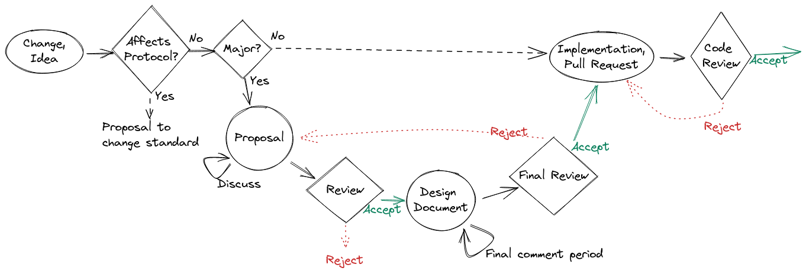

.. _contribution-guide:

******************
Contribution Guide
******************

Welcome to the SCION contribution guide! If you are interested in contributing to
the project, this page will help you out on your journey to your first SCION commit.

.. _slack:

.. Hint::
   If you have any questions, you can always find us
   on our `Slack workspace <https://scionproto.slack.com>`__
   or on our `Github project page <https://github.com/scionproto/scion>`__.
   Do not hesitate to ask us anything, or feel free to just drop by and say "Hi".

   Please use this invite link to `join scionproto Slack workspace <https://join.slack.com/t/scionproto/shared_invite/zt-2tbqf49yo-4quzKc4N3g5h8wjZ~axNYQ>`__.

What skills do you need to contribute?
======================================

SCION is a complex project, and uses a lot of different technologies. If you are unfamiliar
with some of them, we have compiled a list containing some great resources to get you started.

+----------------+----------------------------+------------------------------------------+
|     Language   |    Contribution area       |    Tutorials                             |
+================+============================+==========================================+
|       Go       |   SCION Control-plane,     |    :doc:`go-learn`                       |
|                |   SCION Data-plane,        |                                          |
|                |   SCION Tools              |                                          |
+----------------+----------------------------+------------------------------------------+
|   Python,      |   Acceptance testing,      | Coming soon                              |
|   Bash         |   Helper scripts           |                                          |
+----------------+----------------------------+------------------------------------------+
|  Starlark      |   Bazel build/test system  | Coming soon                              |
+----------------+----------------------------+------------------------------------------+

For version control, we use Git and GitHub. For more information about using Git (including
links to resources to get you started if you've never used before), please visit :doc:`git`.

No matter what language you want to contribute to, one of the first steps to take is to set
up a development environment. See :ref:`setting-up-the-development-environment` for the needed steps.
If you encounter issues, please visit our :ref:`Slack <slack>` and ask for help.

.. _finding-an-issue-to-contribute-to:

Finding an issue to contribute to
=================================

We use GitHub labels to categorize issues in the SCION tracker. The two most interesting categories
when searching for something to contribute to are:

- `Help wanted issues <https://github.com/scionproto/scion/labels/i%2Fhelp%20wanted>`__.
  These are issues that nobody is working on at the moment, and are up for grabs.
- `Good first issue issues <https://github.com/scionproto/scion/labels/i%2Fgood%20first%20issue>`__.
  These are usually **Help wanted** uses that are somewhat simpler. These are a good place to start if you've
  never contributed to the project before.

Once you find something you like, post a comment on the issue announcing that
you're interested in working on it. This initial message signals to others that
somebody is already working on it (and thus avoids duplicate work), and also is
the first step in gathering more information about the issue from the SCION team.

From this point on, somebody from the SCION maintainers team will reach out to
you and guide you for the rest of the process. If you have any questions, please
remember to shoot us a question on our :ref:`Slack <slack>`.

Finally, make sure that the code you write adheres to the SCION project
:doc:`style/index`.

.. _governance:

Governance: TC Implementation
=============================

The `Technical Committee (TC) Implementation <https://scion.org/development>`_
of the SCION Association are the custodians of the open-source SCION
implementation projects.

.. |span-github| raw:: html

   

.. |span-slack| raw:: html

   

.. rubric:: People

The current members of the TC Implementation are:

* Jean-Christophe Hugly (|span-github| `@jiceatscion <https://github.com/jiceatscion>`_, |span-slack| @Jean-Christophe Hugly)
* Dominik Roos (|span-github| `@oncilla <https://github.com/oncilla>`_, |span-slack| @roosd)
* François Wirz (|span-github| `@FR4NK-W <https://github.com/FR4NK-W>`_, |span-slack| @frank)
* Lukas Vogel (|span-github| `@lukedirtwalker <https://github.com/lukedirtwalker>`_, |span-slack| @luke)
* Marc Frei (|span-github| `@marcfrei <https://github.com/marcfrei>`_, |span-slack| @marcfrei)
* Jordi Subirà (|span-github| `@JordiSubira <https://github.com/JordiSubira>`_, |span-slack| @jordisubira)

.. rubric:: Responsibilities and Tasks

The TC Implementation has the following main responsibilities, as defined in its
`charter <https://www.scion.org/assets/docs/SCION-Association-Charter-TC-Implementation.pdf>`_:

* Coordination with the Association Board and other bodies of the SCION
  Association. In particular, coordinate with the TC Standardisation to
  synchronise the evolution of the SCION standards, specifications, and their
  implementation. Consult with the Advisory Board on strategic planning.
* Steering strategic direction of the open source SCION project(s); planning
  projects aligned with priorities of SCION Association members and the open
  source developer community.
* Deciding on cross-cutting issues such as development processes, guidelines,
  tooling, etc.

The TC may define technical teams and work groups and delegate tasks.
No technical teams or work groups are currently defined.

Where not delegated to technical teams, the TC Implementation members
participate in the day-to-day operations to implement the
:ref:`change-proposal-process` defined below, in particular by

* Participating in change proposal discussions and moderating discussions
* Reviewing and deciding over individual change proposals and pull requests

.. _change-proposal-process:

Change Proposal Process
=======================

Many changes, including bug fixes and documentation improvements, can be
implemented and reviewed via the normal GitHub pull request workflow.

More **substantial changes** must be submitted as a **proposal**
in the form of a GitHub issue, in order to create a consensus among the SCION community.
Typical examples for substantial change proposals include:

* Adding, changing, or removing components or functionality
* Changing interfaces between components

Proposals for changes to the SCION protocol (e.g., header format, processing
rules, cryptography) are currently following the same process. This may,
however, change in the near future when a formal specification or standard for
the SCION protocol is established.

.. hint:: It is recommended to discuss proposals with other (senior) developers
   before submitting them, for example on our :ref:`Slack <slack>`.

.. warning:: Pull requests for substantial features that did not go through the
   proposal process will be rejected or put on hold.

Formal Process
--------------

:Creation: To open a proposal, the author submits a GitHub issue following the
  ``proposal`` template.
:Review: The proposal may receive feedback from the community, which should be
  incorporated by the author. Moreover, the assigned technical team triages the
  proposal and assigns one of its members to manage the process. The technical
  team discusses the proposal and provides feedback. To increase transparency,
  the results of these discussions are summarised publicly.
:Decision:
  The technical team decides to **accept**, **postpone**, or **reject** the
  proposal based on the outcomes of the discussion and feedback from the
  community.
:Initial Design:
  If the proposal has been accepted, the authors complete an initial design document
  and submit it to the repository (:file-ref:`doc/dev/design`)
  in the form of a pull request. The design document has the status **WIP** and
  is linked to the WIP section of :doc:`design/index`. Once that pull request is
  approved and merged, the proposal issue is closed. A new issue (following the ``Work Item``
  template), owned by the design proponent, is open to track its evolution
  towards its final form. The title of the issue may be of the form:
  ``<topic>: finalize design``.
:Design Improvements:
  Multiple revisions to the WIP document may be submitted and reviewed as PRs.
  Participants may discuss any change required via the tracking issue.
:Final review:
  Once the document reaches a form that appears consensual, the technical
  team starts the final comment period, together with a proposition to
  **accept**, **postpone**, or **reject** the design.

  The **final comment period** lasts **ten calendar days** and is advertised, such that
  stakeholders have a chance to lodge any final objections before a decision is
  reached. If no major comments are raised during the final comment period, the
  proposed action (accept, postpone, reject) is acted; otherwise, the
  proposal goes back to the review step and is discussed further.

  Following the decision, the document's status is changed to one of **Active**, **Postponed**,
  or **Rejected**, the design document is linked to the corresponding section of the index,
  and the tracking issue is closed. If the design's new status is **Active**, a new tracking
  issue is open for its implementation.
:Implementation:
  The design is implemented typically, but not necessarily, by the authors.
  The implementation is submitted as one or more pull requests. The implementation will be
  reviewed; acceptance of the design does not automatically imply that its implementation
  will be accepted.

  Once the implementation is deemed complete, the design document's status is changed to
  **Completed**, it is linked to the corresponding section of the index, and the
  implementation tracking issue is closed.

  Should a decision be made to abandon or postpone the implementation, the design document's
  status is changed to **Postponed**, **Outdated**, or **Rejected**; depending on the reason
  for the decision.

Learning resources
==================

.. toctree::
   :maxdepth: 1

   go-learn
   git

.. seealso::

   :doc:`setup`
      Get started by :doc:`cloning the repository and installing the build tools <setup>`.

   :doc:`run`
      :doc:`Run a SCION network <run>` on your development machine

   :doc:`wireshark`
      Install :doc:`wireshark` and the SCION packet dissector plugin to inspect packets on the wire.
