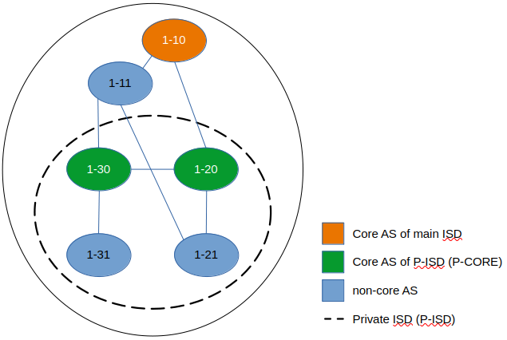
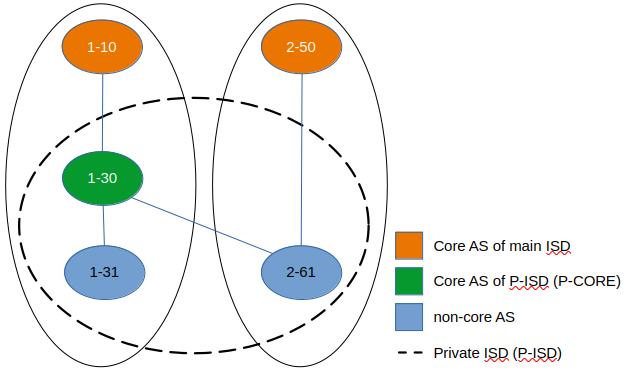
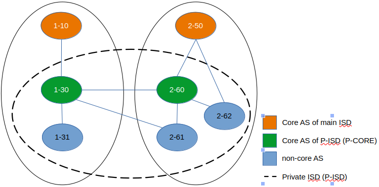
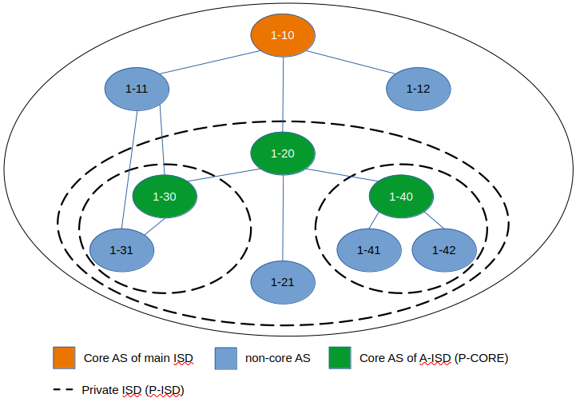
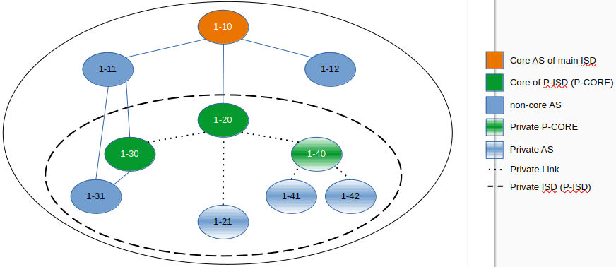

************
Private ISDs
************

- Author(s): Tilmann Zäschke (+ ideas from Jonghoon Kwon)
- Last updated: 2025-08-13
- Discussion at: :issue:`NNNN`
- Status: **WIP**

Other references:

- Overlapping ISDs https://github.com/scionproto/scion/issues/4293
- Nested ISDs (Scion Book 1, Section 3.6): https://scion-architecture.net/pdf/SCION-book.pdf

Abstract
========
*TL;DR This proposal aims to resolve scaling issues with large numbers
of ISD and core ASes. As a side effect it introducees new privacy
features, censorship protection, and (maybe) removes the need for
inter-ISD peering links.*

The current ISD design combines several features:

1. An ISD has a globally unique ID.
2. An ISD has a core AS that is part of the global network of core routers.
3. An ISD has its own independent TRC
4. An ISD has its own beaconing and independent routing

Features (1.) and (2.) cause several issues:

* The number of ISDs is limited to 65000 (spec: 4000). A change would require
  modification of the dataplane, i.e. the SCION header.
* Every ISD has at least one CORE AS. A global network with 65000 core ASes
  would break down. We should aim to have at most a few 1000 CORE ASes.
* Having a CORE ASes in the global core routing network is undesirable for
  many non-backbone ISDs because they are not interested in transit traffic
  and need ways to avoid it.

However, it seems like that many entities that are interested in setting up an ISD
are only interested in the features (3.) and (4.).

This proposal introduces Private ISDs (or User-/Anonymous ISDs, TBD).
Private ISDs (P-ISDs) provide the features 3. and 4. (independent TRC and routing)
without requiring an features 1. or 2. (ISD number or a CORE AS).

Background
==========
[Introduction of the topic, description of the problem being solved.]

Terminology
-----------
- P-ISD - Private ISD
- P-CORE - The core router(s) of a P-ISD. P-ISDs provide TRCs and local
  beaconing but (usually) do not participate in the normal ISDs' core routing
- BR - Border router
- CS - Control service
- Private AS - A Private AS is part of an P-ISD but not visible from
  outside their P-ISD. Private-ASes cannot have a parent AS outside the P-ISD.
  Every P-ISD must have at least one non-private (public) AS in order to
  have a connection to the outside.
- Private Links - A Private Link is a link that is only visible inside a P-ISD.

Proposal
========
[A precise statement of the proposed change.]

Building an A-ISD
-----------------

1. We select a group of ASes to form an P-ISD.
   These ASes can be from different ISDs, but they must be
   non-separated, meaning that they must form a single contiguous network
   where every AS can reach every other AS without leaving the network.

2. We chose one or more of the selected ASes to be P-COREs.
   Like normal ISD cores, these P-COREs provide TRC and  beaconing for
   all ASes in the P-ISD. However, unlike normal ISD cores, P-COREs do not
   have external "core" links to any other (P-)ISDs.

3. Pick an (P-)ISD number. For now, we can use an ISD number from the `private range (16-63)
   <https://github.com/scionproto/scion/wiki/ISD-and-AS-numbering>`_.

The resulting P-ISD is built mostly like a normal ISD: It has a TRC, performs
beaconing, has at least one CORE AS, ASes have child/parent/peer relationships.
However, there are some differences:

- P-CORE ASes to not perform beaconing outside the P-ISD.
- ASes keep their P-ISD number from the surrounding ISD.
- ASes in an P-ISD can have different ISD numbers (from their respective ISDs.
- P-ISDs are not addressable or even visible from the outside, they don't have
  an external ISD number.

Note: An P-ISD can contain ASes (including P-COREs) and links that are not
visible outside of the P-ISD. These are called "private",
see also `Private Links and Private ASes`_.

Example: Simple P-ISD
^^^^^^^^^^^^^^^^^^^^^

The following diagram shows a simple P-ISD that consists of 4 ASes (1-20, 1-21, 1-30, 1-31).
Two of these, 1-20 and 1-30, act as cores (P-COREs) for the P-ISD, which means they
provide a TRC and perform beaconing for inside the P-ISD.

Example: An P-ISD spread over two ISDs
^^^^^^^^^^^^^^^^^^^^^^^^^^^^^^^^^^^^^^

The following diagram shows an P-ISD that has ASes in multiple ISDs.

Something to consider: If an AS in an P-ISD requests a segment that cannot be resolved locally,
it will forward the request to a CORE AS, but which CORE AS?
For building a path to another P-ISD-AS, we should only ask the local P-CORE. For paths to outside
the P-ISD we should only ask the surrounding ISD's core.

Example: An P-ISD spread over two ISDs with two P-COREs
^^^^^^^^^^^^^^^^^^^^^^^^^^^^^^^^^^^^^^^^^^^^^^^^^^^^^^^

The following diagram shows an P-ISD that has ASes in multiple ISDs, with one
multiple P-COREs spread over different ISDs.

Beaconing
---------
The P-CORE performs beaconing just like a normal core AS.
However, PCBs from an P-CORE are signed/extend with the TRC
of the originating P-CORE instead of the normal ISD core.

Path Service
------------
When a path service receives a segment request, it should try to determine
whether the destination is inside a known P-ISD. If it is, the path service
should contact the P-CORE of the respective P-ISD, otherwise it should contact
the ISD's core ASes.
This behavior may be configurable, but a preference for intra-P-ISD routing
seems like a sensible default.

This requires an API change in the CS because we need the source and destination
ASes to make that decision.

In addition it would be useful to have an request argument where the endhost can
specify their preference regarding from which (P-ISD) the returned segments should be:
- No preference specified (default): CS delivers segments from best fitting
  (P-)ISD (there could be several).
- Preference list of (P-)ISDs: CS delivers segments form all listed (P-)ISDs
- Preference "ALL": CS delivers segements from all known (P-)ISDs

See also `Nested P-ISDs and Hierarchies`_.

Enddost: Sending Traffic
------------------------
Endhosts need to be able to know all P-ISDs that the local AS AS is part of,
at least if it wants to use a "private" connection (i.e. inside a given P-ISD).

When constructing a path, an endhost must take care to use segments
that are all either from the same P-ISD or all from public ISDs.
This rule ensures that P-ISDs traffic remains private.
However, this rule may reconsidered in future, mixing P-ISD with ISD segements
may be useful.

When constructing a packet, the endhost needs to put the correct (P-)ISD
number into the SCIOn address header, otherwise routing will fail because
the BRs will attempt hop field verification with the wrong certificate.

Border Routers
--------------
Border routers need to look at the P-ISD in the SCION address header to
identify which TRC should be used for authenticating the segments.

Endhost: Path Verification
--------------------------
To verify incoming paths, similar to border routers, endhosts can get the
 P-ISD identifier from the SCION dataplane header.

Nested P-ISDs and Hierarchies
-----------------------------
P-ISDs can be nested. The current proposal is that P-ISDs must form a
"strict" hierarchy: Every P-ISD must be fully enclosed in its parent P-ISD.
However, private ASes and private links which do not need to be visible to
the parent P-ISD. In other words, any non-private AS that is part of an P-ISD must
also be part of its parent P-ISDs and any parents thereof.

This "strict" hierarchy enables path service to easily decide which segments
should be returned to a segment request: it should always return only those
segments that are part of the smallest P-ISD that contains both the source and
destination AS of a request (this presumes a modified API that allows specifying
the source and destination AS for a path).

Alternatively, we could allow arbitrary overlapping of P-ISDs. Path services
would then simply serve segment from all (P-)ISDs.
This would require all endhosts to have full knowledge of all P-ISDs and their
ASes in order to be able to select sensible segments. This would also require
more complex policies (e.g. with preferred P-ISD).

The dilemma appears to be:

1. Either we enforce strict hierarchies and disallow arbitrarily overlapping A-ISDs.
   This gives an unambiguous definition of "innermost" A-ISD  and a good way of
   automatic A-ISD selection.
2. Or, we allow arbitrarily overlapping, and lose the automatic ISD routing policy.
   instead we require the enhosts to decide in which A-ISD they want to select a
   path.

**TODO open question: "strict" hierarchy vs overlapping A-ISDs?***

**TODO open question: Disallow one AS being CORE for multiple (A-)ISDs?***
If an A-CORE serves as A-CORE for multiple A-ISDs or as core AS of the ISD,
then it must restrict returned segments to those of the "lowest/innermost A-ISD".
This is to ensure that traffic doesn't unnecessarily leave an A-ISD.

Private Links and Private ASes
------------------------------
P-ISD allow to hide links and ASes from the rest of the ISD.
These are called "private links" and "private ASes".

Hiding these is achieved by simply excluding them from any PCBs that come from
outside the P-ISD.
Every private AS needs an AS number. Unfortunately, this needs to be globally unique,
so the parent ISD can see that the AS exists. However, to hide its identity,
the AS can use the ISD code of a different ISD. There could even be a dedicated
ISD code for private ASes.
**TODO** What??? Why globally unique? Why should the parent ISD see that he AS exists?

Hidden A-COREs require ASes to have multiple parents.
Specifically, any non-hidden AS needs a non-hidden CORE that is visible from
the outside.

Is it possible to have multiple parents?
This relates to the question if an P-ISD must have at least one P-CORE in every
ISD. To avoid this we could simply require an ASes' CS to forward segment
queries selectively: destination outside P-ISD -> ask parent; otherwise
ask local P-CORE.
Again, this requires more complex segment queries where we provide
only the start AS and end AS and get as result UP+CORE+DOWN or even
actual paths. -> Only segments is probably better because
there are many more paths than segments -> I/O problem.

Rationale
=========
[A discussion of alternate approaches and the trade-offs, advantages, and disadvantages of the specified approach.]

Advantages and Disadvantages
----------------------------

Advantages
^^^^^^^^^^

- A-ISDs do not need an identifier (saves space in the 16bit ISD number space)
- A-ISDs do not (usually) have a CORE-AS.

  - That improves scalability: people can have an (A)ISD without impacting scalability
  - A-ISDs do not need to worry about transit traffic.

- A-ISDs provide isolation + independency of TRC and routing
- A-ISDs can cross ISD boundaries as long as there is a physical link.
  They can probably replace current peering links.

- Privacy: An A-ISD can contain any number of ASes and link that are not visible
  outside the A-ISD (private ASes).
- A-ISDs can be nested.

- An AS can join an A-ISD without having to worry about a 2nd AS identifier.
  The normal AS number of an AS remains valid and the only way to address the AS.

- P-ISDs can even be hidden from individual endhosts in ASes that participate
  in the P-ISD.
  Either the path server can choose not to give P-ISD segments to the endhost,
  or the anonymous path server itself could be hidden from some endhosts such
  that the endhost would contact a different path server that serves only
  non-P-ISD segments.
- Similar to hiding P-ISDs from specific endhosts in ASes of the P-ISD,
  we can also hide the P-ISDs from child ASes of P-ISD-ASes.

- No change to endhost libraries required.

Disadvantages
^^^^^^^^^^^^^
- P-ISDs have no ISD number. Any AS inside an P-ISD must have a globally unique
  AS number from some ISD.
  However, if it is okay for the AS to not be globally addressable, it does
  not need to be connected to that ISD or even be visible to that ISD.
- Border routers need more state and compute. They need to know all ASes in
  all P-AISDs in which the local AS participates.
  They also need a more complex algorithm to determine which certificate/TRC
  to use.

Limitations
-----------

A-ISDs cannot arbitrarily overlap. Any given AS can participate only in
one A-ISD hierarchy.
The problem is that BRs need to be able to authenticate hop fields.
To do so, they need to determine which certificate to use.
They can determine the correct certificate by looking at the first + last
AS in a given path. The correct TRC is then the "innermost" A-ISD that
contains both ASes. If the ASes could both be in multiple A-ISD, then
the BR cannot uniquely determine the correct TRC.

Possible "solutions":

* Add a unique certificate ID to the SCION packet header. This would
  immediately solve the problem and also avoid the need for the BR to
  store AS->TRC mappings for all local A-ISDs.
* BRs should also check all A-COREs in the paths. If A-COREs are
  restricted to belong to only one A-ISD-hierarchy, then this would
  allow determining the correct certificate even if other ASes
  belong to multiple A-ISD hierarchies. Unfortunately this breaks
  if we allow segments without A-COREs, for example when optimizing
  path with shortcuts or on-path.
* Is it possible to have two or more TRCs in a certificate? I.e. can we
  create a certificate that can be verified with the normal A-ISD, or,
  if that is not available, with one or more A-ISDs?
  We could use this certificate to sign all segments, whether they are
  created in the ISD or in a local A-ISD.
* Ask BR to brute try out multiple certificates. This is expensive,
  but the number of possible certificate per AS should be small (every
  AS is likely to be in only a small number of ISD + A-ISDs).
* Allow BRs to forward unchecked traffic indide A-ISDs.

Alternative: Allow mixing P-ISD segments with ISD segments
----------------------------------------------------------

Currently the rule is theat, when constructing a path, the segmenats are either all
from the same P-ISD or all from public ISDs.
The idea is to ensures that P-ISDs traffic remains private.

However, this rule may reconsidered, mixing P-ISD with ISD segements may be useful.

It is also unclear whether mixing segments like this is technically feasible.

Alternative: Avoid using ISD number altogether
----------------------------------------------
Instead of using A-ISD-IDs from the private range (16-64), we could avoid
using any IDs altogether.

If we don't have A-ISD-IDs, border routers need to have some additional state in order
to compute the
correct TRC for a given path. For every AS, they need a list that represents the AS's A-ISD
hierarchy, the first entry is the outermost A-ISD and the last entry is the innermost A-ISD.
At each level, we store a reference to the AS's TRC certificate for that A-ISD.

When a border router receives a packet, it looks at the first and last AS in the
path header. For both ASes it looks up the hierarchy list.

- If at least one of the does not have a list (meaning it is not in any A-ISD known to the BR)
  the we use the normal (rooted in the ISD's TRC) AS certificate for both.
- If they both have a list, then we walk through both lists until they differ.
  THis gives us the deepest common A-ISD and the associate certificate.
- The lists cannot differ in the first entry, that would violate the
  A-ISD-hierarchy principle.

A similar logic would be used on endhosts that want to authenticate paths.

For example, for any route to an AS that is in the same A-ISD as the
source AS, the path service will return segments that go through the
local A-CORE as well as segments that go through the ISD's core.
The endhost **must** then use the segments that go through the A-CORE.
More specifically, if both ASes are in a hierarchy of nested A-ISDs,
the endhost must use the A-CORE of the innermost A-ISD that it has in
common with the destination AS.

Advantages of avoiding A-ISD-IDs:

- One advantage would be that we do not need to modify the dataplane,
  i.e. the SCION packet header would contain
  the original ISD for source/destination instead of the private ISDs.
- Another advantage is that any AS has exactly one ISD number
  (and no A-ISD number). This may avoid some complexity in control services
  and in managing ASes.
- Endhosts do not need to deal with local AS's ISD number being different
  from the ISD number use in an UP/DOWN path (path stitching).
- No need to ensure that the A-ISD numbers differ in an A-ISD hierarchy.

Disadvantages:

- One disadvantage is clearly the added complexity in border routers and endhosts
  for authenticating path segments.

Compatibility
=============
[A discussion of breaking changes and how this change can be deployed.]

There are no conflicts with existing stuff.

Naming
======

The current preferred name is "private" ISD. The name hints at the following features:

- Privacy. The P-ISD is not visible to the outside.
  What happens in the P-ISD stays in the P-ISD.
- Autonomy. Everyone (who controls one or more ASes) can set it up.

However:

- The term "private ISD" is already in use and refers to ISDs that are
  physically separate from the production network. This is hopefully not
  a problem, these ISDs could be turned into P-ISDs, or otherwise we called
  "separate" ISDs.

One alternative considered was User-ISD (indicating that it is user defined).
However, this does not emphasize the privacy aspect.

Implementation
==============
[A description of the steps in the implementation, which components need to be changed and in which order.]

1. Control service administration:

   - Facility to register ASes and their links and to communicate
     this to other ASes in the local P-ISD

   - API for enhosts to learn about all (P-)ISDs that the local AS is part of.

   - Optional: Add capability for an AS to have multiple parents, one per ISD.
     If a CS receives a segment request for outside the local P-ISD, it can decide
     for forward the request to multiple A-COREs, at most one per ISD that the P-ISD
     participates in. P-COREs can be each other's parent (parent must be in different ISD).
     This allows any AS in the P-ISD to transparently use any ISD that participates
     in the P-ISD.

     **TODO how does path stitching(beaconing) work? -> Same as peering ...?!

2. Control service API

   - Provide API to allow end-to-end segment requests. Stitching is not necessary,
     but the request should return UP+CORE+DOWN segments in one request.
     Requests should also allow to specify preferred (P-)ISDs, including a
     wildcard to request segments from all (P-)ISDs.
     There should probably two wildcards: a) "I want segments for ALL (P-)ISDs",
     and b) "I want segments for whatever (P-)ISD you think is best".
     Option b) should be the default.
     In any case, the CS is free to ignore the preferred ISD and deliver segments
     only for some (P-)ISDs (configurable on the CS).

3. Border routers

   - They need to obtain and handle certificates from the local P-ISDs.

4. Endhost libraries

   - Libraries and daemons need to be adapted to use the new CS API for
     requesting segments.
   - Libraries need to ensure that they put the respective P-ISDs into
     the SCION header of each packet.
   - Libraries and deamons need to be able to handle (P-)ISDs.
   - Path policies may need to be extended to allow specifying (P-)ISD preference.

