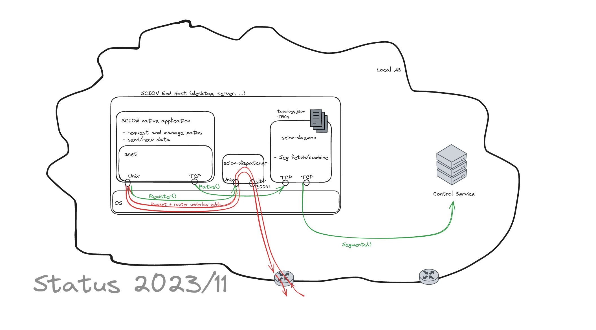
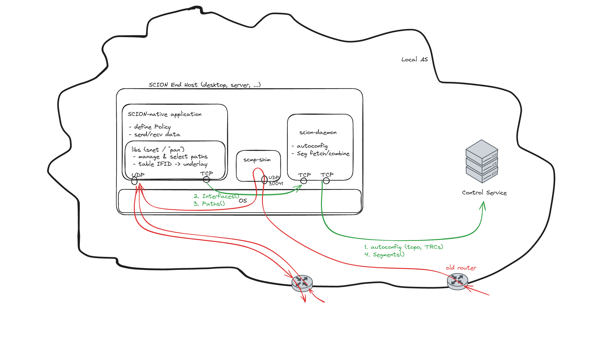

******************************
End host developments overview
******************************

- Author(s): Matthias Frei, Jordi Subirà Nieto
- Last updated: 2023-12-01
- Status: draft
- Discussion at: -

Abstract
========

There are multiple development projects that concern the SCION end host stack.
This document aims to give an overview on how these parts will fit together.

Background
==========

Status quo
^^^^^^^^^^

Sketch of the current end host stack. Each SCION-enabled end host comprises:

- :doc:`scion-daemon </manuals/daemon>`

  - Loads static configuration of the AS topology (:ref:`common-conf-topo`)., mapping :term:`Interface IDs <Interface ID>` to
    router underlay (UDP/IP) addresses.
  - Loads static configuration of the relevant :term:`TRCs <TRC>`.
  - Provides a simplified interface for the path lookup to applications on the host.
    The ``Paths`` API returns fully formed paths to a queried destination AS.
    Internally, the scion-daemon will fetch (from the AS-local SCION control service) and cache path-segments and execute the path-segment
    combination algorithm to assemble the fully formed paths.
    The information returned to the application contains the relevant router underlay address.

- :doc:`scion-dispatcher </manuals/dispatcher>`. Responsible for

  - receiving incoming packets from router/other end hosts (on UDP 30041)
    and dispatching them to the relevant application socket.
  - transmitting outgoing to the network (from UDP 30041).
  - Communicates to applications over bespoke API via Unix sockets.
  - Maintains mapping of ports to application sockets.

- Applications:

  - Register UDP/SCION socket with dispatcher.
  - Fetch available paths from daemon.
  - Select a path, send SCION packet out via dispatcher.
    ``snet`` obtains the router underlay address from the path metadata and includes the router
    underlay address in the frame submitted to the dispatcher.
  - Receive packets via the dispatcher.
    When replying to a packet, the path can be reversed and the underlay address from which the
    packet was received is used when sending the reply.

Ongoing or planned work
^^^^^^^^^^^^^^^^^^^^^^^

- Dispatcher removal (:issue:`4280`).

  As part of this chage, BR will be updated to inspects the L4 header and to deliver packets directly to the applications underlay port for a locally configured range.
  Otherwise, it will send packets to the fixed endhost port 30041. The endhost port range will be configured per AS independently.

- Self-contained distribution of SCION-native applications.

  On some platforms, there is no good path to install and run the default SCION stack with the daemon and the dispatcher as a dependency for running individual SCION-native applications.
  This was one of the observations that led the dispatcher removal work.
  The daemon and the compatibility "shim" replacing the dispatcher still remain.

  The "shim" is intentionally designed to be optional; if it's not there, applications are only
  restricted to receive UDP/SCION packets, no SCMP or other L4 types.
  Additionally, the "shim" also plays the role of backwards-compatibility component. In networks with legacy BRs, those would still send packets to the fixed port 30041. In this case,
  the "shim" allows end applications to still receive traffic from those legacy BRs.

  The functionality of the daemon, however, is necessary. It might already possible to bundle the daemon into an
  application, but it is certainly tedious and not well supported.
  The (simplified) functionality of the daemon should be made available as plug-able library.

- Automated end host configuration integrated into scion daemon.
  Configuration reloading?
- Extend or replace ``pkg/snet`` API with higher-level library like `netsec-ethz/scion-apps/pkg/pan <https://pkg.go.dev/github.com/netsec-ethz/scion-apps/pkg/pan>`_.

A compatiblity mechanism of the dispatcher removal project appears to imply that the underlay address cannot reliably be obtained for received SCION packets.
Consequently, we need a different mechanism to obtain the underlay address. This couples the dispatcher removal with the second listed item and potentially the third one.

Proposal
========

1. Interface ID to underlay address mapping:

   - ``snet`` keeps a table mapping Interface ID to underlay address
   - This table is populated on ``snet`` initialization with a request ``Interfaces()`` to the daemon.
   - **Transition**: this table is not auto-refreshed for now. Either we just don't update it at
     all, or only poll e.g. whenever a ``Path()`` request occurs.
     Note that this is not a significant change from the current situation, where the underlay
     address contained in the path information may be considered valid for the entire lifetime of a
     path.
   - **Later**: this table is updated with an event subscription from the daemon (proto API with stream response).
     Updates are generally very infrequent and the connection to the daemon does not need to be maintained with high reliablity, e.g. for deamon restarts.

2. The dispatcher is removed (see :issue:`4280`).
   Applications open an underlay UDP/IP socket directly and use the same port for the UDP/SCION.
   The router inspects the L4 header to deliver packets directly to the applications underlay port.

   A "shim" component takes care of locally dispatching incoming packets, a) from old routers that don't
   support the port dispatching, and b) with any L4 other than UDP/SCION.

3. The daemon obtains the AS topology information (Interface ID to underlay address mapping), and any necessary TRCs, directly
   from the AS-local control service. Effectively, we integrate the functionality described in
   :doc:`endhost-bootstrap` into the daemon and control service.

   For this, we add a proto rpc ``Interfaces()`` to the control service.
   The daemon no longer loads the ``topology.json`` file.

   - **Transition**: Same as in 1.; the topology info is not refreshed, only loaded at startup.
   - **Later**: The topology info is updated with an event subscription from the AS-local control
     service.

   The topology information is authenticated with the AS's CP-PKI signing key; either, by using this
   to establish a TLS channel, or by signing the information as a message, directly.

   A set of relevant TRCs is obtained from the control service, also.
   If the end host does not have any pre-installed TRCs for the local ISD, this needs to follow a trust on first use
   model.
   Otherwise, the known base TRC can be used to verify any TRC update sequence and ultimately the
   local AS's CP-PKI certificate.

   Finally, the daemon also obtain the endhost port range for the local AS, using also a rpc call ``PortRange()``.

4. The relatively low-level ``snet.Conn`` API is replaced a higher-level API based on application provided path policies.

   In current ``snet``, the application is responsible for managing and selecting paths, and
   and passes a path for every individual ``Write`` call.
   In this model, paths often need to be piped from the application, through
   various layers (like e.g. an http library), down into the actual ``snet`` library Write; or the
   other way around, for reads.
   To make this possible, ``snet`` bundles a path into a ``net.Addr``.
   This, however, is both rather inconvient and conceptually unclean.

   In the policy based model, an application sets a path policy when dialing a connection, and then
   the library internally manages and selects paths. There are still hooks to allow more fine
   granular control, but the default case becomes extremely simple for applications.
   In particular, this model does not require passing paths along with every individual Write call,
   obviating the need to bundle paths into addresses.

   Of the current ``snet`` functionality, only the very low level part ``snet.PacketConn`` and
   ``snet.Packet`` remain. This is effectively a "raw socket" API.
   The rest is removed and replaced with (a re-worked version of) `pan <https://pkg.go.dev/github.com/netsec-ethz/scion-apps/pkg/pan>`_.

   The focus of this library should be usability for "normal" applications.
   In particular, special functionality to listen on service addresses, which is only needed in
   the control service implementation, can be left out. This can be implemented in terms of the
   "raw socket" API directly in internal packages of the control service implementation.

5. Self-contained SCION application distribution;

   .. image:: fig/endhost-overview/endhost-overview_target-mobile.png

   The functionality of the daemon is made available as a library with a straight-forward entry point.
   At build time, the application can chose to initialize ``snet`` with either the default stub connecting to the daemon,
   or the in-process implementation of the same interface.
   It's also possible to choose dynamically; if no daemon is detected running at the expected
   address, the in-process functionality is used.

   The in-process approach has some drawbacks and should only be used where required.

   - increased size of binaries and increased memory usage of individual applications.
   - no sharing of fetched topology or TRC information between applications; this leads to higher
     startup times.
   - no sharing of cached path information between applications.

   .. admonition:: Open question

      Investigate if it is feasible to provide language bindings for (parts of?) this daemon-library,
      so that the full path-segment combinator etc, don't need to be re-implemented in every language.

.. Rationale
.. =========
.. [A discussion of alternate approaches and the trade-offs, advantages, and disadvantages of the specified approach.]

.. Compatibility
.. =============
.. [A discussion of breaking changes and how this change can be deployed.]

.. Implementation
.. ==============
.. [A description of the steps in the implementation, which components need to be changed and in which order.]
