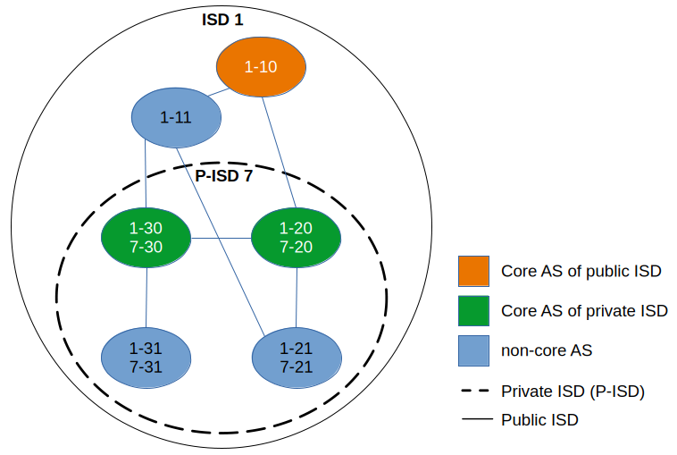
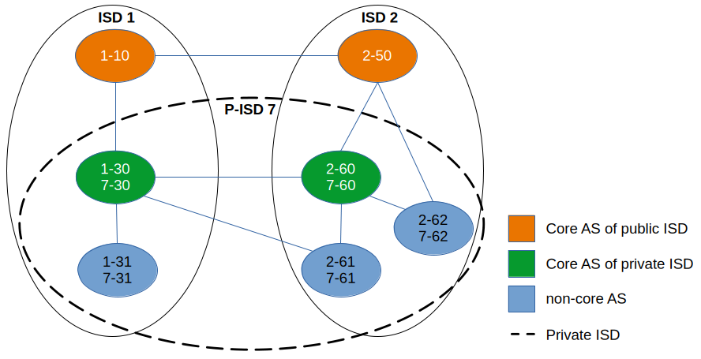
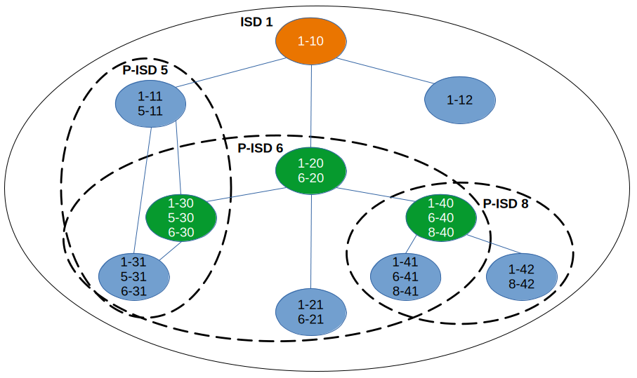
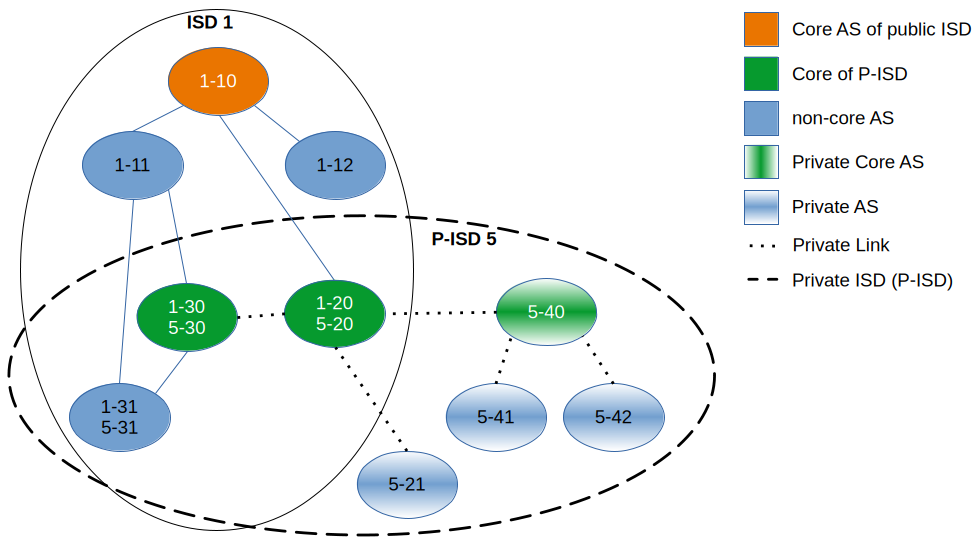

************
Private ISDs
************

- Author(s): Tilmann Zäschke (+ ideas from others)
- Last updated: 2026-06-03
- Discussion at: :issue:`4827`
- Status: **WIP**

Other references:

- Previous version of this document: :issue:`4827`
- Overlapping ISDs: `#4293 <https://github.com/scionproto/scion/issues/4293>`_
- Nested ISDs (Scion Book 1, Section 3.6): `PDF <https://scion-architecture.net/pdf/SCION-book.pdf>`_

Abstract
========

This proposal has multiple objectives:

1) Enable ASes to participate in multiple ISDs

   a) Running an AS in multiple ISDs is already possible but poorly documented.
   b) Improve endhost support for multi-ISD ASes.
   c) Improve infrastructure support for multi-ISD ASes, eg. with shared infrastructure.

2) Based on multi-ISD capability, the proposal introduces *Private ISDs*

   a) Document benefits of Private ISDs.
   b) Discuss implementations changes required for private ISDs (there are very few).

Having an AS in multiple ISDs can be beneficial for organizational reasons.
Running Private ISDs has benefits for their users as well as for the global public SCION network:

- For the global network: improved scalability, especially relating to the public ISD registry
  and to the global network of core ASes.
- For the users of Private ISDs: Improved privacy, protection and failure tolerance.

Background
==========

Terminology
-----------
- P-ISD - Private ISD
- (P-)ISD - Private or public ISD
- BR - Border router
- CS - Control service, the service that performs beaconing and has a path database
- PS - Path service, the that delivers path segment to endhosts. May be identical to CS.
- Private AS - A Private AS is part of an P-ISD but not visible from
  outside their P-ISD. Private-ASes cannot have a parent AS outside the P-ISD.
  Every P-ISD must have at least one non-private (public) AS in order to
  have a connection to the outside.
- Private Links - A Private Link is a link that is only visible inside a P-ISD.

Multi-ISD ASes
--------------

This proposal turns participation of ASes in multiple ISDs into a first class feature. This proposal:

- ensures that participation multiple ISDs is scalable with large numbers of ISDs,
- attempts to reduce admin overhead and resource overhead for managing multiple ISDs in an AS, and
- makes availability of multiple ISDs transparent for endhost.

Private ISDs
------------

The current ISD design combines several features:

1. An ISD has a globally unique ID.
2. An ISD has a core AS that is part of the global network of core routers.
3. An ISD has its own independent TRC
4. An ISD has its own beaconing and independent routing

Features (1.) and (2.) cause several issues:

* The number of ISDs is limited to 65000 (spec: 4000). A change would require
  modification of the dataplane, i.e. the SCION header. This is a low number considering
  that globally 100s of jurisdiction may want to run many ISDs each, plus
  many other entities that may want to run ISDs outside of jurisdictions.
* Every ISD has at least one CORE AS. A global network with 65000 core ASes
  would break down. We should aim to have at most a few 1000 CORE ASes.
* Many entities may want to control their own ISD but do not want to participate
  in the global core routing network because they are not interested in transit
  traffic and need ways to avoid it. However, the current is based on the assumption
  that any AS with access to the public network is exclusively in ISD that
  participate on global core routing. An AS cannot currently participate (securely)
  in public and non-public ISD at the same time.

While features (1.) and (2.) cause several issues, it seems that many entities that are
interested in setting up an ISD are only interested in the features (3.) and (4.).

This proposal introduces Private ISDs.
Private ISDs (P-ISDs) provide the features (3.) and (4.) (independent TRC and routing)
without requiring features (1.) or (2.) (ISD number or a CORE AS).

For users of P-ISDs, benefits include:

- Independence: Routing in an independent (private ISD) that is completely independent of any
  other ISD: Own TRC, own routing, additional ASes, private links.
- Privacy: Existence of, and participation in, a private ISD is completely invisible outside
  of the private ISD.
- Fault tolerance: Private ISDs can offer fallback paths for the public ISDs.
  This is aided by the ability to run all infrastructure on separate hardware.

Differences to proposal v1
--------------------------

- Clarify that ISDs and P-ISDs are (almost) the same.
- Clarify that implementation changes are mostly to support AS participating in multiple ISDs.
  The fact that some of these multiple ISDs may be "private" is secondary.
- Remove implied preference of private links over public links.

Proposal
========

Overview
--------

This document shifts SCION's primary design as follows:

- It establishes as first class design goal that ASes can participate in multiple ISDs
  (or P-ISDs). This is already possible, but:

  - it is not well documented,
  - does not provide secure ISD separation (forged paths can cross ISD boundaries),
  - and is cumbersome to use on endhosts (e.g. requires running multiple daemons),
  - it does not scale well with multiple (P-)ISDs.

- It establishes Private ISDs (P-ISDs) as first class design goal:

  - Define security properties (private links, private ASes, routing isolation, ...).
  - Define requirements on routers, services, and endhosts.

In summary, with the presented design, an AS can safely participate in a large number of
public (or private) ISDs.
The changes to the current implementation are relatively minor, they are (almost?)
completely within the boundaries of the specification in the CP, DP and CPPKI drafts.

Just to emphasize this:

- Private ISDs need no special treatment in the implementation (except for one case in
  border routers forwarding key validation).
- Their differences to public ISDs are purely semantic or on the organisational level.
- Changes to the implementation are mainly to improve security, scalability and ease of use
  for ASes participating in multiple ISDs (public or private).

Building a P-ISD
----------------

1. Select a group of ASes to form an P-ISD.
   These ASes can be from different ISDs, but they must be non-separated,
   meaning that they must form a single contiguous network
   where every AS can reach every other AS without leaving the network.
   A P-ISD can share interfaces/links between ASes the public ISD or other P-ISD.
   A P-ISD may also additional interfaces/links that are not otherwise available.
   Unlike normal ISDs, P-ISDs have no "core" links or "peering" links that leave the P-ISD.

2. Out of the participating ASes, we chose core ASes, authoritative ASes,
   voting ASes, ... and so on for an ISD (TRC, etc) as usual.

3. Pick an (P-)ISD number. For now, we can use any ISD number from the `private range (16-63)
   <https://github.com/scionproto/scion/wiki/ISD-and-AS-numbering>`_.
   The aim is to assign the range 4096 - 65535 for P-ISDs. There is also an option
   to use 32bit numbers for P-ISDs (without changing the dataplane).
   A (current) limitation is that an AS cannot participate in two ISDs that have the same ISD number.

The resulting P-ISD is built mostly like a normal ISD: It has a TRC, performs
beaconing, has at least one CORE AS, ASes have child/parent/peer relationships.
However, there are some differences:

- Core ASes have no links to other ISDs so they do not perform beaconing outside the P-ISD.
- P-ISD numbers do not need to be publicly registered or announced outside the P-ISD.
- ASes in an P-ISD can have multiple ISD numbers (from their respective ISDs).
- P-ISDs are not addressable or even visible from the outside.

Beaconing and routing is completely separate for each (P-)ISD. PCBs and traffic cannot
leave or enter a P-ISD. Path segments from different P-ISDs cannot be combined.

Note: An P-ISD can contain ASes (including core ASes) and links that are not
visible outside of the P-ISD. These are called "private",
see also `Private Links and Private ASes`_.

Note: In all diagrams, ASes have only their public ISD number specified.
The P-ISD numbers are not shown but there is one P-ISD identifier in each
P-ISD (dashed oval shapes).

Example: Simple Nested P-ISD
^^^^^^^^^^^^^^^^^^^^^^^^^^^^

   Figure 1: The diagram shows six ASes. The ASes 10 and 11 participate only in the
   public ISD (ISD 1), the other four ASes (20, 21, 30, 31) participate in both the public
   ISD (ISD 1) and the private ISD (ISD 7). Since, in this case, all ASes of the P-ISD are
   also part of the public ISD, the P-ISD may be called "nested".

   The private ISD is not visible to the outside, the public ISD simply sees six ASes but
   is not aware of the P-ISD formed by some of them.

Example: An P-ISD spread over two ISDs
^^^^^^^^^^^^^^^^^^^^^^^^^^^^^^^^^^^^^^

   Figure 2: The diagram shows an P-ISD (7) that has ASes in multiple ISDs (1 and 2).
   If AS 31 want to communicate with AS 62, it use the public path
   (1-30) - (1-10) - (2-50) - (2-60) or the private path (7-30) - (7-60).
   Which path is preferred can depend on configurable AS policies or on
   path properties, such as performance, cost, or availability.

   This figure also illustrates the improved power of peering links. The link 1-30 -
   2-60 would normally be a peering link where paths would end in either 1-30 or 2-60.
   With P-ISDs, the links becomes a normal link that allows 1-31 and 2-62 to communicate.
   The path could even extend to other ISDs, using multiple (previously) peering links
   in one path or even one segment.

Beaconing
---------
The core ASes perform beaconing just like in a normal ISD.

Beacons are created and forwarded separately for each (P-)ISDs.

Shared Infrastructure - Control Service
^^^^^^^^^^^^^^^^^^^^^^^^^^^^^^^^^^^^^^^

The question whether is whether to have separate CS for each (P-)ISD or
whether one CS can handle beaconing for multiple (P-)ISDs.
The best solution is probably to do the latter and have multiple or all
(P-)ISDs use the same control service and the same beacons storage.

- This simplifies set-up for ASes with only a few (P-ISDs): Only one
  CS to install (+ potentially one backup)
- This simplifies SVC address because BR can announce the same SVC addresses
  regardless of ISD, which is consistent with current SVC announcement.

For ASes with many (1000s) (P-)ISDs, hosting one CS (+ Backup) per (P-)ISD is
probably inefficient, so having multiple (P-)ISDs per CS is probably more
efficient. However, having all (P-)ISDs in one CS is also impossible, so
(P-)ISDs need to be grouped into CSes.
For access to these CSes, we need a SVC address system that can distinguish
requests from different (P-)ISDs and serve the matching CS address.

For increased security, or failure tolerance, or to handle becaoning load
from large networks (public ISDs), it may still be desirable to
handle different (P-)ISDs in separate CSes.

Path Service
------------

When an endhost requests path segments, they should have single service in their
AS that needs to be queried, regardless of the (P-)ISDs in which the path segments originate.
This can be done in two ways:

- A single process with a beacon store that contains all segments. This is proposed in the
  previous section: `Beaconing`_.
- Alternatively, there could be a service that exposes a single segment query API to
  endhosts, but is internally forwarding requests to different processes/machines
  with separate beacon stores.

It is an implementation decision whether an endhost API is backed by a single CS that
managed all local (P-)ISDs, or whether it connects to multiple CS, one (or more) for each (P-)ISD.
Both implementations are viable and the difference is not relevant for the following discussion.
the endhost-facing API is called Path Service (PS), without specifying how it works internally.

When a PS receives a segment request from an endhost, as default, the PS should
return segments for through all available (P-)ISDs.

The endhost is responsible for constructing path that are either completely inside
a single P-ISD or only in public ISDs. Segments from a given P-ISD must not be stitched
with segments from other P-ISDs or from public ISDs.

The PS can decide which segments are made available to a given endhost.

This works best with the "new endhost API".

The "new endhost API" allows segment requests to be answered in multiple responses.
To indicate an AS's preference for a given path, the PS may decide to have the
first response contain only preferred segments (through preferred ISDs) and
offer other segments only in follow-up responses.

An endhost may indicate their preference for a given (P-)ISD in the segment request,
but the PS is allowed to ignore this preference and offer segments from other (P-)ISDs.

This gives the AS additional power in routing preference.
This also simplifies endhost implementations such that they don't really need to
know about participation in multiple ISDs, the just construct path from the first
PS response. More complex implementations can of course take full advantage of
multi-ISD participation.

See also `Nested P-ISDs and Hierarchies`_.

Endhost: Sending Traffic
------------------------
When requesting segments, an endhost may specify specific P-ISDs for which it
requires segments. If no P-ISD is given, the path server should return
any segments it deems fitting.

When constructing a path, an endhost must take care to use segments
that are all either from the same P-ISD or all from public ISDs. This
can distinction can be done based on the numeric range of the ISD number.

When constructing a packet, the endhost needs to put the correct (P-)ISD
number into the SCION address header, otherwise routing will fail because
the BRs will attempt hop field verification with the wrong forwarding key.

Border Routers
--------------
An AS has separate forwarding keys for each (P-)ISD.
For ingress and egress, border routers need to look at the ISD fields in
the SCION address header to identify which forwarding key should be used
for authenticating the hopfields.
If the ISDs are the same and from the Private ISD range, the forwarding for
the required P-ISD is used. If the ISDs are from outside the range, the default key
for public ISDs is used.

Forwarding keys do not need to be stored in memory, they may be derived dynamically.

DRKey, EPIC, ...
----------------
Using the P-ISD's TRC, an AS can derive DRKeys which can, for example,
be used for EPIC.
To verify incoming packets with EPIC, endhosts can get the
P-ISD identifier from the SCION address header to identify which DRKey
to use for authentication (i.e. the DRKey derived from the public ISD/TRC
or from any of the P-ISD's TRCs).

Nested P-ISDs and Hierarchies
-----------------------------
P-ISDs can be nested or overlap arbitrarily. However, if an AS wishes to
participate in multiple P-ISDs, all P-ISDs must have different identifiers.

Every AS may specify a preference list for routing, if the source and
destination AS have multiple P-ISDs in common, the preference indicates from which
P-ISD (or ISD) the segments should used.

   Figure 3: The diagram shows one large P-ISD with two smaller P-ISDs nested inside it.
   There is no special meaning to "nesting", P-ISDs can overlap arbitrarily or
   partially as desired.

In some scenarios it may be useful if an AS can act as core AS for multiple P-ISDs.
For example an ISP could offer to set up P-ISDs as a service for customers,
it's own AS would then act as core AS for each P-ISD.

Having an AS participating in many (P-)ISDs works but is limited by two aspects:

- (P-)ISD numbers are limited to 16bit. Even if we use the reserved ISD numbers
  the range would be limited to 60000, so an ISP can set up only 60K P-ISDs for
  customers. This can be circumvented by the ISP
  by setting up multiple ASes, then each AS can serve up to 60000 P-ISDs.
- P-ISD number are not globally unique. If customers want to communicate with P-ISDs
  from other providers, duplicate P-ISD numbers may occur.
  A workaround is for the ISP to set up multiple AS that each serve a subset
  of the customer's P-ISD requirements.

There is also a proposed extension that reduces the problem by 32bit ISD numbers,
see `Alternative: 32bit ISD Numbers`_.

Private Links and Private ASes
------------------------------
P-ISDs allow to hide links and ASes from the rest of the ISD.
These are called "private links" and "private ASes". They are visible only
to other ASes that participate in the local P-ISD.

Hiding links or ASes is achieved by simply excluding them from any PCBs that come from
outside the P-ISD.
Every private AS needs an AS number. It is recommended, but not necessary,
that these numbers are globally unique. Global uniqueness ensures that
the ASes can join a common P-ISD in future without problems (i.e. without
having another AS in the same P-ISD that has the same AS number).

To hide its existence from the local public ISD, neighboring ASes must simply
not even forward PCBs from the public ISD.

   Figure 4: In this example, the ASes 21, 40, 41 and 42, as well as the link
   between AS 20 and AS 30, are invisible outside the private ISD 5.

Rationale
=========

Advantages and Disadvantages
----------------------------

Advantages
^^^^^^^^^^

- P-ISDs do not need a globally unique identifier (saves space in the 16bit ISD number space)
- P-ISDs do not (usually) participate in the global network of CORE-AS.

  - That improves scalability: people can have a (P-)ISD without impacting scalability
  - P-ISDs do not need to worry about transit traffic.

- P-ISDs provide isolation + independence of TRC and routing
- P-ISDs can cross ISD boundaries as long as there are links.
  They can make these peering links more powerful by using them as normal links in a P-ISD
  and thus using several of them in a normal segment.

- Privacy: An P-ISD can contain any number of ASes and links that are not visible
  outside the P-ISD (private ASes).
  A P-ISD itself is not detectable from the outside.
- P-ISDs can be nested and overlapping.

- An AS can join an P-ISD without having to worry about a 2nd AS identifier.
  The normal AS number of an AS remains valid and the only way to address the AS.

- P-ISDs can even be hidden from individual endhosts in ASes that participate
  in the P-ISD.
  Either the path server can choose not to give P-ISD segments to the endhost,
  or the path server itself could be hidden from some endhosts such
  that the endhost would contact a different path server that serves only
  non-P-ISD segments.
- Similar to hiding P-ISDs from specific endhosts in ASes of the P-ISD,
  we can also hide the P-ISDs from child ASes of P-ISD-ASes.

Disadvantages
^^^^^^^^^^^^^
- Border routers need more state and compute. They need to know all ASes in
  all P-ISDs in which the local AS participates.

Alternative: Shared vs Separate Control Services
------------------------------------------------

One open question is whether to separate control services (CS) for each (P-)ISD.

For a typical set-up with only a few (P-)ISDs, a shared control service
simplifies infrastructure cost.

For large numbers of (P-)ISDs, we anyway need multiple CS instances,
so it may be easier to manage with each (P-)ISD having it's own CS.

For separate CS, one problem to consider is how external requests for
services addresses are handled if there are different service addresses
for different ISDs.

For separate CS, there should be an endhost API implementation that
offers a single point of access for endpoints to query segments. The
implementation would relay queries to the different CS for each (P-)ISD.
This single API reduces complexity for endhosts to have to discover and query
multiple API services.

Advantage of shared CS
^^^^^^^^^^^^^^^^^^^^^^

- Simple service address handling
- Probably slightly more efficient to run a ssingle large CS process than
  multiple smaller ones (memory + CPU).

Advantages of separate CS
^^^^^^^^^^^^^^^^^^^^^^^^^

- Full separation of different ISDs, a CS failure will affect only one (P-)ISD.
- Maybe easier to manage for large (P-)ISD numbers.

Alternative: 32bit ISD Numbers
------------------------------

With private ISDs, the two 16bit ISD numbers in the SCION address header always
have the same value.
This can exploited by instead storing a 32bit ISD number in these two fields.
To avoid confusion with public ISD numbers, the usage of 32bit can be indicated by a flag.
This flag could live in the reserved bits 80-95 of the common header; or it could
simply be the first bit of the SRC ISD field.

This is currently considered a future extension.

Compatibility
=============
There are no conflicts with the existing design.

All changes are additions to current features and APIs.

Naming
======

The current preferred name is "private" ISD. The name hints at the following features:

- Privacy. The P-ISD is not visible to the outside.
  What happens in the P-ISD stays in the P-ISD.
- Autonomy. Everyone (who controls one or more ASes) can set it up.

However:

- The term "private ISD" is already in use and refers to ISDs that are
  physically separate from the production network. This is hopefully not
  a problem, these ISDs could be turned into P-ISDs, or otherwise we called
  "separate" ISDs.

One alternative considered was User-ISD (indicating that it is user defined).
However, this does not emphasize the privacy aspect.

Another alternative is "Nested ISDs". This is accurate and has the advantage
that the naming doesn't conflict with other terminology. Unfortunately,
it doesn't really convey the privacy/isolation aspect.
Maybe it is still a better choice than "Private ISD"?

Implementation
==============

1. Control service

   - (optional) Control services must be able to handle PCBs and paths from
     multiple (P-)ISDs.
   - (optional alternative) If CS can handle only a single local (P-)ISD, the
     new endhost API needs to be adapted to relay segment requests to all
     relevant CS. Endhosts should need to contact only this single endhost API to
     retrieve all available paths for all local (P-)ISDs.

2. Path service

   - Provide API to allow end-to-end segment requests. The request contains
     the start AS, the destination AS and an optional (P-)ISD preference argument.
     The request returns UP+CORE+DOWN segments in one request.

     (optional) The (P-)ISD preference argument has three options:

     - "Not set" (or "default"). The PS should return segments from
       whatever (P-)ISD it thinks is best (configurable by the PS admin)
     - "All" (or "*"). This should return segments from all (P-)ISDs that
       the PS is willing to share.
     - A list of (P-)ISDs. The PS should return segments only for (P-)ISDs
       in the list.

     In any case, the PS is free to ignore the preferred (P-)ISD and deliver
     segments only for some (P-)ISDs (configuration option on the PS).

3. Border routers

   - They need to be able to store separate forwarding keys or derive
     them on the fly when required.

   - Every link must be able to handle multiple forwarding keys, i.e.
     multiple (P-)-ISDs may use the same interface/link.

   - Service addresses: If CSes can handle only one (P-)ISD each, the border routers
     need to be able to hand out service addresses depending on the (P-)ISDs for which
     a service address is requested. This may be solved by the new service address API.
     See `#4388 <https://github.com/scionproto/scion/issues/4388>`_.

4. Endhost libraries

   - Libraries and daemons need to be adapted to use the new PS API for
     requesting segments.
   - Libraries need to ensure that they properly handle multiple local (P-)ISDs.
     - Put the correct src/dst ISD in the address header.
     - Ensure that they don't create paths with segments from different P-ISDs.
   - Path policies may need to be extended to allow specifying (P-)ISD preference.
