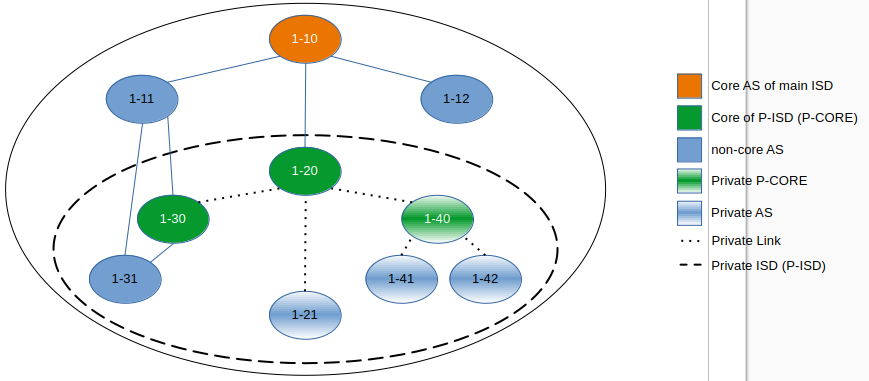

************
Private ISDs
************

- Author(s): Tilmann Zäschke (+ ideas from others)
- Last updated: 2025-08-15
- Discussion at: :issue:`4827`
- Status: **WIP**

Other references:

- Overlapping ISDs https://github.com/scionproto/scion/issues/4293
- Nested ISDs (Scion Book 1, Section 3.6): https://scion-architecture.net/pdf/SCION-book.pdf

Abstract
========
*TL;DR This proposal aims to resolve scaling issues with large numbers
of ISD and core ASes. As a side effect it introduces new privacy
features, censorship protection, and (maybe) removes the need for
inter-ISD peering links.*

The current ISD design combines several features:

1. An ISD has a globally unique ID.
2. An ISD has a core AS that is part of the global network of core routers.
3. An ISD has its own independent TRC
4. An ISD has its own beaconing and independent routing

Features (1.) and (2.) cause several issues:

* The number of ISDs is limited to 65000 (spec: 4000). A change would require
  modification of the dataplane, i.e. the SCION header.
* Every ISD has at least one CORE AS. A global network with 65000 core ASes
  would break down. We should aim to have at most a few 1000 CORE ASes.
* Many entities may want to control their own ISD but do not want to participate
  in the global core routing network because they are not interested in transit
  traffic and need ways to avoid it.

However, it seems like that many entities that are interested in setting up an ISD
are only interested in the features (3.) and (4.).

This proposal introduces Private ISDs (or User-/Anonymous ISDs, TBD).
Private ISDs (P-ISDs) provide the features 3. and 4. (independent TRC and routing)
without requiring an features 1. or 2. (ISD number or a CORE AS).

Background
==========

Terminology
-----------
- P-ISD - Private ISD
- P-CORE - The core router(s) of a P-ISD. P-ISDs provide TRCs and local
  beaconing but (usually) do not participate in the normal ISDs' core routing.
- BR - Border router
- CS - Control service / path service
- Private AS - A Private AS is part of an P-ISD but not visible from
  outside their P-ISD. Private-ASes cannot have a parent AS outside the P-ISD.
  Every P-ISD must have at least one non-private (public) AS in order to
  have a connection to the outside.
- Private Links - A Private Link is a link that is only visible inside a P-ISD.

Proposal
========

Building a P-ISD
----------------

1. We select a group of ASes to form an P-ISD.
   These ASes can be from different ISDs, but they must be
   non-separated, meaning that they must form a single contiguous network
   where every AS can reach every other AS without leaving the network.

2. We chose one or more of the selected ASes to be P-COREs.
   Like normal ISD cores, these P-COREs provide TRC and  beaconing for
   all ASes in the P-ISD. However, unlike normal ISD cores, P-COREs do not
   have external "core" links to any other (P-)ISDs.

3. Pick an (P-)ISD number. For now, we can use an ISD number from the `private range (16-63)
   <https://github.com/scionproto/scion/wiki/ISD-and-AS-numbering>`_.
   In case of nested P-ISDs, we need to ensure that no AS participates in P-ISDs
   that use the same ISD number.

The resulting P-ISD is built mostly like a normal ISD: It has a TRC, performs
beaconing, has at least one CORE AS, ASes have child/parent/peer relationships.
However, there are some differences:

- P-CORE ASes to not perform beaconing outside the P-ISD.
- ASes keep their P-ISD number from the surrounding ISD.
- ASes in an P-ISD can have different ISD numbers (from their respective ISDs.
- P-ISDs are not addressable or even visible from the outside, they don't have
  an external ISD number.

Note: An P-ISD can contain ASes (including P-COREs) and links that are not
visible outside of the P-ISD. These are called "private",
see also `Private Links and Private ASes`_.

Example: Simple P-ISD
^^^^^^^^^^^^^^^^^^^^^

   Figure 1: The diagram shows a simple P-ISD that consists of 4 ASes (1-20, 1-21, 1-30, 1-31).
   Two of these, 1-20 and 1-30, act as cores (P-COREs) for the P-ISD, which means they
   provide a TRC and perform beaconing for inside the P-ISD.

Example: An P-ISD spread over two ISDs
^^^^^^^^^^^^^^^^^^^^^^^^^^^^^^^^^^^^^^

   Figure 2: A P-ISD that has ASes in multiple ISDs.

If an AS in an P-ISD requests a segment that cannot be resolved locally,
it will forward the request to a CORE AS, but which CORE AS?
For building a path to another P-ISD-AS, we should only ask the local P-CORE.
For paths to outside the P-ISD we should only ask the surrounding ISD's core.

Example: An P-ISD spread over two ISDs with two P-COREs
^^^^^^^^^^^^^^^^^^^^^^^^^^^^^^^^^^^^^^^^^^^^^^^^^^^^^^^

   Figure 3: The diagram shows an P-ISD that has ASes in multiple ISDs, with
   multiple P-COREs spread over different ISDs.

Beaconing
---------
The P-CORE performs beaconing just like a normal core AS.
However, PCBs from an P-CORE are signed/extend with the TRC
of the originating P-CORE instead of the normal ISD core.

Path Service
------------
When a CS receives a segment request, it should try to determine whether the
destination is inside a known P-ISD. If it is, the CS should contact the
P-CORE of the respective P-ISD, otherwise it should contact the ISD's core ASes.
By default, the CS should return segments for only one (P-)ISD.
In the case of nested P-ISDs, it should return segments for the "innermost" P-ISD.
"Innermost" may be ambiguous in case of overlapping P-ISDs, so a preference
hierarchy must be configured in the CS.

This requires an API change in the CS because we need the source and destination
ASes to make that decision.

In addition it would be useful to have an request argument where the endhost can
specify their preference regarding from which (P-ISD) the returned segments should be:

- No preference specified (default): CS delivers segments from best fitting
  (P-)ISD (there could be several).
- Preference list of (P-)ISDs: CS delivers segments form all listed (P-)ISDs.
- Preference "ALL": CS delivers segements from all known (P-)ISDs.

See also `Nested P-ISDs and Hierarchies`_.

Endhost: Sending Traffic
------------------------
Endhosts need to be able to know all P-ISDs that the local AS AS is part of,
at least if it wants to use a "private" connection (i.e. inside a given P-ISD).

When constructing a path, an endhost must take care to use segments
that are all either from the same P-ISD or all from public ISDs.
This rule ensures that P-ISDs traffic remains private.

When constructing a packet, the endhost needs to put the correct (P-)ISD
number into the SCION address header, otherwise routing will fail because
the BRs will attempt hop field verification with the wrong certificate.

This constitues a semantic change to the SCION address header, but not a
structural change. This change is fully backwards compatible.

Border Routers
--------------
Border routers need to look at the P-ISD in the SCION address header to
identify which TRC should be used for authenticating the segments.

Endhost: Path Verification
--------------------------
To verify incoming paths, similar to border routers, endhosts can get the
P-ISD identifier from the SCION address header.

Nested P-ISDs and Hierarchies
-----------------------------
P-ISDs can be nested or overlap arbitrarily. However, if an AS whishes to
participate in multiple ASes, all ASes must have different identifiers.
Also, every AS must specify a preference list for routing, if the source and
destination AS have multiple P-ISDs in common, it must be clear from which
P-ISD (or ISD) the segments should used.

   Figure 4: The diagram shows one large P-ISD with two smaller P-ISDs nested inside it.
   In this example the smaller ones participate only in the large one. This need not
   be the case, the P-ISDs can overlap arbitrarily and partially as desired.

**TODO open question: Disallow one AS being CORE for multiple (P-)ISDs?***
This should be possible, but it is not clear how useful that is and it
may add quite a bit of complexity to CS implementations.

Private Links and Private ASes
------------------------------
P-ISDs allow to hide links and ASes from the rest of the ISD.
These are called "private links" and "private ASes". They are visible only
to other ASes that participate in the local P-ISD.

Hiding these is achieved by simply excluding them from any PCBs that come from
outside the P-ISD.
Every private AS needs an AS number. It is recommended, but not neccesary,
that these numbers are globally unique. Global uniquenes ensure that
the ASes can join a common P-ISD in future without problems.

To hide its existence from the local ISD, a private AS can use the ISD code of a
different ISD. There could even be a dedicated ISD code for private ASes.

   Figbure 5: In this example, only the ASes 1-120, 1-130 and 1-131 and the link
   between 1-130 and 1-131 are visible from the outside.

Rationale
=========

Advantages and Disadvantages
----------------------------

Advantages
^^^^^^^^^^

- P-ISDs do not need a globally unique identifier (saves space in the 16bit ISD number space)
- P-ISDs do not (usually) participate in the global network of CORE-AS.

  - That improves scalability: people can have a (P-)ISD without impacting scalability
  - P-ISDs do not need to worry about transit traffic.

- P-ISDs provide isolation + independency of TRC and routing
- P-ISDs can cross ISD boundaries as long as there are links.
  They can probably replace current inter-ISD peering links.

- Privacy: An P-ISD can contain any number of ASes and links that are not visible
  outside the P-ISD (private ASes).
  A P-ISD itself is not detectable from the outside.
- P-ISDs can be nested and overlapping.

- An AS can join an P-ISD without having to worry about a 2nd AS identifier.
  The normal AS number of an AS remains valid and the only way to address the AS.

- P-ISDs can even be hidden from individual endhosts in ASes that participate
  in the P-ISD.
  Either the path server can choose not to give P-ISD segments to the endhost,
  or the path server itself could be hidden from some endhosts such
  that the endhost would contact a different path server that serves only
  non-P-ISD segments.
- Similar to hiding P-ISDs from specific endhosts in ASes of the P-ISD,
  we can also hide the P-ISDs from child ASes of P-ISD-ASes.

Disadvantages
^^^^^^^^^^^^^
- Border routers need more state and compute. They need to know all ASes in
  all P-ISDs in which the local AS participates.

Alternative: Avoid using ISD numbers altogether
-----------------------------------------------
Instead of using P-ISD-IDs from the private range (16-64), we could avoid
using any IDs altogether.

P-ISD need to form a strict hierarchy, that means for nested P-ISDs, any
inner P-ISD is fully eclosed in exactly one parent P-ISD.
In such a hierarchy, for any given two ASes (source + destination), we can
find exactly one P-ISD that is the "innermost" (smallest) P-ISD that
contains both ASes.
By default, path services always return segments that lie in this innermost
P-ISD.

This way, the two source and destination ASes determine P-ISD whose TRC was
used to create the segments and that can be used to authenticate them.
This means border routers can determine the correct certificate from the AS
numbers alone, clients do nod need to put P-ISD numbers into the address header.
In effect, we do not need P-ISD number at all.

Border routers may use an algorithm as follows:
For every AS, they have a list that represents the AS's P-ISD hierarchy,
the first entry is the outermost P-ISD and the last entry is the innermost P-ISD.
At each level, we store a reference to the AS's TRC certificate for that P-ISD.
When a border router receives a packet, it looks at the first and last AS in the
path header. For both ASes it looks up the hierarchy list.

- If at least one of the ASes does not have a list (meaning it is not in any
  P-ISD known to the BR) then we use the normal ISD's certificate.
- If they both have a list, then we walk through both lists until they differ.
  This gives us the deepest common P-ISD and the associated certificate.

Advantages of avoiding P-ISD-IDs:

- (Almost) no need to modify endhost libraries.

  - The SCION address header simply contains the public ISD number for SCR/DST
  - Libraries and daemons can request segments withoiut knowning the P-ISD-ID.
  - Endhosts do not need to deal with local AS's ISD number being different
    from the ISD number use in an UP/DOWN path (path stitching).
  - (Almost): We still need to change the segment request API suchg that
    it returns UP and CORE and DOWN segments in one query. Endhosts
    need to be adapted to that

- Any AS has exactly one ISD number (and no P-ISD number).
  This may avoid some complexity in control services and in managing ASes.
- No need to ensure that the P-ISD numbers differ in an P-ISD hierarchy.

Disadvantages:

- P-ISDs must form a strict hierarchy.
- Added complexity in BRs and endhosts for determining the correct certificate
  for authenticating path segments.

Compatibility
=============
[A discussion of breaking changes and how this change can be deployed.]

There are no conflicts with existing stuff.

The SCION address header needs a semantic change: the SRC/DST ISD number
may now be a P-ISD number.
This constitues a semantic change to the SCION address header, but not a
structural change. This change is fully backwards compatible.

All other changes are additions to current features and APIs.

The only constraint is that in any AS, CS and BR must be updated before
endhosts are updated, otherwise the segment request API does not work.

It may be a useful extension (separate from this proposal) to add an
API version identifier to the CS API so that a client knows which requests
are available an which requests will fail.

Naming
======

The current preferred name is "private" ISD. The name hints at the following features:

- Privacy. The P-ISD is not visible to the outside.
  What happens in the P-ISD stays in the P-ISD.
- Autonomy. Everyone (who controls one or more ASes) can set it up.

However:

- The term "private ISD" is already in use and refers to ISDs that are
  physically separate from the production network. This is hopefully not
  a problem, these ISDs could be turned into P-ISDs, or otherwise we called
  "separate" ISDs.

One alternative considered was User-ISD (indicating that it is user defined).
However, this does not emphasize the privacy aspect.

Implementation
==============

1. Control service administration:

   - Mechanism to register ASes and their links and to communicate
     this to other ASes in the local P-ISD.

   - API for enhosts to learn about all (P-)ISDs that the local AS is part of.

2. Control service API

   - Provide API to allow end-to-end segment requests. The request contains
     the start AS, the destination AS and an (P-)ISD preference argument.
     The request returns UP+CORE+DOWN segments in one request.
     Stitching (creating) is not necessary, that may still be done on the endhost.
     The (P-)ISD preference argument has three options:

     - "Not set" (or "default"). The CS should return segments from
       whatever (P-)ISD it hinks is best (configurable by the CS admin)
     - "All" (or "*"). This should return segments from all (P-)ISDs that
       the CS is willing to share.
     - A list of (P-)ISDs. The CS should return segments only for (P-)ISDs
       in the list.

     In any case, the CS is free to ignore the preferred (P-)ISD and deliver
     segments only for some (P-)ISDs (configuration option on the CS).

   - (Optional): Add an request to the API that return the API version.
     E.g., version "1" would be the version as of Summer 2025,
     version "2" adds a request API for segment requests as described above.
     This would simplify migration, endhost libraries can find out whether
     the local AS supports the new segment request API without resorting to
     trial and error.

3. Border routers

   - They need to obtain and handle certificates from the local P-ISDs.

4. Endhost libraries

   - Libraries and daemons need to be adapted to use the new CS API for
     requesting segments.
   - Libraries need to ensure that they put the respective P-ISDs into
     the SCION header of each packet.
   - Path policies may need to be extended to allow specifying (P-)ISD preference.

