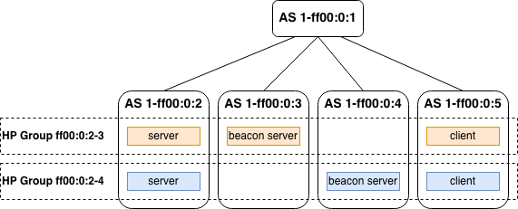

********************
Hidden Paths testing
********************

This document describes how to test the SCION Hidden Paths features. The
end-to-end acceptance test at the end of this document indirectly
covers all features (because they are all needed to ensure a functioning
Hidden Paths system). Additionally, we include unit tests covering
various Hidden Paths requirements in isolation.

.. note::

   All commands listed in this document assume that the project is properly set
   up (see :ref:`setting-up-the-development-environment`), and that the commands
   are run from the project root.

.. note::

   This document uses older terminology, while code contains the latest names
   for Hidden Paths applications. The names have changed in code as follows:

   - The **Hidden Path Server** is now called **Registry**, if it maintains the database
     for a hidden paths group.
   - The **Beacon Server** is now called **Hidden Path Writer**.
   - **Sciond** is now called **SCION Daemon**.

Unit tests
==========

The unit tests cover many of the basic components of a Hidden Path architecture.
In this section we list them grouped based on the application that uses the component.
The components that are not covered in unit tests are covered by the end-to-end
acceptance test at the end of this document.

All unit tests can be executed with the following command:

.. code-block:: bash

   bazel test //pkg/experimental/hiddenpath/...

Hidden path server unit tests
-----------------------------

These unit tests check that:

- the Hidden Path Server serves the correct hidden segments from its
  database, and only to those clients which are part of the hidden path group.
- the Hidden Path Server forwards hidden path segment requests to
  the appropriate server if it does not have the segments locally.
- the Hidden Path Server accepts hidden path registrations from ASes
  that are writers in the hidden path group.
- the hidden path server correctly stores registered segments in its
  database.
- the Hidden Path Server is discoverable via SCION (that is, Beacon
  Servers and SCION Control Services can establish connections to the
  Hidden Path Server).

Beacon server unit tests
------------------------

These unit tests check that:

- the Beacon server registers hidden path segments correctly.
- the Beacon server can be configured with which segments to register
  as hidden and which segments to register as public.

Configuration library unit tests
--------------------------------

These unit tests check that the hidden path configuration can be loaded from file.

End-to-end acceptance test
==========================

In addition to all the functionality that is also covered by the unit tests,
end-to-end acceptance tests the following features:

- Hidden paths requests that are forwarded by the Hidden Path Server are
  signed with the AS certificate, and the signature is verified by the
  destination Hidden Path Server.
- Beacon Server segment registration requests are signed,
  and the signature is verified by the destination Hidden Path Server.
- SCIOND uses hidden path groups to fulfill path segment requests from
  SCION applications.

The acceptance test constructs a network with 2 hidden paths groups, and then
checks that ASes in the same group can talk to each other and ASes in different
groups cannot talk to each other. The network topology of the test is described
in the diagram below.

The topology consists of a core AS (``1-ff00:0:1``) and 4 non-core ASes
(``1-ff00:0:2``, ``1-ff00:0:3``, ``1-ff00:0:4``, ``1-ff00:0:5``). The
non-core ASes have various roles in two hidden paths groups, ``ff00:0:2-3``
and ``f00:0:2-4`` as displayed in the diagram. The test checks that only ASes
present in the same hidden paths group are allowed to talk to each other. It
also checks that ASes that are not in the same group (e.g., ``1-ff00:0:3``
and ``1-ff0:0:4``) cannot talk to each other.

To run the test, execute:

.. code-block:: bash

   bazel test //acceptance/hidden_paths:test

