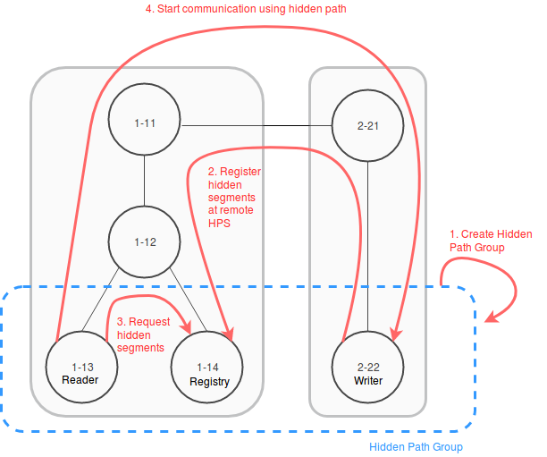
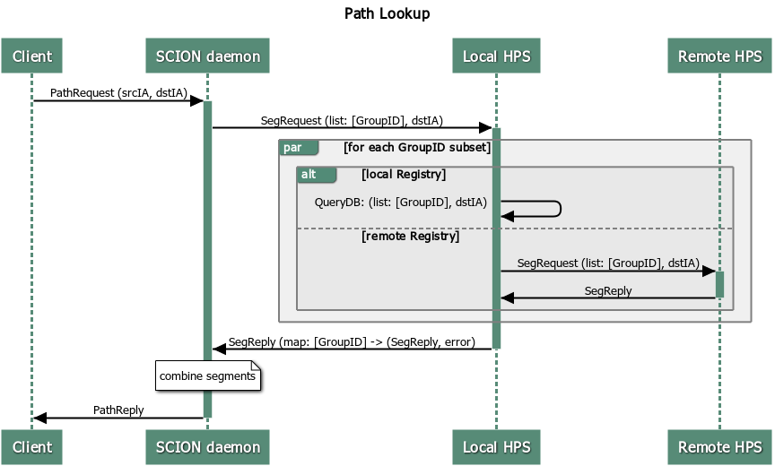

************
Hidden Paths
************

.. admonition:: TODO

   Add the EPIC-HP overview documentation (from the design document).

   Move configuration file description to the Manual section.

Overview
========

Hidden path communication enables the hiding of specific path segments, i.e.
certain path segments are only available for authorized ASes. In the common
case, path segments are publicly available to any network entity. They are
fetched from the control service and used to construct forwarding paths. In a
hidden path communication setting, certain down-segments are not registered
publicly. Instead, they are registered at hidden segment service instances which
enforce access control, such that only authorized entities can fetch and use
these segments to create forwarding paths. Likewise, the corresponding
up-segment can be registered as hidden up-segment at the local hidden segment
service such that endhosts are aware that they are using hidden path
communication to leave the AS.

*Hidden Path communication scheme:*

#. *Owner* AS creates a hidden path group and shares the configuration
   out-of-band.

#. *Writer* ASes register down-segments at *Registry* ASes of their group.

#. *Reader* ASes query *Registry* ASes for hidden segments.

#. *Reader* ASes can communicate with *Writer* ASes based on hidden path segments.

Design
======

Hidden path configuration file
------------------------------

A hidden path configuration file is loaded by all applications participating
in Hidden Paths. It is a YAML file organized in two main sections:

- Group definitions. This section is present on all SCION Daemons and Control Services
  wanting to use Hidden Paths. It contains the hidden paths groups that should be
  known by the applications, with each group further defining the roles of each AS
  in the group.
- Registration policy. This section is only present on ASes wanting to register
  hidden paths with a Hidden Paths Registry (i.e., leaf ASes that want to be hidden)

We now describe each of the sections. An example with a full configuration can
be found later in the document.

Hidden path group
-----------------

A hidden path group is defined as a group of ASes within which hidden path
information is shared. A hidden path group consists of:

- GroupID: Unique 64bit identification of the group:
  :math:`OwnerAS_{48bit}||GroupID_{16bit}`

- Owner: AS ID of the owner of the hidden path group. The *Owner* AS is
  responsible for maintaining the hidden path group configuration and
  distributing it to all servers that require it. The *Owner* has Read and
  Write access to the Hidden Paths registry contents.

- Writers: All ASes in the group which are allowed to register hidden paths
  The *Writers* have Read and Write access to the Hidden Paths registry
  contents.

- Readers: All ASes in the group which are allowed to read hidden path
  information. The *Readers* have Read access to the Hidden Paths registry
  contents.

- Registries: All ASes in the group at which *Writers* register hidden paths.
  The *Registries* have Read access to the Hidden Paths registry contents.
  Note that even though they can Write data to the registry storage they
  maintain, they are unable to build paths that are valid in the Hidden
  Paths group, meaning they effectively only have Read access.

The hidden path group configuration is shared amongst the members of the group
out-of-band. It is the group owner's responsibility to disseminate updated
versions to all members. An online way to initially share and update the hidden
path group configuration might be added in the future.

Example group configuration
^^^^^^^^^^^^^^^^^^^^^^^^^^^

The group configuration is the first section of a hidden paths configuration file.
Below is an example of a hidden path group configuration containing
two groups. The groups are owned by two ASes and use distinct registries,
but the readers and writers are the same.

.. code-block:: yaml

   groups:
     "ff00:0:110-69b5":
       owner: "1-ff00:0:110"
       writers:
         - "1-ff00:0:111"
         - "1-ff00:0:112"
       readers:
         - "1-ff00:0:114"
       registries:
         - "1-ff00:0:111"
         - "1-ff00:0:113"
     "ffaa:0:222-abcd":
       owner: "1-ffaa:0:222"
       writers:
         - "1-ff00:0:111"
         - "1-ff00:0:112"
       readers:
         - "1-ff00:0:114"
       registries:
         - "1-ff00:0:115"

Segment registration
--------------------

Segment registration is the second part of a hidden paths configuration file.
It is an optional section, and only Control Services who want to register
hidden paths at a registry must define it.

The segment registration needs to distinguish between segments to be registered
publicly and hidden. These decisions are based on a policy that is defined
for each SCION Interface ID in the local AS. If an interface is marked as
``public``, then down-segments going through the interface will be registered
via the normal SCION beacon down-segment registration mechanism. For each
hidden path group that is specified, the down-segment will be registered via
the hidden paths registration mechanism.

Below is an example registration configuration.

.. code-block:: yaml

   registration_policy_per_interface:
     2:
       - public
       - "ff00:0:110-69b5"
       - "ffaa:0:222-abcd"
     3:
       - public

Segments constructed via interfaces not listed in the registration policy will not
be registered at all. This default prevents the scenario where an AS that wants to stay
hidden adds a new interface, and announces paths to itself without realizing.

Example complete configuration
^^^^^^^^^^^^^^^^^^^^^^^^^^^^^^

A sample configuration file for SCION Daemons and Control Services that don't register hidden paths
might look like the following:

.. code-block:: yaml

   ---
   groups:
     "ff00:0:110-69b5":
       owner: "1-ff00:0:110"
       writers:
         - "1-ff00:0:111"
         - "1-ff00:0:112"
       readers:
         - "1-ff00:0:114"
       registries:
         - "1-ff00:0:111"
         - "1-ff00:0:113"
     "ffaa:0:222-abcd":
       owner: "1-ffaa:0:222"
       writers:
         - "1-ff00:0:111"
         - "1-ff00:0:112"
       readers:
         - "1-ff00:0:114"
       registries:
         - "1-ff00:0:115"
   ...

For an AS that wants to register hidden paths with a registry, both sections need to be included:

.. code-block:: yaml

   ---
   groups:
     "ff00:0:110-69b5":
       owner: "1-ff00:0:110"
       writers:
         - "1-ff00:0:111"
         - "1-ff00:0:112"
       readers:
         - "1-ff00:0:114"
       registries:
         - "1-ff00:0:111"
         - "1-ff00:0:113"
     "ffaa:0:222-abcd":
       owner: "1-ffaa:0:222"
       writers:
         - "1-ff00:0:111"
         - "1-ff00:0:112"
       readers:
         - "1-ff00:0:114"
       registries:
         - "1-ff00:0:115"
   registration_policy_per_interface:
     2:
       - public
       - "ff00:0:110-69b5"
       - "ffaa:0:222-abcd"
     3:
       - public
   ...

Hidden segment registration service
^^^^^^^^^^^^^^^^^^^^^^^^^^^^^^^^^^^

The hidden segment registration service needs to verify that the sender of the
segment is a writer in the hidden path group it tries to register.

Below is the gRPC definition of the service that accepts hidden segment
registrations.

.. code-block:: protobuf

   service HiddenSegmentRegistrationService {
       // HiddenSegmentRegistration registers hidden segments at the remote.
       rpc HiddenSegmentRegistration(HiddenSegmentRegistrationRequest) returns (HiddenSegmentRegistrationResponse) {}
   }

   message HiddenSegmentRegistrationRequest {
       message Segments {
           // List of path segments.
           repeated PathSegment segments = 1;
       }

       // Mapping from path segment type to path segments. The key is the integer
       // representation of the SegmentType enum.
       map<int32, Segments> segments = 1;

       // GroupID is the group ID to which these segments should be registered.
       uint64 group_id = 2;
   }

  message HiddenSegmentRegistrationResponse {}

Note that ``PathSegment`` and ``SegmentType`` are already defined by the normal
segment registration service and should be reused from there.

Path lookup
-----------

Hidden segment lookup service
^^^^^^^^^^^^^^^^^^^^^^^^^^^^^

The hidden segment lookup service can be queried for hidden segments to a given
destination. The request includes a set of hidden path group IDs and a
destination ISD-AS identifier. Upon receiving a request, the service must
validate the requester is allowed to access the requested hidden path groups.
For this, the service checks that for each requested group ID the requesting AS
has read access, i.e. is listed in the hidden path group.

Once validation is completed, the hidden segment lookup service can take one of
the following actions for each group ID in the request:

- lookup segments in the database for hidden path groups where the local AS is a
  *Registry* and thus the service is *authoritative*.
- *forward* the request to a hidden segment lookup service in an AS that is a
  *Registry* for the requested hidden path groups. Forwarding is only allowed if
  the request comes from within the AS, i.e. from a SCION daemon.

Note that multiple *forward* requests might be required depending on the hidden
path groups that are requested. To determine a small set of *Registry* ASes to
query for the required ``GroupID``'s the hidden paths lookup service should
partition the requested ``GroupID``'s into disjoint subsets, such that each
subset is covered by a single *Registry*. Note that a minimal set is not
strictly required since this is only an optimization.

The gRPC definition of the service is as follows:

.. code-block:: protobuf

   service HiddenSegmentLookupService {
       // HiddenSegments returns all segments that match the request.
       rpc HiddenSegments(HiddenSegmentsRequest) returns (HiddenSegmentsResponse) {}
   }

   message HiddenSegmentsRequest {
       // Hidden path group IDs for which a hidden segment is requested.
       repeated uint64 group_ids = 1;
       // The destination ISD-AS of the segment.
       uint64 dst_isd_as = 2;
   }

   message HiddenSegmentsResponse {
       message Segments {
           // List of path segments.
           repeated PathSegment segments = 1;
       }

       // Mapping from path segment type to path segments. The key is the integer
       // representation of the SegmentType enum.
       map<int32, Segments> segments = 1;
   }

SCION daemon
^^^^^^^^^^^^

Additional to up-, core- and down-segments, the daemon is responsible for
fetching hidden down-segments. The daemon is configured with the hidden path
group IDs it should query. Using the configured hidden path group IDs the daemon
queries the local hidden segment lookup service for the given destination. Once
the daemon has all segments collected it combines the segments to paths and returns the paths
to the requester.

Everything combined the path lookup looks as follows:

Hidden segment service discovery
--------------------------------

Hidden segment services in remote ASes can be discovered via a hidden segment
service discovery. Similar to the gateway discovery an initial UDP roundtrip is
done to find the discovery service. The discovery service can then be queried
for hidden segment services. The reply of the discovery contains a list of
hidden segment lookup services and a list of hidden segment registration
services.

To make the information of what hidden segment services exist in an AS available
to the discovery service, the servers that run hidden segment services must
register in the topology file:

- Servers that run the hidden segment lookup service must be listed as
  ``hidden_segment_lookup_service``.

- Servers that run the hidden segment registration service must be listed as
  ``hidden_segment_registration_service``.

Note that having access control on the hidden segment discovery service is not
strictly required, since even if someone can get access to the endpoints, which
service hidden segment infrastructure, the services themselves must verify
that only authorized parties read or write hidden segment data.

Discovery service gRPC definition
^^^^^^^^^^^^^^^^^^^^^^^^^^^^^^^^^

.. code-block:: protobuf

   service DiscoveryService {
       // Return the remote hidden segment services.
       rpc HiddenSegmentServices(HiddenSegmentServicesRequest) returns (HiddenSegmentServicesResponse) {}
   }

   message HiddenSegmentServicesRequest {}

   message HiddenSegmentServicesResponse {
       // The list of lookup service instances.
       repeated HiddenSegmentLookupServer lookup = 1;
       // The list of registration service instances.
       repeated HiddenSegmentRegistrationServer registration = 2;
   }

   message HiddenSegmentLookupServer {
       // The address of a hidden segment lookup service instance.
       string address = 1;
   }

   message HiddenSegmentRegistrationServer {
       // The address of a hidden segment registration service instance.
       string address = 1;
   }

Security
--------

Various operations in this design are security critical and require
client/server authentication:

#. For the creation of hidden path groups we assume that the chosen out-of-band
   mechanism is safe.

#. For segment registrations from a control server to the hidden path
   registration service we need to authenticate the AS of the registration
   service. This can be done using TLS based on AS certificates.

#. The SCION daemon querying paths from the local hidden path lookup service is
   secured by AS internal policies / PKIs.

#. For inter-AS hidden segment lookups, clients are authenticated using
   TLS client certificates based on the AS certificate.
