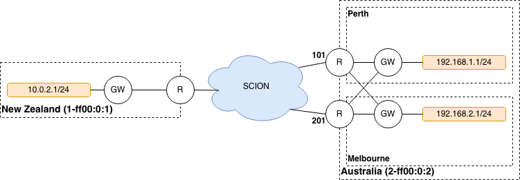

*******
Gateway
*******

Nomenclature
============

SessionPolicy
-------------
A Session Policy describes the traffic configuration to a remote AS. It contains

- a Policy ID uniquely identifying the Session Policy
- a Traffic Class defining the set of IP packets that are forwarded in this Session
- a Path Class defining the set of paths that can be used to forward the IP packets
- a Performance Policy defining an ordering on the set of allowed paths with respect to a certain optimization goal
- a Path Count defining the number of paths used simultaneously to load balance different flows in the Session

Traffic Class
-------------

A Traffic Class defines a classification of IP packets. All IP packets that
match the matching criteria of the Traffic Class belong to that class. A Traffic
Class has a Name and a Traffic Matcher

Traffic Matcher
---------------

A Traffic Matcher defines the matching criteria for a Traffic Class. The
matching criteria is defined using the traffic classification language, e.g., ::

  # match all packets with a dest IP in this prefix
  dst=192.168.1.0/24
  # match all packets with a given dest IP or given DSCP bits
  any(dst=192.168.1.0/24, dscp=0xb2)

Path Class
----------

A Path Class defines a classification of paths. All paths that match the
matching criteria of the Path Class belong to that class. A Path Class has a
Name and a Path Matcher.

Path Matcher
------------

A Path Matcher defines the matching criteria for a Path Class. The matching
criteria is defined using the path policy language, e.g., ::

  # blacklist paths containing AS 111 (in any ISD). Allow everything else.
  acl:
    - 0-111#0
    + 0
  # Matches all paths that consisting of any number of interfaces,
  # followed by interface 1 in AS 111 followed by at least one other interface.
  sequence: 0* 0-111#1 0+

Performance Policy
------------------

A Performance Policy defines the performance metric that should be optimized
when making a path selection. Possible values can be shortest_path, latency,
jitter, droprate, or mix (take a weighted score across all metrics) (note, not
all of these are currently implemented and are subject to change). A Performance
Policy is used to order the set of paths defined by a Path Class.

Path Count
----------

The Path Count defines the number of paths that can be simultaneously used
within a Session. Default is 1.

How it all fits together
------------------------

A gateway has one or multiple Session Policies per remote AS. The Traffic Class
defines the set of IP packets which are forwarded by the configuration. A Path
Class defines the set of possible paths that can be used by this configuration.
A Performance Policy orders the set of possible paths according to the some
metric. Finally, PathCount defines how many paths are being used simultaneously
within a configuration.

Port table
==========

+---------------------------+----------------+--------+-----------------------------+
|    Description            | Transport      | Port   | Application protocol        |
+---------------------------+----------------+--------+-----------------------------+
| Control plane             | QUIC/SCION     | 30256  | gRPC (Prefix discovery)     |
+---------------------------+----------------+--------+-----------------------------+
| Probe plane               | UDP/SCION      | 30856  | Custom probe encapsulation  |
+---------------------------+----------------+--------+-----------------------------+
| Underlay data-plane       | UDP/SCION      | 30056  | none                        |
+---------------------------+----------------+--------+-----------------------------+
| Monitoring                | TCP            | 30456  | HTTP/2                      |
+---------------------------+----------------+--------+-----------------------------+

Metrics
=======

Gateway metrics can expose the following set of labels:

- ``remote_isd_as``: The ISD-AS of the remote AS.
- ``remote_ifid``: An interface ID of the remote AS.
- ``policy_id``: The ID identifying a session policy.

Traffic Metrics
---------------

Sent IP packets
^^^^^^^^^^^^^^^

**Name**: ``gateway_ippkt_bytes_sent_total``, ``gateway_ippkts_sent_total``

**Type**: Counter

**Description**: Total bytes and packet count of IP packets sent to remote
gateways.

**Labels**: ``remote_isd_as`` and ``policy_id``

Received IP packets
^^^^^^^^^^^^^^^^^^^

**Name**: ``gateway_ippkt_bytes_received_total``, ``gateway_ippkts_received_total``

**Type**: Counter

**Description**: Total bytes and packet count of IP packets received from remote
gateways.

**Labels**: ``remote_isd_as``

Sent local IP packets
^^^^^^^^^^^^^^^^^^^^^

**Name**: ``gateway_ippkt_bytes_local_sent_total``, ``gateway_ippkts_local_sent_total``

**Description**: Total bytes and packet count of IP packets sent to the local
network, i.e., on the internal interface.

**Labels**: none

.. note::
   In the Anapaya EDGE Gateway this covers only those packets that match one of the configured prefixes.

Received local IP packets
^^^^^^^^^^^^^^^^^^^^^^^^^^

**Name**: ``gateway_ippkt_bytes_local_received_total``, ``gateway_ippkts_local_received_total``

**Description**: Total bytes and packet count of IP packets received from the
local network, i.e., on the internal interface.

**Labels**: none

.. note::
   In the Anapaya EDGE Gateway this covers only those packets that match one of the configured prefixes.

Sent frames
^^^^^^^^^^^

**Name**: ``gateway_frame_bytes_sent_total``, ``gateway_frames_sent_total``

**Type**: Counter

**Description**: Total bytes and packet count of frames sent to remote gateways.
This counts the frames the gateway uses to encapsulate the IP traffic. A frame
can contain a partial, one, or multiple encapsulated IP packets.

**Labels**: ``remote_isd_as`` and ``policy_id``

Received frames
^^^^^^^^^^^^^^^

**Name**: ``gateway_frame_bytes_received_total``, ``gateway_frames_received_total``

**Type**: Counter

**Description**: Total bytes and packet count of frames received from remote
gateways. This counts the frames the gateway uses to encapsulate the IP traffic.
A frame can contain a partial, one, or multiple encapsulated IP packets.

**Labels**: ``remote_isd_as``

Discarded Frames
----------------

**Name**: ``gateway_frames_discarded_total``

**Type**: Counter

**Description**: Counts the number of discarded frames. The ``reason`` label can
be used to distinguish different reasons why frames get discarded. Possible values are:

- ``too_old``: discarded because the received frame was older than what the receive window allows
- ``invalid``: discarded because the received frame was corrupted
- ``duplicate``: discarded because the received frame was a duplicate
- ``evicted``: discarded because a newer frame move the receive window and discarded previously received frames that became too old.

**Labels**: ``remote_isd_as``, ``reason``

Discarded IP Packets
--------------------

**Name**: ``gateway_ippkts_discarded_total``

**Type**: Counter

**Description**: Counts the number of discarded IP packets. The ``reason`` label
can be used to distinguish different reasons why IP packets get discarded.
Possible values are:

- ``invalid``: discarded because the received IP packet was corrupted
- ``no_route``: discarded because there is no route for the IP packet
- ``fragmented``: discarded because the IP packet was fragmented.

**Labels**: ``reason``

I/O errors
----------

Send errors
^^^^^^^^^^^

**Name**: ``gateway_send_local_errors_total`` and ``gateway_send_external_errors_total``

**Type**: Counter

**Description**: Counts the number of errors when sending IP packets to the
network (LAN) and sending frames to the network (WAN).

**Labels**: none

Receive errors
^^^^^^^^^^^^^^

**Name**: ``gateway_receive_local_errors_total`` and ``gateway_receive_external_errors_total``

**Type**: Counter

**Description**: Counts the number of errors when receiving IP packets from the
network (LAN) and receiving frames from the network (LAN).

**Labels**: none

Path Monitoring Metrics
-----------------------

Monitored paths
^^^^^^^^^^^^^^^

**Name**: ``gateway_paths_monitored``

**Type**: Gauge

**Description**: Number of paths being monitored to a given remote AS.

**Labels**: ``remote_isd_as``

Path probes sent
^^^^^^^^^^^^^^^^

**Name**: ``gateway_path_probes_sent``

**Type**: Counter

**Description**: Number of path probes being sent.

**Labels**: ``remote_isd_as``

Path probe replies received
^^^^^^^^^^^^^^^^^^^^^^^^^^^

**Name**: ``gateway_path_probes_received``

**Type**: Counter

**Description**: Number of replies to the path probes being received.

**Labels**: ``remote_isd_as``

Available session paths
^^^^^^^^^^^^^^^^^^^^^^^

**Name**: ``gateway_session_paths_available``

**Type**: Gauge

**Description**: Number of paths to a remote AS per session policy. The
``status`` label indicates the status of the path. Possible values are
``rejected`` ``alive``, and ``timeout``.

**Labels**: ``remote_isd_as``, ``policy_id``, ``status``

Session Monitoring Metrics
--------------------------

Session probes
^^^^^^^^^^^^^^

**Name**: ``gateway_session_probes``

**Type**: Counter

**Description**: Number of probes sent to a remote AS per session id.

**Labels**: ``remote_isd_as``, ``policy_id``, ``session_id``

Session probe replies
^^^^^^^^^^^^^^^^^^^^^

**Name**: ``gateway_session_probe_replies``

**Type**: Counter

**Description**: Number of probes from a remote AS per session id.

**Labels**: ``remote_isd_as``, ``policy_id``, ``session_id``

Session is healthy
^^^^^^^^^^^^^^^^^^

**Name**: ``gateway_session_is_healthy``

**Type**: Gauge

**Description**: Healthiness flag to a remote AS per session ID. The
session is ephemeral so it is recommended to use after aggregating
per `remote_isd_as` and `policy_id`.

**Labels**: ``remote_isd_as``, ``policy_id``, ``session_id``

Discovery Metrics
-----------------

Remote gateways
^^^^^^^^^^^^^^^

**Name**: ``gateway_remotes``

**Type**: Gauge

**Description**: Number of remote gateways.

**Labels**: ``remote_isd_as``

Remote IP prefixes
^^^^^^^^^^^^^^^^^^

**Name**: ``gateway_prefixes_accepted``, ``gateway_prefixes_rejected``

**Type**: Gauge

**Description**: Number of accepted/rejected remote IP prefixes.

**Labels**: ``remote_isd_as``

Advertised IP prefixes
^^^^^^^^^^^^^^^^^^^^^^

**Name**: ``gateway_prefixes_advertised``

**Type**: Gauge

**Description**: Number of advertised IP prefixes.

**Labels**: ``remote_isd_as``

Zebra Metrics
-------------

Connection to Zebra
^^^^^^^^^^^^^^^^^^^

**Name**: ``gateway_zebra_connected``

**Type**: Gauge

**Description**: Indicates whether gateway is connected to Zebra server.

**Labels**: none

Processing updates from Zebra
^^^^^^^^^^^^^^^^^^^^^^^^^^^^^

**Name**: ``zebra_application_unresponsive``

**Type**: Counter

**Description**: Incremented each time when zebra can't push routes to the gateway.

**Labels**: none

HTTP API
========

The HTTP API is exposed by the ``gateway`` on the IP address and port of the ``metrics.prometheus``
configuration setting.

The HTTP API does not support user authentication or HTTPS. Applications will want to firewall
this port or bind to a loopback address.

In addition to the :ref:`common HTTP API <common-http-api>`, the ``gateway`` supports the following API calls:

- ``/status`` (**EXPERIMENTAL**)

  - Method **GET**. Prints a text description of the operating state of the Gateway. This includes the
    list of remote AS numbers, the sessions that exist, what networks are in the
    routing table. For example, the description might look like the following (note that formatting
    and contents might change between releases):

    .. code-block:: text

       ISD-AS 1-ff00:0:111
         SESSION 0, POLICY_ID 0, REMOTE: 172.20.5.6:30856, HEALTHY true
           PATHS:
             STATE REVOKED LATENCY JITTER DROPRATE        PATH
             -->   false      0.47   0.59     0.00        Hops: [1-ff00:0:110 1>1 1-ff00:0:111] MTU: 1472 NextHop: 172.20.4.3:30042

       ISD-AS 1-ff00:0:112
         SESSION 1, POLICY_ID 0, REMOTE: 172.20.6.6:30856, HEALTHY true
           PATHS:
             STATE REVOKED LATENCY JITTER DROPRATE        PATH
             -->   false      0.63   0.74     0.00        Hops: [1-ff00:0:110 2>1 1-ff00:0:112] MTU: 1472 NextHop: 172.20.4.5:30042

       ISD-AS 1-ff00:0:113
         SESSION 2, POLICY_ID 0, REMOTE: 172.20.7.6:30856, HEALTHY true
           PATHS:
             STATE REVOKED LATENCY JITTER DROPRATE        PATH
             -->   false      0.67   0.51     0.00        Hops: [1-ff00:0:110 1>1 1-ff00:0:111 2>1 1-ff00:0:113] MTU: 1472 NextHop: 172.20.4.3:30042
                   false      0.65   0.79     0.00        Hops: [1-ff00:0:110 2>1 1-ff00:0:112 2>2 1-ff00:0:113] MTU: 1472 NextHop: 172.20.4.5:30042

       ROUTING TABLE:
       172.20.5.0/24 index: 2
         condition: BOOL=true
         session: {ID: 0, path: Hops: [1-ff00:0:110 1>1 1-ff00:0:111] MTU: 1472 NextHop: 172.20.4.3:30042}
       172.20.6.0/24 index: 3
         condition: BOOL=true
         session: {ID: 1, path: Hops: [1-ff00:0:110 2>1 1-ff00:0:112] MTU: 1472 NextHop: 172.20.4.5:30042}
       172.20.7.0/24 index: 1
         condition: BOOL=true
         session: {ID: 2, path: Hops: [1-ff00:0:110 1>1 1-ff00:0:111 2>1 1-ff00:0:113] MTU: 1472 NextHop: 172.20.4.3:30042}

- ``/engine`` (**EXPERIMENTAL**)

  - Method **GET**. Prints a text description of the full state of the forwarding engine of
    the Gateway. This includes session health, available paths, session configs, the
    control-plane routing and the data-plane routing table.

- ``/sessionconfigurator`` (**EXPERIMENTAL**)

  - Method **GET**. Prints a text description of the last input and output of the session
    configurator.

- ``/ip-routing/policy`` (**EXPERIMENTAL**)

  - Method **GET**. Prints the current routing policy.
  - Method **PUT**. Updates the current routing policy. This can be used instead of
    forcing a reload from disk via ``SIGHUP``. Only the routing policy is reloaded, and
    the update only affects the in-memory state of the gateway (in other words, the
    gateway does not write the configuration it has received to disk, so a restart will
    cause the changes to be overwritten by whatever is on disk).

- ``/configversion`` (**EXPERIMENTAL**)

  - Method **GET**. Prints the version number of the traffic policy configuration file.

Routing Policy File
===================

The routing policy file contains the configuration which IP prefixes are
advertised, accepted, and rejected.

A routing policy consists of a list of rules. Each rule consists of an action
and three matchers. Optionally, a rule can have a comment.

Policies are defined in plain text. Each line represents a rule. Each rule
consists of four whitespace separated columns. The optional comment is
appended at the end of the line and needs to start with a '#'. ::

  accept     1-ff00:0:110   1-ff00:0:112  10.0.1.0/24,10.0.2.0/24  # Accept from AS 110.
  accept     2-0            1-ff00:0:112  10.0.3.0/24              # Accept from ISD 2.
  reject     !1-ff00:0:110  1-ff00:0:112  10.0.0.0/8               # Reject unless AS 110.
  advertise  1-ff00:0:112   1-ff00:0:110  10.0.9.0/8               # 1-ff00:0:112 advertises 10.0.9.0/8 to 1-ff00:0:110.

The first column represents the action. Currently, we support: ::

  accept    <a> <b> <prefixes>: <b> accepts the IP prefixes <prefixes> from <a>.
  reject    <a> <b> <prefixes>: <b> rejects the IP prefixes <prefixes> from <a>.
  advertise <a> <b> <prefixes>: <a> advertises the IP prefixes <prefixes> to <b>.

The remaining three columns define the matchers of a rule. The second and
third column are ISD-AS matchers, the forth column is a prefix matcher.

The second column matches the 'from' ISD-AS. The third column the 'to'
ISD-AS. ISD-AS matchers support wildcards and negation: ::

  1-ff00:0:110   Matches for 1-ff00:0:110 only.
  0-ff00:0:110   Matches for all ASes with AS number ff00:0:110.
  1-0            Matches for all ASes in ISD 1.
  0-0            Matches for all ASes.

  !0-ff00:0:110  Matches for all ASes except the ones with AS number 'ff00:0:110'.
  !1-ff00:0:110  Matches for all ASes except 1-ff00:0:110.
  !1-0           Matches for all ASes not in ISD 1.

Network prefix matcher consist of a list of IP prefixes to match. The list is
comma-separated. A prefix matches, if it is in the subset of the union of the
IP prefixes in the list. The network prefix matcher can also be negated. The
negation applies to the entire list. A prefix matches in the negated case, if
it is not a subset of the union of the prefix list. ::

  10.0.1.0/24,10.0.2.0/24    Matches all IP prefixes that are a subset of 10.0.1.0/24 or
                             10.0.2.0/24. It also matches 10.0.1.0/24 and 10.0.2.0/24.
  !10.0.1.0/24,10.0.2.0/24   Matches all IP prefixes that are not a subset of 10.0.1.0/24 and
                             not a subset of 10.0.2.0/24.

Default Routing Policy
----------------------

The routing policy file is optional. If no routing policy is explicitly defined,
the gateway uses a default policy equivalent to ::

  reject 0-0 0-0 0.0.0.0/0,::/0

i.e., it rejects all IP prefixes advertised by any remote. Additionally, no local
IP prefixes are advertised, because there is no explicit ``advertise`` directive.

Network prefix pinning
======================

When a SCION Gateway sends data to a remote SCION Gateway, it does so based
on the policies that are configured locally and the prefixes it learns from
the remote gateway. When multiple remote gateways are available, the choice
of gateway and path is completely in the hands of the sending AS.

However, in some scenarios the remote AS might be composed of multiple data
centers, and might want to avoid traffic between the data centers. To do this
it can use a feature called Prefix pinning, which allows a remote AS to hint
at how traffic should be sent towards it. In this section we outline when
Gateway pinning is relevant, and how to configure it.

Refer to the topology below. New Zealand is the local AS, and it contains one
IPv4 network: ``10.0.2.0/24``. This network wants to communicate with two
networks in the Australia AS, ``192.168.1.0/24`` and ``192.168.2.0/24``. The
networks are reachable through either the Perth Router (Interface ID 101) or
the Melbourne Router (Interface ID 201), and then, depending on the
destination network, through either the Perth Gateway or Melbourne Gateway.

It is possible for traffic to flow from the Perth Router to the Melbourne
Gateway. This can happen if the New Zealand gateway chooses to encapsulate
traffic for the Melbourne gateway but chooses a path going through the Perth
router.

The networking administrators of the Australia AS want to prohibit this
behavior because it would lead to increased latency and an inefficient use of
inter-DC bandwidth. Instead, ``192.168.1.0/24`` should only be reachable
through the Perth Router and Gateway, and ``192.168.2.0/24`` should only be
reachable through the Melbourne Router and Gateway.

We'll first look at how the basic configuration for dynamic prefix discovery
for the Perth and Melbourne gateways would look like, and then see why it is
not sufficient to provide the connectivity constraints the Australia AS
administrators want.

To configure dynamic prefix discovery, Australia configures its gateways with
the following traffic policies:

.. code-block:: text

   # Perth
   advertise 2-ff00:0:2 1-ff00:0:1 192.168.1.0/24
   accept           0-0        0-0      0.0.0.0/0

   # Melbourne
   advertise 2-ff00:0:2 1-ff00:0:1 192.168.2.0/24
   accept           0-0        0-0      0.0.0.0/0

This will have the gateways advertise the two internal networks in Australia,
and the New Zealand gateway will thus learn the prefixes and be able to route
to them. For completeness, the New Zealand gateway might have the following
configuration:

.. code-block:: text

   # New Zealand
   advertise 1-ff00:0:1 2-ff00:0:2 10.0.2.0/24
   accept           0-0        0-0   0.0.0.0/0

Assuming routing inside the two ASes is configured correctly, hosts in
``10.0.2.0/24`` should now be able to ping hosts in ``192.168.1.0/24`` and
``192.168.2.0/24``.

However, when New Zealand chooses paths for reaching the gateways in
Australia, it does so independently of the remote gateways. This is because
the internal structure of the Australia AS is hidden from New Zealand, so it
cannot make assumptions about what paths would be more appropriate for each
gateway. In total, there are four possible combinations:

#. Perth Router (Interface ID 101) to Perth Gateway (for destination ``192.168.1.1``).
#. Perth Router (Interface ID 101) to Melbourne Gateway (for destination ``192.168.2.1``).
#. Melbourne Router (Interface ID 201) to Perth Gateway (for destination ``192.168.1.1``).
#. Melbourne Router (Interface ID 201) to Melbourne Gateway (for destination ``192.168.2.1``).

For Australia to recommend that New Zealand use only options 1 and 4, it
needs an additional config.

Path pinning is a Discovery Service setting that informs the Discovery Service to
hint to other ASes which SCION Interfaces should be used to reach a gateway.
The setting is configured via the topology file.

In this scenario, Australia can configure the topology file as follows:

.. code-block:: json

   {
     "sigs": {
       "perth": {
         "ctrl_addr": "...omitted...",
         "data_addr": "...omitted...",
         "allow_interfaces": [
           101
         ]
       },
       "melbourne": {
         "ctrl_addr": "...omitted...",
         "data_addr": "...omitted...",
         "allow_interfaces": [
           201
         ]
       }
     }
   }

Due to the additional ``allow_interfaces`` setting, the Discovery Service in
the Australia AS will announce that the respective gateways should be
reachable only through the specified interface. Note that this is only a
hint. In the end, the New Zealand AS can choose to ignore this setting, and
still send data to the Melbourne network via the Perth router. However,
Anapaya software will respect the hint.

Multiple interfaces can be specified in ``allow_interfaces``, and the same
interface can be present under multiple gateways.
