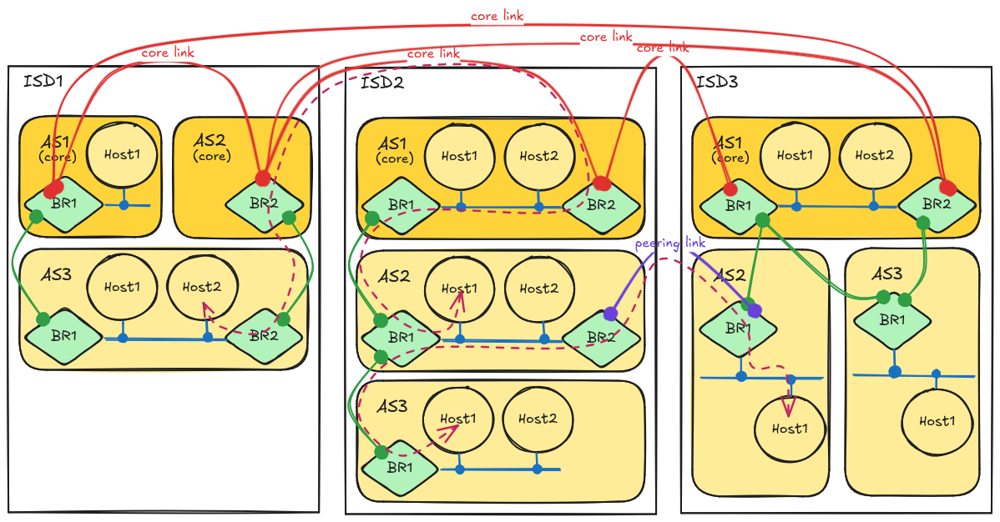

**************
SCION Overview
**************

Scope and Goals
===============

SCION is an inter-domain routing protocol, designed to provide route control, failure isolation, and
explicit trust information for end-to-end communication.

SCION's main goal is to offer highly available and efficient inter-domain packet delivery, even in
the presence of actively malicious entities.

SCION's aspiration is to improve *inter*-AS routing and to focuses on providing end-to-end
connectivity. However, SCION does not solve *intra*-AS routing issues, nor does it provide
end-to-end payload encryption, and identity authentication. These topics, which are equally
important for the Internet to perform well, lie outside the scope of SCION.

Concepts
========

.. _overview-isds:

Isolation Domains (ISDs)
^^^^^^^^^^^^^^^^^^^^^^^^

SCION organizes existing :term:`ASes <AS>` into groups of independent routing planes, called
**Isolation Domains (ISD)**.
An AS can be a member of multiple ISDs.
All ASes in an ISD agree on a set of trust roots, called the **Trust Root Configuration (TRC)**.
The ISD is governed by a set of **core ASes**, which provide connectivity to other ISDs and manage
the trust roots.
Typically, a few distinguished ASes within an ISD form the ISD’s core.
Isolation domains serve the following purposes:

- They allow SCION to support trust heterogeneity, as each ISD can independently define its roots of
  trust;
- They provide transparency for trust relationships;
- They isolate the routing process within an ISD from external influences such as attacks and
  misconfigurations; and
- They improve the scalability of the routing protocol by separating it into a process within and
  one between ISDs.

ISDs provide natural isolation of routing failures and misconfigurations, provide meaningful and
enforceable trust, enable :term:`endpoints <endpoint>` to optionally restrict traffic forwarding to
trusted parts of the Internet infrastructure only, and enable scalable routing updates with high
path-freshness.

ISD and AS Numbering
^^^^^^^^^^^^^^^^^^^^

SCION decouples :term:`endpoint` addressing from inter-domain routing.
Routing is based on the ISD-AS tuple, agnostic of endpoint addressing.

ISD numbers are 16-bit identifiers.
The 48-bit AS numbers are globally unique, and use a superset of the existing BGP AS numbering
scheme.
Formatting rules and allocations are currently described in `wiki page "ISD and AS numbering" <https://github.com/scionproto/scion/wiki/ISD-and-AS-numbering>`_.

The endpoint local address is not used for inter-domain routing or forwarding, does not need to be
globally unique, and can thus be an IPv4, IPv6, or MAC address, for example.
A SCION endpoint address is the ``ISD-AS,local address`` 3-tuple.

.. _overview-as-roles:

AS Roles
^^^^^^^^

Some ASes have special roles in their ISD.
The TRC of an ISD declares which AS has which designated roles.
An AS can have multiple, or all, of these roles at the same time.

- **Core ASes** have a special role in routing.
  They are at the top of their ISD's routing domain, and connect their customer ASes to the outside.
  Core ASes participate in the inter-ISD *and* the intra-ISD path-exploration process (see
  `Routing`_ below).

- **Certification authorities (CAs)** are responsible for issuing AS certificates to other ASes
  and/or themselves.

- **Voting ASes** and **Authoritative ASes** are related to the update mechanism for TRCs.
  Voting ASes can "vote" to accept an updated TRC.
  Authoritative ASes always have the latest TRCs of the ISD and start the announcement of a TRC update.

.. _overview-link-types:

Link Types
^^^^^^^^^^

There are three types of links between ASes in SCION:

- A **core link** can only exist between two core ASes.
- A **parent-child link** requires that both ASes are in the same ISD and
  that at least one of the two connected ASes is a non-core AS.
  ASes with a parent-child link usually belong to the same entity or have a provider-customer
  relationship.
  Every non-core AS needs at least one parent link.
- A **peering link** also includes at least one non-core AS. The ASes may be in different ISDs.
  Peering links are only available for use by children (direct or indirect) of the two linked ASes.

Topology summary
^^^^^^^^^^^^^^^^

The following diagram provides a visual summary of the topology of a SCION network.

Core links (in bright red) connect core ASes, thereby providing inter-ISD connectivity. Intra ISD
links (in green) connect ASes within an ISD. AS-internal networks (in blue) connect the various
hosts within an AS (including border routers). Peering links (in purple) provide restricted use
shortcuts between ISDs.

This diagram attempts to illustrate the variety of valid configurations. For example, notice that:

- There may be multiple core ASes per ISD.
- There may be connections between a non-core AS and multiple core-ASes.
- There may be multiple connections between any two ASes.
- There may be multiple border routers per AS.
- There may be any number of end-hosts (includng none) in an AS.
- Border routers need not be dedicated to one particular kind of links.
- Excludig core links, the ASes within an ISD form a directed acyclic graph (no other constraint).
- The core ASes themselves form an arbitrary graph.

The dark red dashed arrows show examples of possible paths through the network.

Routing
^^^^^^^

SCION operates on two routing levels: intra-ISD and inter-ISD. Both levels use **path-segment
construction beacons (PCBs)** to explore network paths. A PCB is initiated by a core AS and then
disseminated either within an ISD (to explore intra-ISD paths) or among core ASes (to explore core
paths across different ISDs). The PCBs accumulate cryptographically protected path and forwarding
information on the AS-level, and store this information in the form of **hop fields (HFs)**.
Endpoints use information from these hop fields to create end-to-end forwarding paths for data
packets, which carry this information in their packet headers.
This concept is called **packet-carried forwarding state**. The concept also supports multi-path
communication among :term:`endpoints <endpoint>`.

The process of creating an end-to-end forwarding path consists of the following steps:

1. First, an AS discovers paths to other ASes, during the *path exploration* (or beaconing) phase.
2. The AS then selects a few PCBs according to defined policies, transforms the selected PCBs into
   path segments, and registers these segments with its path infrastructure, thus making them
   available to other ASes. This happens during the *path registration* phase.
3. During the *path resolution* phase, the actual creation of an end-to-end forwarding path to the
   destination takes place. For this, an endpoint performs (a) a *path lookup* step, to obtain path
   segments, and (b) a *path combination* step, to combine the forwarding path from the segments.

.. seealso::

   :doc:`control-plane`
      Overview of SCION's path exploration process.

   :doc:`data-plane`
      Description of SCION packet header formats and processing rules for packet forwarding based
      the packed-carried forwarding state.
