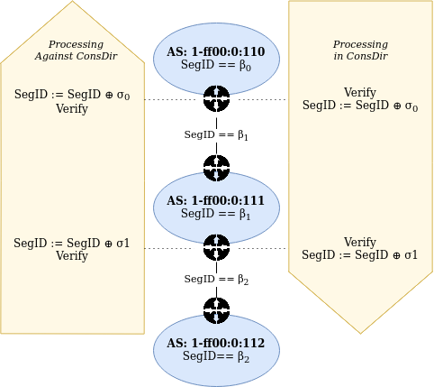

**************************
SCION Header Specification
**************************

.. _header-specification:

This document contains the specification of the SCION packet header.

SCION Header Formats
====================
Header Alignment
----------------
The SCION Header is aligned to 4 bytes.

.. _scion-common-header:

Common Header
-------------
The Common Header has the following format::

     0                   1                   2                   3
     0 1 2 3 4 5 6 7 8 9 0 1 2 3 4 5 6 7 8 9 0 1 2 3 4 5 6 7 8 9 0 1
    +-+-+-+-+-+-+-+-+-+-+-+-+-+-+-+-+-+-+-+-+-+-+-+-+-+-+-+-+-+-+-+-+
    |Version|      QoS      |                FlowID                 |
    +-+-+-+-+-+-+-+-+-+-+-+-+-+-+-+-+-+-+-+-+-+-+-+-+-+-+-+-+-+-+-+-+
    |    NextHdr    |    HdrLen     |          PayloadLen           |
    +-+-+-+-+-+-+-+-+-+-+-+-+-+-+-+-+-+-+-+-+-+-+-+-+-+-+-+-+-+-+-+-+
    |    PathType   |DT |DL |ST |SL |              RSV              |
    +-+-+-+-+-+-+-+-+-+-+-+-+-+-+-+-+-+-+-+-+-+-+-+-+-+-+-+-+-+-+-+-+

Version
    The version of the SCION Header. Currently, only 0 is supported.
QoS
    8-bit traffic class field. The value of the Traffic Class bits in a received
    packet or fragment might be different from the value sent by the packet's
    source. The current use of the Traffic Class field for Differentiated
    Services and Explicit Congestion Notification is specified in `RFC2474
    <https://tools.ietf.org/html/rfc2474>`_ and `RFC3168
    <https://tools.ietf.org/html/rfc3168>`_
FlowID
    The 20-bit FlowID field is used by a source to
    label sequences of packets to be treated in the network as a single
    flow. It is **mandatory** to be set.
NextHdr
    Field that encodes the type of the first header after the SCION header. This
    can be either a SCION extension or a layer-4 protocol such as TCP or UDP.
    Values of this field respect the :ref:`Assigned SCION Protocol Numbers
    <assigned-protocol-numbers>`.
HdrLen
    Length of the SCION header in bytes (i.e., the sum of the lengths of the
    common header, the address header, and the path header). All SCION header
    fields are aligned to a multiple of 4 bytes. The SCION header length is
    computed as ``HdrLen * 4 bytes``. The 8 bits of the ``HdrLen`` field limit
    the SCION header to a maximum of 1024 bytes.
PayloadLen
    Length of the payload in bytes. The payload includes extension headers and
    the L4 payload. This field is 16 bits long, supporting a maximum payload
    size of 65'535 bytes.
PathType
    The PathType specifies the SCION path type with up to 256 different types.
    The format of each path type is independent of each other. The initially
    proposed SCION path types are Empty (0), SCION (1), OneHopPath (2), EPIC-HP (3),
    COLIBRI (4), and EPIC-SAPV (5).
DT/DL/ST/SL
    DT/ST and DL/SL encode host-address type and host-address length,
    respectively, for destination/ source. The possible host address length
    values are 4 bytes, 8 bytes, 12 bytes and 16 bytes. ST and DT additionally
    specify the type of the address. If some address has a length different from
    the supported values, the next larger size can be used and the address can
    be padded with zeros.
RSV
    These bits are currently reserved for future use.

.. _scion-address-header:

Address Header
==============
The Address Header has the following format::

     0                   1                   2                   3
     0 1 2 3 4 5 6 7 8 9 0 1 2 3 4 5 6 7 8 9 0 1 2 3 4 5 6 7 8 9 0 1
    +-+-+-+-+-+-+-+-+-+-+-+-+-+-+-+-+-+-+-+-+-+-+-+-+-+-+-+-+-+-+-+-+
    |            DstISD             |                               |
    +-+-+-+-+-+-+-+-+-+-+-+-+-+-+-+-+                               +
    |                             DstAS                             |
    +-+-+-+-+-+-+-+-+-+-+-+-+-+-+-+-+-+-+-+-+-+-+-+-+-+-+-+-+-+-+-+-+
    |            SrcISD             |                               |
    +-+-+-+-+-+-+-+-+-+-+-+-+-+-+-+-+                               +
    |                             SrcAS                             |
    +-+-+-+-+-+-+-+-+-+-+-+-+-+-+-+-+-+-+-+-+-+-+-+-+-+-+-+-+-+-+-+-+
    |                    DstHostAddr (variable Len)                 |
    +-+-+-+-+-+-+-+-+-+-+-+-+-+-+-+-+-+-+-+-+-+-+-+-+-+-+-+-+-+-+-+-+
    |                    SrcHostAddr (variable Len)                 |
    +-+-+-+-+-+-+-+-+-+-+-+-+-+-+-+-+-+-+-+-+-+-+-+-+-+-+-+-+-+-+-+-+

DstISD, SrcISD
    16-bit ISD identifier of the destination/source.
DstAS, SrcAS
    48-bit AS identifier of the destination/source.
DstHostAddr, SrcHostAddr
    Variable length host address of the destination/source. The length and type
    is given by the DT/DL/ST/SL flags in the common header.

.. _path-type-scion:

Path Type: SCION
================
The path type SCION has the following layout::

    +-+-+-+-+-+-+-+-+-+-+-+-+-+-+-+-+-+-+-+-+-+-+-+-+-+-+-+-+-+-+-+-+
    |                          PathMetaHdr                          |
    +-+-+-+-+-+-+-+-+-+-+-+-+-+-+-+-+-+-+-+-+-+-+-+-+-+-+-+-+-+-+-+-+
    |                           InfoField                           |
    +-+-+-+-+-+-+-+-+-+-+-+-+-+-+-+-+-+-+-+-+-+-+-+-+-+-+-+-+-+-+-+-+
    |                              ...                              |
    +-+-+-+-+-+-+-+-+-+-+-+-+-+-+-+-+-+-+-+-+-+-+-+-+-+-+-+-+-+-+-+-+
    |                           InfoField                           |
    +-+-+-+-+-+-+-+-+-+-+-+-+-+-+-+-+-+-+-+-+-+-+-+-+-+-+-+-+-+-+-+-+
    |                           HopField                            |
    +-+-+-+-+-+-+-+-+-+-+-+-+-+-+-+-+-+-+-+-+-+-+-+-+-+-+-+-+-+-+-+-+
    |                           HopField                            |
    +-+-+-+-+-+-+-+-+-+-+-+-+-+-+-+-+-+-+-+-+-+-+-+-+-+-+-+-+-+-+-+-+
    |                              ...                              |
    +-+-+-+-+-+-+-+-+-+-+-+-+-+-+-+-+-+-+-+-+-+-+-+-+-+-+-+-+-+-+-+-+`

It consists of a path meta header, up to 3 info fields and up to 64 hop fields.

PathMeta Header
---------------

The PathMeta field is a 4 byte header containing meta information about the
SCION path contained in the path header. It has the following format::

     0                   1                   2                   3
     0 1 2 3 4 5 6 7 8 9 0 1 2 3 4 5 6 7 8 9 0 1 2 3 4 5 6 7 8 9 0 1
    +-+-+-+-+-+-+-+-+-+-+-+-+-+-+-+-+-+-+-+-+-+-+-+-+-+-+-+-+-+-+-+-+
    | C |  CurrHF   |    RSV    |  Seg0Len  |  Seg1Len  |  Seg2Len  |
    +-+-+-+-+-+-+-+-+-+-+-+-+-+-+-+-+-+-+-+-+-+-+-+-+-+-+-+-+-+-+-+-+

(C)urrINF
    2-bits index (0-based) pointing to the current info field (see offset
    calculations below).
CurrHF
    6-bits index (0-based) pointing to the current hop field (see offset
    calculations below).
Seg{0,1,2}Len
    The number of hop fields in a given segment. :math:`Seg_iLen > 0` implies
    the existence of info field `i`.

Path Offset Calculations
^^^^^^^^^^^^^^^^^^^^^^^^

The number of info fields is implied by :math:`Seg_iLen > 0,\; i \in [0,2]`,
thus :math:`NumINF = N + 1 \: \text{if}\: Seg_NLen > 0, \; N \in [2, 1, 0]`. It
is an error to have :math:`Seg_XLen > 0 \land Seg_YLen == 0, \; 2 \geq X > Y
\geq 0`. If all :math:`Seg_iLen == 0` then this denotes an empty path, which is
only valid for intra-AS communication.

The offsets of the current info field and current hop field (relative to the end
of the address header) are now calculated as

.. math::
    \begin{align}
    \text{InfoFieldOffset} &= 4B + 8B \cdot \text{CurrINF}\\
    \text{HopFieldOffset} &= 4B + 8B \cdot \text{NumINF}  + 12B \cdot
    \text{CurrHF} \end{align}

To check that the current hop field is in the segment of the current
info field, the ``CurrHF`` needs to be compared to the ``SegLen`` fields of the
current and preceding info fields.

This construction allows for up to three info fields, which is the maximum for a
SCION path. Should there ever be a path type with more than three segments, this
would require a new path type to be introduced (which would also allow for a
backwards-compatible upgrade). The advantage of this construction is that all
the offsets can be calculated and validated purely from the path meta header,
which greatly simplifies processing logic.

.. _scion-path-info-field:

Info Field
----------

InfoField has the following format::

     0                   1                   2                   3
     0 1 2 3 4 5 6 7 8 9 0 1 2 3 4 5 6 7 8 9 0 1 2 3 4 5 6 7 8 9 0 1
    +-+-+-+-+-+-+-+-+-+-+-+-+-+-+-+-+-+-+-+-+-+-+-+-+-+-+-+-+-+-+-+-+
    |r r r r r r P C|      RSV      |             SegID             |
    +-+-+-+-+-+-+-+-+-+-+-+-+-+-+-+-+-+-+-+-+-+-+-+-+-+-+-+-+-+-+-+-+
    |                           Timestamp                           |
    +-+-+-+-+-+-+-+-+-+-+-+-+-+-+-+-+-+-+-+-+-+-+-+-+-+-+-+-+-+-+-+-+

r
    Unused and reserved for future use.
P
    Peering flag. If set to true, then the forwarding path is built as
    a peering path, which requires special processing on the dataplane.
C
    Construction direction flag. If set to true then the hop fields are arranged
    in the direction they have been constructed during beaconing.
RSV
    Unused and reserved for future use.
SegID
    SegID is a updatable field that is required for the MAC-chaining mechanism.
Timestamp
    Timestamp created by the initiator of the corresponding beacon. The
    timestamp is expressed in Unix time, and is encoded as an unsigned integer
    within 4 bytes with 1-second time granularity.  This timestamp enables
    validation of the hop field by verification of the expiration time and MAC.

Hop Field
---------
The Hop Field has the following format::

     0                   1                   2                   3
     0 1 2 3 4 5 6 7 8 9 0 1 2 3 4 5 6 7 8 9 0 1 2 3 4 5 6 7 8 9 0 1
    +-+-+-+-+-+-+-+-+-+-+-+-+-+-+-+-+-+-+-+-+-+-+-+-+-+-+-+-+-+-+-+-+
    |r r r r r r I E|    ExpTime    |           ConsIngress         |
    +-+-+-+-+-+-+-+-+-+-+-+-+-+-+-+-+-+-+-+-+-+-+-+-+-+-+-+-+-+-+-+-+
    |        ConsEgress             |                               |
    +-+-+-+-+-+-+-+-+-+-+-+-+-+-+-+-+                               +
    |                              MAC                              |
    +-+-+-+-+-+-+-+-+-+-+-+-+-+-+-+-+-+-+-+-+-+-+-+-+-+-+-+-+-+-+-+-+

r
    Unused and reserved for future use.
I
    ConsIngress Router Alert. If the ConsIngress Router Alert is set, the
    ingress router (in construction direction) will process the L4 payload in
    the packet.
E
    ConsEgress Router Alert. If the ConsEgress Router Alert is set, the egress
    router (in construction direction) will process the L4 payload in the
    packet.

    .. Note::

        A sender cannot rely on multiple routers retrieving and processing the
        payload even if it sets multiple router alert flags. This is entirely
        use case dependent and in the case of `SCMP traceroute` for example the
        router for which the traceroute request is intended will process it (if
        the corresponding router alert flag is set) and reply to the request
        without further forwarding the request along the path. Use cases that
        require multiple routers/hops on the path to process a packet should
        instead rely on a **hop-by-hop extension**.
ExpTime
    Expiry time of a hop field. The field is 1-byte long, thus there are 256
    different values available to express an expiration time. The expiration
    time expressed by the value of this field is relative, and an absolute
    expiration time in seconds is computed in combination with the timestamp
    field (from the corresponding info field) as follows

    .. math::
        Timestamp + (1 + ExpTime) \cdot \frac{24\cdot60\cdot60}{256}

ConsIngress, ConsEgress
    The 16-bits ingress/egress interface IDs in construction direction.
MAC
    6-byte Message Authentication Code to authenticate the hop field. For
    details on how this MAC is calculated refer to `Hop Field MAC Computation`_.

Hop Field MAC Computation
-------------------------
The MAC in each hop field has two purposes:

#. Authentication of the information contained in the hop field itself, in
   particular ``ExpTime``, ``ConsIngress``, and ``ConsEgress``.
#. Prevention of addition, removal, or reordering hops within a path segment
   created during beaconing.

To that end, MACs are calculated over the relevant fields of a hop field and
additionally (conceptually) chained to other hop fields in the path segment. In
the following, we specify the computation of a hop field MAC.

We write the `i`-th  hop field in a path segment (in construction direction) as

.. math::
    HF_i = \langle  Flags_i || ExpTime_i || InIF_i || EgIF_i || \sigma_i \rangle

:math:`\sigma_i` is the hop field MAC calculated from the following input data::

     0                   1                   2                   3
     0 1 2 3 4 5 6 7 8 9 0 1 2 3 4 5 6 7 8 9 0 1 2 3 4 5 6 7 8 9 0 1
    +-+-+-+-+-+-+-+-+-+-+-+-+-+-+-+-+-+-+-+-+-+-+-+-+-+-+-+-+-+-+-+-+
    |               0               |            Beta_i             |
    +-+-+-+-+-+-+-+-+-+-+-+-+-+-+-+-+-+-+-+-+-+-+-+-+-+-+-+-+-+-+-+-+
    |                           Timestamp                           |
    +-+-+-+-+-+-+-+-+-+-+-+-+-+-+-+-+-+-+-+-+-+-+-+-+-+-+-+-+-+-+-+-+
    |       0       |    ExpTime    |          ConsIngress          |
    +-+-+-+-+-+-+-+-+-+-+-+-+-+-+-+-+-+-+-+-+-+-+-+-+-+-+-+-+-+-+-+-+
    |          ConsEgress           |               0               |
    +-+-+-+-+-+-+-+-+-+-+-+-+-+-+-+-+-+-+-+-+-+-+-+-+-+-+-+-+-+-+-+-+

.. math::
    \sigma_i = \text{MAC}_{K_i}(InputData)

where :math:`\beta_i` is the current ``SegID`` of the info field.
The above input data layout comes from the 8 Bytes of the Info field and the
first 8 Bytes of the Hop field with some fields zeroed out.

:math:`\beta_i` changes at each hop according to the following rules:

.. math::
    \begin{align}
    \beta_0 &= \text{RND}()\\
    \beta_{i+1} &= \beta_i \oplus \sigma_i[:2]
    \end{align}

Here, :math:`\sigma_i[:2]` is the hop field MAC truncated to 2 bytes and
:math:`\oplus` denotes bitwise XOR.

During beaconing, the initial random value :math:`\beta_0` can be stored in the
info field and all subsequent segment identifiers can be added to the respective
hop entries, i.e., :math:`\beta_{i+1}` can be added to the *i*-th hop entry. On
the data plane, the *SegID* field must contain :math:`\beta_{i+1}/\beta_i` for a
segment in up/down direction before being processed at the *i*-th hop (this also
applies to core segments).

Peering Links
^^^^^^^^^^^^^

Peering hop fields can still be "chained" to the AS' standard up/down hop field
via the use of :math:`\beta_{i+1}`:

.. math::
    \begin{align}
    HF^P_i &= \langle  Flags^P_i || ExpTime^P_i || InIF^P_i || EgIF^P_i ||
    \sigma^P_i \rangle\\
    \sigma^P_i &= \text{MAC}_{K_i}(TS || ExpTime^P_i || InIF^P_i || EgIF^P_i || \beta_{i+1})
    \end{align}

Path Calculation
^^^^^^^^^^^^^^^^

**Initialization**

The paths must be initialized correctly for the border routers to verify the hop
fields in the data plane. `SegID` is an updatable field and is initialized based
on the location of sender in relation to path construction.

Initialization cases:

- The non-peering path segment is traversed in construction direction. It starts
  at the `i`-th AS of the full segment discovered in beaconing:

  :math:`SegID := \beta_{i}`

- The peering path segment is traversed in construction direction. It starts at
  the `i`-th AS of the full segment discovered in beaconing:

  :math:`SegID := \beta_{i+1}`

- The path segment is traversed against construction direction. The full segment
  discovered in beaconing has `n` hops:

  :math:`SegID := \beta_{n}`

**AS Traversal Operations**

Each AS on the path verifies the hop fields with the help of the current value
in `SegID`. The operations differ based on the location of the AS on the path.
Each AS has to set the `SegID` correctly for the next AS to verify its hop
field.

Each operation is described form the perspective of AS `i`.

Against construction direction (up, i.e., ConsDir == 0):
   #. `SegID` contains :math:`\beta_{i+1}` at this point.
   #. Compute :math:`\beta'_{i} := SegID \oplus \sigma_i[:2]`
   #. At the ingress router update `SegID`:

      :math:`SegID := \beta'_{i}`
   #. `SegID` now contains :math:`\beta'_{i}`
   #. Compute :math:`\sigma_i` with the formula above by replacing
      :math:`\beta_{i}` with :math:`SegID`.
   #. Check that the MAC in the hop field matches :math:`\sigma_{i}`. If the
      MAC matches it follows that :math:`\beta'_{i} == \beta_{i}`.

In construction direction (down, i.e., ConsDir == 1):
   #. `SegID` contains :math:`\beta_{i}` at this point.
   #. Compute :math:`\sigma'_i` with the formula above by replacing
      :math:`\beta_{i}` with `SegID`.
   #. Check that the MAC in the hop field matches :math:`\sigma'_{i}`.
   #. At the egress router update `SegID` for the next hop:

      :math:`SegID := SegID \oplus \sigma_i[:2]`
   #. `SegID` now contains :math:`\beta_{i+1}`.

An example of how processing is done in up and down direction is shown in the
illustration below:

The computation for ASes where a peering link is crossed between path segments
is special cased. A path containing a peering link contains exactly two path
segments, one in construction direction (down) and one against construction
direction (up). On the path segment in construction direction, the peering AS is
the first hop of the segment. Against construction direction (up), the peering
AS is the last hop of the segment.

Against construction direction (up):
   #. `SegID` contains :math:`\beta_{i+1}` at this point.
   #. Compute :math:`{\sigma^P_i}'` with the formula above by replacing
      :math:`\beta_{i+1}` with `SegID`.
   #. Check that the MAC in the hop field matches :math:`{\sigma^P_i}'`.
   #. Do not update `SegID` as it already contains :math:`\beta_{i+1}`.

In construction direction (down):
   #. `SegID` contains :math:`\beta_{i+1}` at this point.
   #. Compute :math:`{\sigma^P_i}'` with the formula above by replacing
      :math:`\beta_{i+1}` with `SegID`.
   #. Check that the MAC in the hop field matches :math:`{\sigma^P_i}'`.
   #. Do not update `SegID` as it already contains :math:`\beta_{i+1}`.

.. _path-type-empty:

Path Type: EmptyPath
====================

Empty path is used to send traffic within the AS. It has no additional fields,
i.e., it consumes 0 bytes on the wire.

.. _path-type-onehop:

Path Type: OneHopPath
=====================

The OneHopPath path type is a special case of the SCION path type. It is used to
handle communication between two entities from neighboring ASes that do not have
a forwarding path. Currently, it's only used for bootstrapping beaconing between
neighboring ASes.

A OneHopPath has exactly one info field and two hop fields with the speciality
that the second hop field is not known a priori, but is instead created by the
corresponding BR upon processing of the OneHopPath::

    +-+-+-+-+-+-+-+-+-+-+-+-+-+-+-+-+-+-+-+-+-+-+-+-+-+-+-+-+-+-+-+-+
    |                           InfoField                           |
    +-+-+-+-+-+-+-+-+-+-+-+-+-+-+-+-+-+-+-+-+-+-+-+-+-+-+-+-+-+-+-+-+
    |                           HopField                            |
    +-+-+-+-+-+-+-+-+-+-+-+-+-+-+-+-+-+-+-+-+-+-+-+-+-+-+-+-+-+-+-+-+
    |                           HopField                            |
    +-+-+-+-+-+-+-+-+-+-+-+-+-+-+-+-+-+-+-+-+-+-+-+-+-+-+-+-+-+-+-+-+

Because of its special structure, no PathMeta header is needed. There is only a
single info field and the appropriate hop field can be processed by a border
router based on the source and destination address, i.e., ``if srcIA == self.IA:
CurrHF := 0`` and ``if dstIA == self.IA: CurrHF := 1``.

.. _pseudo-header-upper-layer-checksum:

Pseudo Header for Upper-Layer Checksum
======================================

Upper-layer protocols that include the addresses from the SCION header in the
checksum computation should use the following pseudo header:

.. code-block:: text

     0                   1                   2                   3
     0 1 2 3 4 5 6 7 8 9 0 1 2 3 4 5 6 7 8 9 0 1 2 3 4 5 6 7 8 9 0 1
    +-+-+-+-+-+-+-+-+-+-+-+-+-+-+-+-+-+-+-+-+-+-+-+-+-+-+-+-+-+-+-+-+
    |            DstISD             |                               |
    +-+-+-+-+-+-+-+-+-+-+-+-+-+-+-+-+                               +
    |                             DstAS                             |
    +-+-+-+-+-+-+-+-+-+-+-+-+-+-+-+-+-+-+-+-+-+-+-+-+-+-+-+-+-+-+-+-+
    |            SrcISD             |                               |
    +-+-+-+-+-+-+-+-+-+-+-+-+-+-+-+-+                               +
    |                             SrcAS                             |
    +-+-+-+-+-+-+-+-+-+-+-+-+-+-+-+-+-+-+-+-+-+-+-+-+-+-+-+-+-+-+-+-+
    |                    DstHostAddr (variable Len)                 |
    +-+-+-+-+-+-+-+-+-+-+-+-+-+-+-+-+-+-+-+-+-+-+-+-+-+-+-+-+-+-+-+-+
    |                    SrcHostAddr (variable Len)                 |
    +-+-+-+-+-+-+-+-+-+-+-+-+-+-+-+-+-+-+-+-+-+-+-+-+-+-+-+-+-+-+-+-+
    |                    Upper-Layer Packet Length                  |
    +-+-+-+-+-+-+-+-+-+-+-+-+-+-+-+-+-+-+-+-+-+-+-+-+-+-+-+-+-+-+-+-+
    |                      zero                     |  Next Header  |
    +-+-+-+-+-+-+-+-+-+-+-+-+-+-+-+-+-+-+-+-+-+-+-+-+-+-+-+-+-+-+-+-+

DstISD, SrcISD, DstAS, SrcAS, DstHostAddr, SrcHostAddr
    The values are taken from the SCION Address header.
Upper-Layer Packet Length
    The length of the upper-layer header and data. Some upper-layer protocols
    define headers that carry the length information explicitly (e.g., UDP).
    This information is used as the upper-layer packet length in the pseudo
    header for these protocols. For the remaining protocols, that do not carry
    the length information directly (e.g., SCMP), the value is defined as the
    ``PayloadLen`` from the SCION header, minus the sum of the extension header
    lengths.
Next Header
    The protocol identifier associated with the upper-layer protocol (e.g., 1
    for SCMP, 17 for UDP). This field can differ from the ``NextHdr`` field in
    the SCION header, if extensions are present.

Path Type: EPIC-HP
==================
EPIC-HP (EPIC for Hidden Paths) provides improved path authorization
for the last link of the path. For the SCION path type, an attacker
that once observed or brute-forced the hop authenticators for some
path can use them to send arbitrary traffic along this path. EPIC-HP
solves this problem on the last link, which is particularly
important for the security of hidden paths.

The EPIC-HP header has the following structure:
   - A *PktID* field (8 bytes)
   - A 4-byte *PHVF* (Penultimate Hop Validation Field)  and a
     4-byte *LHVF* (Last Hop Validation Field)
   - The complete SCION path type header

::

    +-+-+-+-+-+-+-+-+-+-+-+-+-+-+-+-+-+-+-+-+-+-+-+-+-+-+-+-+-+-+-+-+
    |                             PktID                             |
    +-+-+-+-+-+-+-+-+-+-+-+-+-+-+-+-+-+-+-+-+-+-+-+-+-+-+-+-+-+-+-+-+
    |                             PHVF                              |
    +-+-+-+-+-+-+-+-+-+-+-+-+-+-+-+-+-+-+-+-+-+-+-+-+-+-+-+-+-+-+-+-+
    |                             LHVF                              |
    +-+-+-+-+-+-+-+-+-+-+-+-+-+-+-+-+-+-+-+-+-+-+-+-+-+-+-+-+-+-+-+-+
    |                          PathMetaHdr                          |
    +-+-+-+-+-+-+-+-+-+-+-+-+-+-+-+-+-+-+-+-+-+-+-+-+-+-+-+-+-+-+-+-+
    |                           InfoField                           |
    +-+-+-+-+-+-+-+-+-+-+-+-+-+-+-+-+-+-+-+-+-+-+-+-+-+-+-+-+-+-+-+-+
    |                              ...                              |
    +-+-+-+-+-+-+-+-+-+-+-+-+-+-+-+-+-+-+-+-+-+-+-+-+-+-+-+-+-+-+-+-+
    |                           InfoField                           |
    +-+-+-+-+-+-+-+-+-+-+-+-+-+-+-+-+-+-+-+-+-+-+-+-+-+-+-+-+-+-+-+-+
    |                           HopField                            |
    +-+-+-+-+-+-+-+-+-+-+-+-+-+-+-+-+-+-+-+-+-+-+-+-+-+-+-+-+-+-+-+-+
    |                              ...                              |
    +-+-+-+-+-+-+-+-+-+-+-+-+-+-+-+-+-+-+-+-+-+-+-+-+-+-+-+-+-+-+-+-+
    |                           HopField                            |
    +-+-+-+-+-+-+-+-+-+-+-+-+-+-+-+-+-+-+-+-+-+-+-+-+-+-+-+-+-+-+-+-+

The EPIC-HP header contains the full SCION path type header. The
calculation of the hop field MAC is identical. This allows the
destination host to directly send back (many) SCION path type answer
packets to the source. This can be done by extracting and reversing
the SCION path type header contained in the EPIC-HP packet.

This is allowed from a security perspective, because the SCION path
type answer packets do not leak information that would allow
unauthorized entities to use the hidden path. In particular, a SCION
path type response packet only contains strictly less information
than the previously received EPIC-HP packet, as the response packet
does not include the PktID, the PHVF, and the LHVF.

If the sender is reachable through a hidden path itself, then it is
likely that its AS will not accept SCION path type packets, which
means that the destination can only respond using EPIC-HP traffic.
The destination is responsible to configure or fetch the necessary
EPIC-HP authenticators.

To protect the services behind the hidden link (only authorized
entities should be able to access the services, downgrade to the
SCION path type should be prevented, etc.), ASes need to be able to
configure the border routers such that only certain Path Types are
allowed. This is further described in the accompanying
`EPIC design document`_.

.. _`EPIC design document`: ../EPIC.html

Packet identifier (PktID)
-------------------------

The packet identifier represents the precise time at which a packet
was sent. It contains the EPIC timestamp (EpicTS), which is a
timestamp relative to the Timestamp in the first `Info Field`_.
Together with the (ISD, AS, host) triple of the packet source and
the Timestamp in the first Info Field, the packet identifier uniquely
identifies a packet. Unique packet identifiers are a requirement for
replay suppression.
The EPIC timestamp further allows the border router to discard
packets that exceed their lifetime or lie in the future.

::

     0                   1                   2                   3
     0 1 2 3 4 5 6 7 8 9 0 1 2 3 4 5 6 7 8 9 0 1 2 3 4 5 6 7 8 9 0 1
    +-+-+-+-+-+-+-+-+-+-+-+-+-+-+-+-+-+-+-+-+-+-+-+-+-+-+-+-+-+-+-+-+
    |                            EpicTS                             |
    +-+-+-+-+-+-+-+-+-+-+-+-+-+-+-+-+-+-+-+-+-+-+-+-+-+-+-+-+-+-+-+-+
    |                            Counter                            |
    +-+-+-+-+-+-+-+-+-+-+-+-+-+-+-+-+-+-+-+-+-+-+-+-+-+-+-+-+-+-+-+-+

EpicTS
  A 4-byte timestamp relative to the (segment) Timestamp in the
  first Info Field. EpicTS is calculated by the source host as
  follows:

.. math::
    \begin{align}
        \text{Timestamp}_{\mu s} &= \text{Timestamp [s]}
            \times 10^6 \\
        \text{Ts} &= \text{current unix timestamp [}\mu s\text{]}  \\
        \text{q} &= \left\lceil\left(\frac{24 \times 60 \times 60
            \times 10^6}{2^{32}}\right)\right\rceil\mu s
            = \text{21}\mu s\\
        \text{EpicTS} &= \text{max} \left\{0,
            \frac{\text{Ts - Timestamp}_{\mu s}}
            {\text{q}} -1 \right\} \\
        \textit{Get back the time when} &~\textit{the packet
        was timestamped:} \\
        \text{Ts} &= \text{Timestamp}_{\mu s} + (1 + \text{EpicTS})
            \times \text{q}
    \end{align}

EpicTS has a precision of :math:`21 \mu s` and covers at least
one day (1 day and 63 minutes). When sending packets at high speeds
(more than one packet every :math:`21 \mu s`) or when using
multiple cores, collisions may occur in EpicTS. To solve this
problem, the source further identifies the packet using a Counter.

Counter
  A 4-byte identifier that allows to distinguish packets with
  the same EpicTS. Every source is free to set the Counter arbitrarily
  (it only needs to be unique for all packets with the same EpicTS),
  but we recommend to use the following structure:

::

     0                   1                   2                   3
     0 1 2 3 4 5 6 7 8 9 0 1 2 3 4 5 6 7 8 9 0 1 2 3 4 5 6 7 8 9 0 1
    +-+-+-+-+-+-+-+-+-+-+-+-+-+-+-+-+-+-+-+-+-+-+-+-+-+-+-+-+-+-+-+-+
    |    CoreID     |                  CoreCounter                  |
    +-+-+-+-+-+-+-+-+-+-+-+-+-+-+-+-+-+-+-+-+-+-+-+-+-+-+-+-+-+-+-+-+

CoreID
  Unique identifier representing one of the cores of the source host.

CoreCounter
  Current value of the core counter belonging to the core specified
  by CoreID. Every time a core sends an EPIC packet, it increases
  its core counter (modular addition by 1).

Note that the Packet Identifier is at the very beginning of the
header, this allows other components (like the replay suppression
system) to access it without having to go through any parsing
overhead.

Hop Validation Fields (PHVF and LHVF)
-------------------------------------
::

     0                   1                   2                   3
     0 1 2 3 4 5 6 7 8 9 0 1 2 3 4 5 6 7 8 9 0 1 2 3 4 5 6 7 8 9 0 1
    +-+-+-+-+-+-+-+-+-+-+-+-+-+-+-+-+-+-+-+-+-+-+-+-+-+-+-+-+-+-+-+-+
    |                             PHVF                              |
    +-+-+-+-+-+-+-+-+-+-+-+-+-+-+-+-+-+-+-+-+-+-+-+-+-+-+-+-+-+-+-+-+
    |                             LHVF                              |
    +-+-+-+-+-+-+-+-+-+-+-+-+-+-+-+-+-+-+-+-+-+-+-+-+-+-+-+-+-+-+-+-+

Those 4-byte fields are the Hop Validation Fields of the
penultimate and the last hop of the last segment.
They contain the output of a MAC function (truncated to 4 bytes).
Before an EPIC-HP packet is sent, the source computes the MACs and
inserts them into the PHVF and the LHVF.
When the packet arrives at the border router of the penultimate AS,
the border router recomputes and validates the PHVF, and when the
packet arrives at the border router of the last AS on the path, its
border router recomputes and validates the LHVF.

The specification of how the MACs for the Hop Validation Fields are
calculated can be found in the `EPIC Procedures`_ section.

EPIC-HP Header Length Calculation
---------------------------------
The length of the EPIC Path header is the same as the SCION Path
header plus 8 bytes (Packet Identifier), and plus 8 bytes for the
PHVF and LHVF.

.. _EPIC Procedures:

Procedures
----------
**Control plane:**
The beaconing process is the same as for SCION, but the ASes not
only add the 6 bytes of the truncated MAC to the beacon, but further
append the remaining 10 bytes.

**Data plane:**
The source fetches the path, including all the 6-byte short hop
authenticators and the remaining 10 bytes of the authenticators,
from a (hidden) path server. We will refer to the fully assembled 16-byte
authenticators of the penultimate and last hop on the path as
:math:`{\sigma_{\text{PH}}}` for the penultimate hop (PH) and
:math:`{\sigma_{\text{LH}}}` for the last hop (LH), respectively.

The source then copies the short authenticators to the corresponding
MAC-subfield of the Hop Fields as for SCION path type packets and
adds the current Packet Timestamp. In addition, it calculates the
PHVF and LHVF as follows:

.. math::
    \begin{align}
    \text{Origin} &= \text{(SrcISD, SrcAS, SrcHostAddr)} \\
    \text{PHVF} &= \text{MAC}_{\sigma_{\text{PH}}}
        (\text{Flags}, \text{Timestamp}, \text{PktID},
        \text{Origin}, \text{PayloadLen})~\text{[0:4]} \\
    \text{LHVF} &= \text{MAC}_{\sigma_{\text{LH}}}
        (\text{Flags}, \text{Timestamp}, \text{PktID},
        \text{Origin}, \text{PayloadLen})~\text{[0:4]} \\
    \end{align}

Here, "Timestamp" is the Timestamp from the first `Info Field`_ and
"Flags" is a 1-byte field structured as follows:
::

     0 1 2 3 4 5 6 7 8
    +-+-+-+-+-+-+-+-+-+
    |SL |      0      |
    +-+-+-+-+-+-+-+-+-+

"SL" denotes the source host address length as defined in the
`Common Header`_.
Because the length of the source host address varies based on SL,
also the length of the input to the MAC is dynamic.

The border routers of the on-path ASes validate and forward the
EPIC-HP data plane packets as for SCION path type packets
(recalculate :math:`\sigma_{i}` and compare it to the MAC field in
the packet).

In addition, the penultimate hop of the last segment recomputes and
verifies the PHVF field.
As it has already calculated the 16-byte authenticator
:math:`\sigma_{\text{PH}}` in the previous step, the penultimate hop
only needs to extract the Flags, Timestamp, PktID and
Origin fields from the EPIC-HP packet, and the PayloadLen from
the Common Header, which is all the information it
needs to recompute the PHVF. If the verification fails, i.e., the
calculated PHVF is not equal to the PHVF field in the EPIC-HP
packet, the packet is dropped. In the case of an authorized source
(a source that knows the :math:`\sigma_{\text{PH}}` and
:math:`\sigma_{\text{LH}}`), the recomputed PHVF and the PHVF
in the packet will always be equal (assuming the packet has not been
tampered with on the way).

Similarly, the last hop of the last segment recomputes and
verifies the LHVF field. Again, if the verification fails, the
packet is dropped.

How to only allow EPIC-HP traffic on a hidden path (and not SCION
path type packets) is described in the `EPIC design document`_.

Path Type: EPIC-SAPV
====================
The Path Type EPIC-SAPV (Source Authentication and Path
Validation) contains the following parts:

   - An 8-byte Packet Identifier (same as for EPIC-HP).
   - The 2-byte PayloadLen of the original packet (only needed for
     EPIC-SAPV packets with a reversed path) and some flags.
   - A SCION path type header with slightly modified hop fields.

::

    +-+-+-+-+-+-+-+-+-+-+-+-+-+-+-+-+-+-+-+-+-+-+-+-+-+-+-+-+-+-+-+-+
    |                             PktID                             |
    +-+-+-+-+-+-+-+-+-+-+-+-+-+-+-+-+-+-+-+-+-+-+-+-+-+-+-+-+-+-+-+-+
    |                     OrigPayloadLen + Flags                    |
    +-+-+-+-+-+-+-+-+-+-+-+-+-+-+-+-+-+-+-+-+-+-+-+-+-+-+-+-+-+-+-+-+
    |                          PathMetaHdr                          |
    +-+-+-+-+-+-+-+-+-+-+-+-+-+-+-+-+-+-+-+-+-+-+-+-+-+-+-+-+-+-+-+-+
    |                           InfoField                           |
    +-+-+-+-+-+-+-+-+-+-+-+-+-+-+-+-+-+-+-+-+-+-+-+-+-+-+-+-+-+-+-+-+
    |                              ...                              |
    +-+-+-+-+-+-+-+-+-+-+-+-+-+-+-+-+-+-+-+-+-+-+-+-+-+-+-+-+-+-+-+-+
    |                           InfoField                           |
    +-+-+-+-+-+-+-+-+-+-+-+-+-+-+-+-+-+-+-+-+-+-+-+-+-+-+-+-+-+-+-+-+
    |                           HopField                            |
    +-+-+-+-+-+-+-+-+-+-+-+-+-+-+-+-+-+-+-+-+-+-+-+-+-+-+-+-+-+-+-+-+
    |                              ...                              |
    +-+-+-+-+-+-+-+-+-+-+-+-+-+-+-+-+-+-+-+-+-+-+-+-+-+-+-+-+-+-+-+-+
    |                           HopField                            |
    +-+-+-+-+-+-+-+-+-+-+-+-+-+-+-+-+-+-+-+-+-+-+-+-+-+-+-+-+-+-+-+-+

SCION Header Modifications
--------------------------
EPIC-SAPV contains the SCION path type header with the following
adaptation:

   - The size of the MAC (six bytes for the SCION path type) inside the
     Hop Fields is reduced to two bytes, the four bytes of freed
     space are used for the Hop Validation Field (HVF).

OrigPayloadLen + Flags
^^^^^^^^^^^^^^^^^^^^^^

::

     0                   1                   2                   3
     0 1 2 3 4 5 6 7 8 9 0 1 2 3 4 5 6 7 8 9 0 1 2 3 4 5 6 7 8 9 0 1
    +-+-+-+-+-+-+-+-+-+-+-+-+-+-+-+-+-+-+-+-+-+-+-+-+-+-+-+-+-+-+-+-+
    |R|V|        Reserved           |         OrigPayloadLen        |
    +-+-+-+-+-+-+-+-+-+-+-+-+-+-+-+-+-+-+-+-+-+-+-+-+-+-+-+-+-+-+-+-+

EPIC Path Reversal (R):
  Indicates that the path was reversed. This information tells the
  border routers on the return path that the HVF in the packet was
  already updated and that the source and destination in the address
  header were switched. This is necessary because the destination
  address (instead of the source address) and the OrigPayloadLen
  (instead of the PayloadLen) have to be used for the correct
  verification of the HVF on the return path.

Path Validation for the Source Host (V):
  Specifies whether the source host wants to validate the path.
  Setting this flag will cause the destination host to send back a
  proof that the packet indeed traversed the path intended by the
  source.

OrigPayloadLen:
  For a packet traversing the path in the backward direction (``R=1``),
  the OrigPayloadLen field contains the payload length of the original
  EPIC-SAPV packet. This information allows border routers to verify
  the HVFs of EPIC-SAPV response packets. For packets with ``R=0``,
  i.e., in the forward direction, this field is not used and SHOULD
  be set to zero.

Hop Field
^^^^^^^^^
::

     0                   1                   2                   3
     0 1 2 3 4 5 6 7 8 9 0 1 2 3 4 5 6 7 8 9 0 1 2 3 4 5 6 7 8 9 0 1
    +-+-+-+-+-+-+-+-+-+-+-+-+-+-+-+-+-+-+-+-+-+-+-+-+-+-+-+-+-+-+-+-+
    |r r r r r r I E|    ExpTime    |           ConsIngress         |
    +-+-+-+-+-+-+-+-+-+-+-+-+-+-+-+-+-+-+-+-+-+-+-+-+-+-+-+-+-+-+-+-+
    |        ConsEgress             |              MAC              |
    +-+-+-+-+-+-+-+-+-+-+-+-+-+-+-+-+-+-+-+-+-+-+-+-+-+-+-+-+-+-+-+-+
    |                              HVF                              |
    +-+-+-+-+-+-+-+-+-+-+-+-+-+-+-+-+-+-+-+-+-+-+-+-+-+-+-+-+-+-+-+-+

We reduce the size of the MAC field to 2 bytes and assign a 4-byte
Hop Validation Field (HVF) to the freed space. The total size of the
Hop Field stays the same (12 bytes).
The remaining 2 bytes of the MAC are necessary to be able to recompute
the ``SegID`` when processing a Hop Field against the
beacon-construction direction:
:math:`\beta_{i+1} = \beta_i \oplus \sigma_i[:2]`
(see `Hop Field MAC Computation`_ and `Path Calculation`_).

Therefore, ASes in EPIC-SAPV can still verify path authorization the
same way it is done for SCION path type packets, even though they
only contain 2-byte MACs and not 6-byte MACs.

The reason for this modification is to omit blowing up the header
with additional fields. This is important here because
one HVF is needed per AS, and hence the header size would increase
linearly with the number of ASes on the path.

Packet Validation at the Destination Host
-----------------------------------------
The destination host validates the authenticity of the packet's
source and content, and verifies that the packet indeed followed the
desired path (i.e., the HVFs have all been updated correctly on the
way). For this, EPIC-SAPV packets MUST also include the SPAO
option (`SPAO design document`_).

.. _`SPAO design document`: ../protocols/authenticator-option.html

EPIC-SAPV Header Length Calculation
-----------------------------------
The length of the EPIC-SAPV path type header is the same as the SCION
path type header plus 12 bytes (8 bytes for the Packet ID and 4 bytes
for the OrigPayloadLen and flags).

Procedures
----------

**Control plane:**
The beaconing process is the same as for SCION, but the ASes not
only add the 6 bytes of the truncated MAC to the beacon, but further
append the remaining 10 bytes (as in EPIC-HP).

**Data plane:**
The source host fetches the path, including all the 6-byte short hop
authenticators and the remaining 10 bytes of the authenticators, from
a (hidden) path server. We refer to the 16 bytes of the fully
assembled authenticator of the i'th on-path AS as :math:`{ \sigma_i}`.
Note that the penultimate and the last authenticator of the last
segment are the same as :math:`{\sigma_{\text{PH}}}` and
:math:`{\sigma_{\text{LH}}}` in EPIC-HP.

In addition to the authenticators, the source also retrieves the
2nd-level AS-host DRKeys :math:`K_i^S` between the source host S and
the on-path ASes and the 3rd-level DRKey :math:`K_{SD}` between the
source host and the destination host, from the certificate server
(`DRKey design document`_). The source then calculates the HVFs
(:math:`V_i` for the i'th on-path AS) and the expected HVFs at the
destination (:math:`U_i` for the i'th on-path AS) as follows:

.. math::
    \begin{align}
    W_i &= \text{MAC}_{(K_i^{\text{S}} \oplus \sigma_i)}
        (\text{Timestamp}, \text{PktID}, \text{PayloadLen}) \\
    V_i &= W_i ~\text{[0:4]} \\
    U_i &= W_i ~\text{[4:8]}
    \end{align}

Here, "Timestamp" is the Timestamp from the first `Info Field`_.
Note that the ``R`` and ``V`` flags are not included in the MAC
computation. Also, we do not include the packet origin (source
host/AS/ISD) because this is already included in the computation
of :math:`K_i^{\text{S}}`.
The rationale behind using :math:`(K_i^{\text{S}} \oplus \sigma_i)`
as the key to the MAC is to save one block cipher operation.
The intuition why this is still secure, is that XORing a random
value with some other value again results in a random value.

As in SCION, the source writes all the :math:`\sigma_i` to the
MAC-subfield of the Hop Fields, but in this case truncates the MAC
to 2 bytes instead of 6 bytes. The :math:`V_i` are subsequently
stored in the HVF-subfield of the Hop Fields. The source host writes
the necessary :math:`\beta` to the SegID of the Info Fields as for
the SCION path type.

.. Note::

    If the source not only wants to enable source authentication but
    also path validation, it stores the expected HVFs, i.e., the HVFs
    after they have been updated by every on-path AS
    (:math:`U_i`), under ``(Timestamp | PktID)`` as the lookup key.
    To indicate its need for path validation, it also sets the
    corresponding flag in the EPIC-SAPV header (``V=1``).

In a last step, the source host adds the SPAO, where the SPAO
authenticator is calculated using :math:`K_{SD}`.
Note that in contrast to the computation of the HVFs, the ``R`` and
the ``V`` flags are included in the calculation of the SPAO
authenticator,  which ensures that on-path ASes cannot modify them.

The border routers perform the same path authorization operations as
in SCION (see `Path Calculation`_), but based on the shorter Hop
Field MAC. This is possible because the Hop Fields still contain the
two bytes of the MAC that are necessary for the chaining of the hops.
In addition, the border routers derive the corresponding 2nd-level
DRKey (:math:`K_i^S`), and recompute and validate the :math:`V_i`.
The egress border router then updates the HVF from :math:`V_i` to
:math:`U_i`.

Upon receiving a packet, the destination host fetches :math:`K_{SD}`
from its local certificate server (or derives it from its 2nd-level
DRKey), and validates the SPAO.

.. Note::

    If the validation flag is set (``V = 1``), the destination host
    sends back a response containing the Timestamp, PktID, and the
    HVFs of the original packet as its payload, and again
    authenticates it using the SPAO based on :math:`K_{SD}`.

    The source host subsequently verifies the SPAO of the response,
    and looks up the expected HVFs stored under
    ``(Timestamp | PktID)``. If they match the HVFs in the response,
    the source knows that its original packet indeed traversed the
    intended path.

.. _`DRKey design document`: ../cryptography/DRKeyInfra.html

Replying to an EPIC-SAPV Packet
-------------------------------

When the destination host receives an EPIC-SAPV packet with the
validation flag set ``V=1``, this means that the source host expects
a response packet that allows it to also validate the packet's path.
The destination host is free which path type to choose for the
response packet:

**SCION Path:**
As four of six bytes of the SCION Hop Field MACs are overwritten by a
HVF, it is not possible to invert the modified SCION path inside the
EPIC-SAPV packet and directly return a standard SCION packet over the
same path. Instead, a new path has to be retrieved for response packets.

**New EPIC-SAPV Path:**
To achieve the best security guarantees, the response should also use
the EPIC-SAPV path type without the reverse-flag set (``R=0``). But
also here, a new path has to be retrieved, and additionally the
corresponding DRKeys need to be fetched. To prevent circular
confirmations, the validation-flag MUST NOT be set (``V=0``) in the
EPIC-SAPV response packet.

**Reverse EPIC-SAPV Path (Default Option):**
To avoid having to potentially fetch new paths or DRKeys, it is
possible to return the EPIC-SAPV packet by inverting the EPIC-SAPV
path type header and setting the reverse-flag (``R=1``). This also
corresponds to how border routers can send back SCMP packets in
EPIC-SAPV. Also here, the validation-flag MUST NOT be set (``V=0``).
Every border router on the return path again validates the updated
HVF (:math:`U_i`). Because the reverse-flag is set, it knows that it
has to use the destination address in place of the source address in
the input to the HVF calculation. The response packet will be
forwarded by the border routers based on best-effort.

If the validation-flag was not set, this means that the source host
is not interested in validating the path, and therefore the
destination host does not send back a reply packet.
