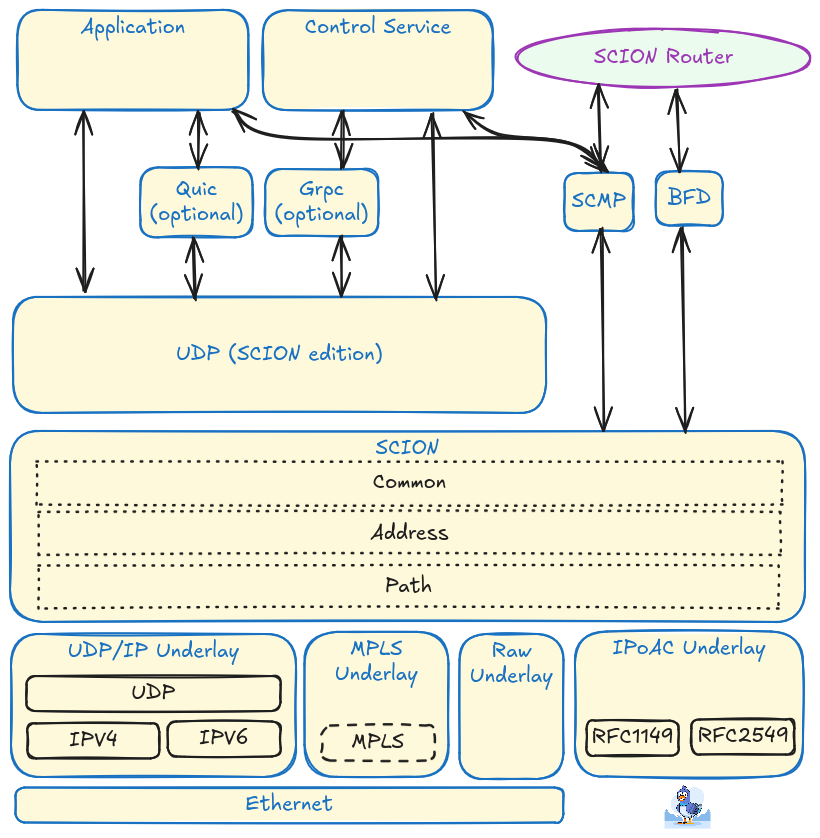

***************
IP/UDP underlay
***************

.. _underlay:

Introduction
------------

SCION strongly emphasizes the separation between inter-domain routing and intra-domain forwarding. This allows it to easily reuse existing intra-domain network fabrics to provide connectivity among SCION infrastructure services, routers, and end-hosts. To maximize compatibility with current network infrastructures, most implementations encapsulate the SCION header inside a standard UDP/IPv6 or UDP/IPv4 packet. In such cases, SCION packets are enclosed within the standard IP/UDP protocol stack:

.. code-block:: text

    +-----------------------------+
    |                             |
    |        Payload (L4)         |
    |                             |
    +-----------------------------+
    |           SCION             |
    +-----------------------------+ <-+
    |            UDP              |   |
    |                             |   | Intra-domain
    +-----------------------------+   | protocol
    |            IP               |   |
    +-----------------------------+   |
    |        Link Layer           |   |
    +-----------------------------+ <-+

Ports Overview
--------------

SCION components rely on a structured port allocation scheme to handle underlay (UDP/IP) and service communications. The following table summarizes the common default ports and their configuration scopes:

+-----------------------------------------+------------+-----------------+----------------------+-----------------------------------------------------------------------------------------------------------------------------------+
| Description                             | Port Range | Default Value   | Scope                | Configured in                                                                                                                     |
+=========================================+============+=================+======================+===================================================================================================================================+
| UDP underlay default port / SCMP Daemon | Fixed      | UDP 30041       | Global all end-hosts | Hardcoded                                                                                                                         |
+-----------------------------------------+------------+-----------------+----------------------+-----------------------------------------------------------------------------------------------------------------------------------+
| UDP underlay dispatched ports           | any        | UDP 31000-32767 | AS-wide              | :doc:`topology.json <../manuals/common>`                                                                                          |
+-----------------------------------------+------------+-----------------+----------------------+-----------------------------------------------------------------------------------------------------------------------------------+
| Router Internal Interfaces              | any        | UDP 30100-30199 | Router-wide          | :doc:`topology.json <../manuals/common>`                                                                                          |
+-----------------------------------------+------------+-----------------+----------------------+-----------------------------------------------------------------------------------------------------------------------------------+
| Router External Interfaces              | any        | UDP 31000-39999 | Link                 | :doc:`topology.json <../manuals/common>`                                                                                          |
+-----------------------------------------+------------+-----------------+----------------------+-----------------------------------------------------------------------------------------------------------------------------------+

Traffic to End-hosts
~~~~~~~~~~~~~~~~~~~~

When routing from border routers to endpoints, the SCION UDP/IP underlay generally uses the destination port from the SCION payload as the underlay destination port.

In the modern "dispatcherless" design (see :doc:`Router Port Dispatch <../dev/design/router-port-dispatch>`), applications open a UDP/IP underlay socket directly. To ensure that traffic goes to the correct application, the ingress router at the destination AS MUST select the underlay destination port by inspecting the Layer 4 destination port from the TCP/SCION, UDP/SCION, or SCMP Error payload:

* **Dispatched Ports**: If the port falls within the configured dispatched ports range, the router forwards the packet to the end host using that same port as the UDP underlay destination port.
* **UDP underlay default port**: If the port falls outside the configured range, or if the system is handling legacy fallback traffic (i.e., traffic from older clients that do not support dynamic port mapping), the router forwards the packet to the default end-host data port: **30041**.
* **SCMP**: For SCMP informational messages, the router forwards the packet to the default end-host port: **30041**. For SCMP error messages, the router tries to extract the end-host port and sends the packet to the endhost, subject to dispatched port settings and the default underlay port. If the port cannot be extracted, the packet is dropped.

.. note::
   Historically, SCION end hosts relied on a user-space "dispatcher" process listening on the default port UDP 30041 to route incoming packets to the correct application socket. For more details, see the :doc:`Dispatcher Manual <../manuals/dispatcher>`.

The SCMP Daemon (``scmpd``) SHOULD listen on the UDP underlay default port (30041) to process and reply to informational SCMP messages, such as echo requests (pings) and traceroutes.

Traffic from End-hosts
~~~~~~~~~~~~~~~~~~~~~~

End hosts send traffic to the SCION router's Internal Interface address and port. This underlay port must be configured on the endpoints via the ``topology.json`` file.

NAT Address Discovery
""""""""""""""""""""""""""""""""""""""

End hosts located behind a Network Address Translation (NAT) device face a unique challenge: the source address they encode must be the external IP and port visible to the first-hop border router, rather than their internal local address.

To resolve this, SCION incorporates a :doc:`NAT IP/port discovery mechanism <../dev/design/NAT-address-discovery>` conceptually similar to the STUN (Session Traversal Utilities for NAT) protocol, operating directly between clients and border routers. The border router acts as a detector; when the client sends a discovery request, the border router observes the NAT-mapped IP and port and reports it back to the client.

The end host can then reliably inject this public, border-router-visible IP and port into the SCION source address fields of its outbound packets. This guarantees that return traffic from the remote destination can be successfully routed back through the NAT to the client.

Routers
~~~~~~~

SCION border routers utilize specific underlay ports to process and forward traffic:

* **Internal Interfaces**: Used for intra-AS communication to receive traffic from end-hosts. Operators can choose the port freely. The same port must be configured on endpoints so that they can send outbound traffic. Routers with multiple internal interfaces can use a range of ports.
* **External Interfaces**: Used for inter-AS links towards neighboring SCION ASes. Note that the choice of underlay protocol and UDP port is per link. It is independent from other links and intra-AS underlay. 

Control Plane Instances
~~~~~~~~~~~~~~~~~~~~~~~

Control plane components communicate  through RPC messages that are transported via Connect RPC. This protocol carries messages over HTTP/3, that uses a QUIC transport layer.  Identification of the relevant addresses and ports for inter-domain queries is provided by  `Service discovery <https://datatracker.ietf.org/doc/html/draft-dekater-scion-controlplane-15#name-control-service-discovery>`_. 

For intra-domain communication of endpoints with service instances, the operator may use arbitrary ports, that have to be communicated to endpoints. For a comprehensive list of ports used by this implementation, refer to the `Control Port Table <../manuals/control.html#port-table>`_.

Protocol Stack Summary
----------------------

A visual summary of the overall SCION protocol stack is shown below:

The current implementation supports an UDP/IP underlay. However, other underlay protocols (e.g., MPLS) can be used within an AS and for each inter-AS link.

