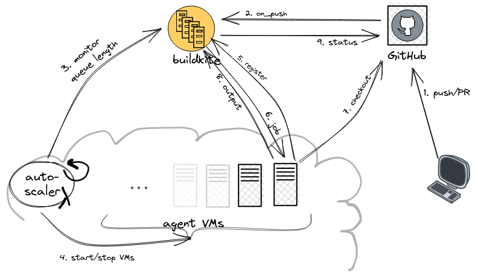

********************************
Buildkite Continuous Integration
********************************

We are currently using `buildkite <https://buildkite.com/scionproto>`_ for
running build, lint, test and integration tests for all pull requests to the
`scionproto/scion <https://github.com/scionproto/scion>`_ github repository.

Overview
========

Buildkite itself orchestrates the builds, the "agents" are provided by us.
We run a `buildkite Elastic CI Stack for AWS <https://buildkite.com/docs/agent/v3/elastic-ci-aws>`_ autoscaling cluster of buildkite agents on AWS VMs.

1. Create PR or push to existing PR in `scionproto/scion <https://github.com/scionproto/scion>`_.
2. Github triggers buildkite pipeline `scion <https://buildkite.com/scionproto/scion>`_.
   This adds the first job of the pipeline to the job queue.
3. The autoscaler, running in an AWS lambda, monitors the length of the job queue.
4. The autoscaler spins up new VMs or shrinks down the number of VMs after some idle time.
5. The ``buildkite-agent`` process in a newly started VM registers to ``buildkite.com`` with the agent code for our organisation.
6. The agent receives a job from the job queue.
7. Clone the github repository to the agent.
8. The agent runs its job and uploads the output to buildkite.

Importantly, buildkite jobs can spawn new jobs by uploading more pipeline steps (from the agent to the central buildkite service).
The first job of a pipeline is configured in the buildkite pipeline. Usually, this is a dummy step that loads or expands the pipeline config file from the repository, spawning all the jobs that will then perform the actual build tasks.
For the ``scion`` and ``scion-nightly`` pipelines, this first step is to run ``.buildkite/pipeline.sh`` in the repository to generate the full pipeline:

.. code::

   .buildkite/pipeline.sh | buildkite-agent pipeline upload

Steps 3./4. and 6./7./8. are then repeated until all pipeline jobs have been processed (or until the pipeline is aborted).
Finally, buildkite reports the status of the build pipeline back to github.

Agents
======

Machine Image
-------------

We use the default machine image of the *Elastic CI Stack for AWS*. `What's on each machine <https://buildkite.com/docs/agent/v3/elastic-ci-aws#whats-on-each-machine>`_:

- Amazon Linux 2
- Buildkite Agent v3.39.1
- Docker v20.10.7
- Docker Compose v1.29.2
- AWS CLI
- jq

Dependencies
------------

Bazel, as well as additional build tools and dependencies that are not managed by bazel, are installed in the ``pre-command`` hook.

See `.buildkite/provision-agent.sh <https://github.com/scionproto/scion/blob/master/.buildkite/provision-agent.sh>`_

Caching
-------

Bazel relies heavily on caching, both for fetching external dependencies as well as to avoid rebuilding or retesting identical components.
For this, we run `bazel-remote cache <https://github.com/buchgr/bazel-remote/>`_ on each build agent, backed by a shared AWS S3 bucket.

Analogously, we run an `athens <https://github.com/gomods/athens>`_ go modules proxy on each build agent. These are also backed by a shared AWS S3 bucket.

Both of these processes are started as docker containers from the ``pre-command`` hook.

Secrets
-------

The *Elastic CI Stack for AWS* has a `designated S3 buckets for secrets <https://buildkite.com/docs/agent/v3/elastic-ci-aws#build-secrets>`_.
In particular, this bucket contains an ``env`` script that is sourced by the buildkite agents.

The secrets to access the S3 buckets for the caches mentioned above are injected as environment variables from this ``env`` script.
See `.buildkite/hooks/bazel-remote.yml <https://github.com/scionproto/scion/blob/master/.buildkite/hooks/bazel-remote.yml>`_
and `.buildkite/hooks/go-module-proxy.yml <https://github.com/scionproto/scion/blob/master/.buildkite/hooks/go-module-proxy.yml>`_.

Cluster configuration
---------------------

.. important::

   The agent cluster is operated by the SCION Association, in the AWS account ``scion-association``.

   Primary contact `matzf <https://github.com/matzf>`_, alt contact `nicorusti <https://github.com/nicorusti>`_.

The agent cluster is based on the `buildkite AWS CloudFormation template <https://buildkite.com/docs/agent/v3/elastic-ci-aws/parameters>`_.
Excerpt of the most relevant parameters:

.. code-block:: yaml

   # Instance Configuration:
   ImageId: ""               # use default machine image based on Amazon Linux 2
   InstanceType: t3.2xlarge  # 8 vCPUs, 32GiB memory
   RootVolumeSize: 100
   RootVolumeType: gp3
   BuildkiteAdditionalSudoPermissions: ALL  # allow any sudo commands in pipeline
   EnableDockerUserNamespaceRemap: false    # not compatible with using host network namespace

   # Auto-scaling Configuration:
   MinSize: 0
   MaxSize: 10
   ScaleInIdlePeriod: 600  # shut down after 10 minutes idle
   ScaleOutFactor: 0.5
   OnDemandPercentage: 0   # use only spot instances
