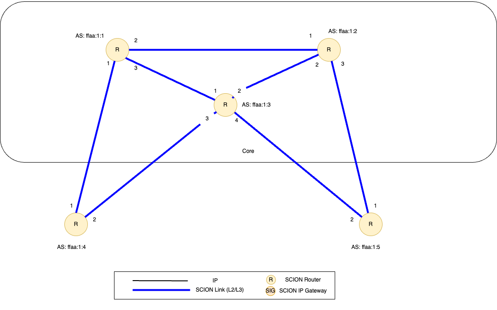

Tutorial: Freestanding SCION Network
====================================

This document helps you set up a freestanding SCION demo network, which consists of a stand-alone complete SCION environment distributed among five computers. The demo environment contains one SCION Isolation Domain (:term:`ISD`), with three core Autonomous Systems (:term:`AS`) and two non-core, leaf ASes.

- If you want to go deep and help develop SCION, use the development environment. See :ref:`setting-up-the-development-environment`.
- If you want to experiment with SCION in a larger environment, use SCIONLab. For more information, see https://www.scionlab.org/.

**Note**: This tutorial does **not** describe how to set up SCION endhosts. For endhosts please follow the instructions of your `SCION library or application <https://github.com/scionproto/awesome-scion>`_.

**Note**: Alternatively, if you want to skip the manual setup you can automatically set up the network with Docker 🐳 by running ``make up`` from within `scion/doc/tutorials/deploy <https://github.com/scionproto/scion/tree/master/doc/tutorials/deploy>`_. Run ``make down`` to stop the setup.

Setup
-----

This first section provides an overview of the setup and topology of the sample demo environment.

Infrastructure
..............

The sample SCION demo setup consists of one ISD with three core ASes and two non-core, leaf ASes. The following table lists some details of the sample ISD and each AS in it, such as the DNS names, the ISD- and AS numbers, the kind of AS (core or leaf) and the IP addresses. This infrastructure could be virtual machines or bare metal.

======== ==== ========= ======== =============== ============ =================== ========= ====
Hostname ISD  AS        Purpose  Notes           IP Address    OS                 Disk      RAM
======== ==== ========= ======== =============== ============ =================== ========= ====
scion01  42   ffaa:1:1  Core     Voting, CA      10.100.0.11  **Ubuntu** 22.04.3  LTS 4 GB  1 GB
scion02  42   ffaa:1:2  Core     Non-Voting, CA  10.100.0.12  **Ubuntu** 22.04.3  LTS 4 GB  1 GB
scion03  42   ffaa:1:3  Core     Voting          10.100.0.13  **Ubuntu** 22.04.3  LTS 4 GB  1 GB
scion04  42   ffaa:1:4  Leaf                     10.100.0.14  **Ubuntu** 22.04.3  LTS 4 GB  1 GB
scion05  42   ffaa:1:5  Leaf                     10.100.0.15  **Ubuntu** 22.04.3  LTS 4 GB  1 GB
======== ==== ========= ======== =============== ============ =================== ========= ====

*Table 1: Required Infrastructure*

Sample SCION Demo Topology
..........................

The topology of the ISD includes the inter-AS connections to neighboring ASes, and defines the underlay IP/UDP addresses of services and routers running in this AS. This is specified in topology files - this guide later explains how to configure these files. A following graphic depicts the topology on a high level.

   *Figure 1 - Topology of the sample SCION demo environment. It consists of 1 ISD, 3 core ASes and 2 non-core ASes.*

.. _prerequisites:

Infrastructure Prerequisites
----------------------------

This deployment requires five virtual machines (VMs) - one for each AS. We recommend using Ubuntu VMs for this.

- 5 VMs - **Ubuntu** 22.04.5 LTS (Jammy Jellyfish). For more information, see `Ubuntu Jammy Jellyfish <https://releases.ubuntu.com/jammy/>`_.
- Each VM should have at least one IP address reachable by the other VMs. (If on AWS, be sure to set up the appropriate security groups.)
- Each VM will need internet access to download the required files (or you will need an alternate way to download the SCION binaries).
- One VM (scion01) should have SSH access (password or SSH keys) to the other hosts scion{02-05} to copy generated configuration files and keys.
- Using the naming convention for each VM of scion01, scion02, scion03, scion04, and scion05 will help follow along with this tutorial.
- The VM names scion01-scion05 can be configured in /etc/hosts.

Tasks to Perform
----------------

To create the sample ISD environment, you need to perform the following tasks, in this order:

- Task 1: OS setup (:ref:`step0`)
- Task 2: Installation (:ref:`step1`)
- Task 3: Configuration (:ref:`step2`)
- Task 4: Testing your environment (:ref:`step3`)

The following sections explain the required tasks, one section per task.

.. _step0:

OS Setup
........

- Set up the host file

  The host file (*/etc/hosts*) will need to be updated with the IP addresses of 5 VMs. This will need to be updated on scion01-scion05. Replace the IP addresses with the assigned IP addresses for the VMs deployed.

  Set this up on scion01-scion05.

  .. code-block:: sh

     # additions to /etc/hosts
     10.100.0.11 scion01
     10.100.0.12 scion02
     10.100.0.13 scion03
     10.100.0.14 scion04
     10.100.0.15 scion05

.. _step1:

Software Download and Installation
..................................

The SCION software can be installed from :ref:`Debian packages <install-debian-packages>`, downloaded from our `latest release <https://github.com/scionproto/scion/releases/>`_.
Note that we have to install the software five times, on each of the VMs scion01-scion05.
Execute the following commands on each VM:

.. code-block:: sh

   cd /tmp/
   wget https://github.com/scionproto/scion/releases/download/v0.12.0/scion_0.12.0_deb_amd64.tar.gz
   tar xfz scion_0.12.0_deb_amd64.tar.gz

   sudo apt install ./scion*.deb

As each virtual machine represents an AS in your demo environment, we will now refer to the VMs as ASes.

.. _step2:

Configuration
.............

To configure your demo SCION environment, perform the following steps.

Step 1 - AS Topology Files
~~~~~~~~~~~~~~~~~~~~~~~~~~

For this tutorial, we have provided the AS :ref:`topology files <common-conf-topo>` - one per each AS. These files represent each AS's local view of the global network topology described above.

- **AS 1 (42-ffaa:1:1)**: :download:`topology1.json <deploy/scion01/topology1.json>`
- **AS 2 (42-ffaa:1:2)**: :download:`topology2.json <deploy/scion02/topology2.json>`
- **AS 3 (42-ffaa:1:3)**: :download:`topology3.json <deploy/scion03/topology3.json>`
- **AS 4 (42-ffaa:1:4)**: :download:`topology4.json <deploy/scion04/topology4.json>`
- **AS 5 (42-ffaa:1:5)**: :download:`topology5.json <deploy/scion05/topology5.json>`

Download the AS topology files onto each host scion01 through scion05.

Copy the download link above and use ``wget`` to download appropriate file for each host, installing it as ``/etc/scion/topology.json``.
On scion01, download the topology1.json file. On scion02, download topology2.json and repeat as such on scion03, scion04, and scion05.

.. code-block:: sh

   wget LINK_TO_TOPOLOGY.JSON_FILE -O /etc/scion/topology.json

The AS topology files reference the hosts scion01-05 by host name.
Ensure that you have set up the ``/etc/hosts`` file (:ref:`see above <step0>`) or replace the hostnames with IP addresses.

Step 2 - Generate the Required Certificates
~~~~~~~~~~~~~~~~~~~~~~~~~~~~~~~~~~~~~~~~~~~

The various cryptographic certificates need to be generated for each of the ASes.
This requires first setting up the :term:`TRC` for this ISD, and then issuing AS-certificates from the :term:`CAs <CA>`.

For the sake of simplicity in this tutorial, we create all the keys and certificates centrally, and distribute the crypto material to the individual ASes.
In practice, the private keys of ASes are of course never revealed to other entities; the TRC would be created in a :ref:`trc-ceremony` involving representatives of all core ASes. The creation of the AS-certificates would involve a certificate-signing request to the CA.

.. admonition:: Challenge

   Instead of following the steps below, act out the full TRC creation ceremony and the creation of AS certificates via certificate signing requests.
   Refer to the documentation on the :ref:`trc-ceremony`, :ref:`ca-cert` and :ref:`ca-ops-as-certs`.

#. To generate all required certificates, execute the following script on any machine where ``scion-pki`` is installed (e.g. scion01).

   .. literalinclude:: ./deploy/base/pki-generation.bash
      :language: bash

   .. note::

      The script above will generate a new TRC for your ISD and must be done exactly once. Once you deploy such TRC on your machines, further TRC updates must be sequential. If for any reason you need to reset your setup and you need to deploy a fresh new TRC generated with the script above, then you must first delete the local DB files on your hosts (in ``/var/lib/scion/``).

#. The just-generated crypto material in can now be copied to the respective AS VMs.

  .. code-block:: bash

     cd /tmp/tutorial-scion-certs
     for i in {1..5}
     do
        ssh scion0$i 'mkdir -p /etc/scion/{crypto/as,certs}'
        scp AS$i/cp-as.{key,pem} scion0$i:/etc/scion/crypto/as/
        scp ISD42-B1-S1.trc scion0$i:/etc/scion/certs/
     done

Step 3 - Generate Forwarding Secret Keys
~~~~~~~~~~~~~~~~~~~~~~~~~~~~~~~~~~~~~~~~~

Two symmetric keys *master0.key* and *master1.key* are required per AS as the forwarding :ref:`secret keys <router-conf-keys>`. These symmetric keys are used by the AS in the data plane to verify the MACs in the hop fields of a SCION path (header).

.. code-block:: bash

   head -c 16 /dev/urandom | base64 - > /etc/scion/keys/master0.key
   head -c 16 /dev/urandom | base64 - > /etc/scion/keys/master1.key

Repeat the above on each host scion01 - scion05.

Step 4 - Service Configuration Files
~~~~~~~~~~~~~~~~~~~~~~~~~~~~~~~~~~~~

Next, you have to download the service configuration file for the router and control service into the ``/etc/scion/`` directory of each AS host scion01-scion05.
Refer to the :ref:`router-conf-toml` and :ref:`control-conf-toml` manuals for details.
We use default settings for most of the available options, so that the same configuration file can be used in all of the VMs.

Download the files, then copy it into the ``/etc/scion/`` directory of each host scion01 - scion05.

- **Border router**: :download:`br.toml <deploy/base/br.toml>`
- **Control service**: :download:`cs.toml <deploy/base/cs.toml>`

Step 5 - Start the Services
~~~~~~~~~~~~~~~~~~~~~~~~~~~

Start the SCION services on each of the five ASes.
Specifically, we start the :doc:`/manuals/router`, :doc:`/manuals/control`, :doc:`/manuals/daemon`
and :doc:`/manuals/dispatcher` processes, by starting their systemd units. The dispatcher starts
automatically as dependency of the control service and daemon.

Execute the following commands on every AS:

.. code-block:: sh

   sudo systemctl start scion-router@br.service
   sudo systemctl start scion-control@cs.service
   sudo systemctl start scion-daemon.service
   # Check that all services are active
   systemctl status scion-*.service

These steps need to be repeated on each host scion01 - scion05.

.. _step3:

Testing the Environment
.......................

You can now test your environment. The code block below includes some tests you could perform to check whether your environment works well.

- Verify that each host has a SCION address. This can be verified with the :ref:`scion address <scion_address>` command as shown below.

   .. code-block:: none

      scion01$ scion address
      42-ffaa:1:1,127.0.0.1

- Verify that each host can ping the other hosts via SCION. This can be done with the :ref:`scion ping <scion_ping>` command. In the example below, we are pinging between scion01 (AS 42-ffaa:1:1) to scion05 (AS 42-ffaa:1:5). Very that each AS can ping every other AS.

   .. code-block:: none

      scion01$ scion ping 42-ffaa:1:5,127.0.0.1 -c 5
      Resolved local address:
      127.0.0.1
      Using path:
      Hops: [42-ffaa:1:1 3>1 42-ffaa:1:3 4>2 42-ffaa:1:5] MTU: 1472 NextHop: 127.0.0.1:31002

      PING 42-ffaa:1:5,127.0.0.1:0 pld=0B scion_pkt=112B
      120 bytes from 42-ffaa:1:5,127.0.0.1: scmp_seq=0 time=0.788ms
      120 bytes from 42-ffaa:1:5,127.0.0.1: scmp_seq=1 time=3.502ms
      120 bytes from 42-ffaa:1:5,127.0.0.1: scmp_seq=2 time=3.313ms
      120 bytes from 42-ffaa:1:5,127.0.0.1: scmp_seq=3 time=3.838ms
      120 bytes from 42-ffaa:1:5,127.0.0.1: scmp_seq=4 time=3.401ms

      --- 42-ffaa:1:5,127.0.0.1 statistics ---
      5 packets transmitted, 5 received, 0% packet loss, time 5000.718ms
      rtt min/avg/max/mdev = 0.788/2.968/3.838/1.105 ms

- Verify that each host has a full table of available paths to the other ASes. This can be done with the :ref:`scion showpaths <scion_showpaths>` command. In the example below, we are displaying the paths between scion01 (AS 42-ffaa:1:1) to scion05 (AS 42-ffaa:1:5). There should be multiple paths through the core ASes.

   .. code-block:: none

      scion01$ scion showpaths 42-ffaa:1:5
      Available paths to 42-ffaa:1:5
      3 Hops:
      [0] Hops: [42-ffaa:1:1 2>1 42-ffaa:1:2 3>1 42-ffaa:1:5] MTU: 1472 NextHop: 127.0.0.1:31002 Status: alive LocalIP: 127.0.0.1
      [1] Hops: [42-ffaa:1:1 3>1 42-ffaa:1:3 4>2 42-ffaa:1:5] MTU: 1472 NextHop: 127.0.0.1:31002 Status: alive LocalIP: 127.0.0.1
      4 Hops:
      [2] Hops: [42-ffaa:1:1 2>1 42-ffaa:1:2 2>2 42-ffaa:1:3 4>2 42-ffaa:1:5] MTU: 1472 NextHop: 127.0.0.1:31002 Status: alive LocalIP: 127.0.0.1
      [3] Hops: [42-ffaa:1:1 3>1 42-ffaa:1:3 2>2 42-ffaa:1:2 3>1 42-ffaa:1:5] MTU: 1472 NextHop: 127.0.0.1:31002 Status: alive LocalIP: 127.0.0.1

Conclusion
----------

Congratulations, you now have a working SCION configuration, which consists of a stand-alone complete SCION environment distributed among five computers. This environment contains one SCION Isolation Domain (ISD), with three core ASes and two non-core, leaf ASes. Being a demo, this configuration has some limitations:

- The certificates are only good for three days unless explicitly renewed using :ref:`scion-pki certificate renew <scion-pki_certificate_renew>`.
- Each AS contains a single host running all the SCION services. In a typical deployment, these services would run a separate hosts and include multiple border routers.
- This environment does not include a :doc:`SCION-IP gateway </manuals/gateway>`.

.. seealso::

   :doc:`/overview`
      Introduction to the SCION architecture and core concepts.

   :doc:`/dev/setup`
      If you would like to learn more and help develop SCION, consider :doc:`setting up the development environment </dev/setup>`.

   `SCIONLab <https://www.scionlab.org/>`_
      If you would like to experiment with SCION in a larger deployment, consider joining `SCIONLab <https://www.scionlab.org/>`_.
