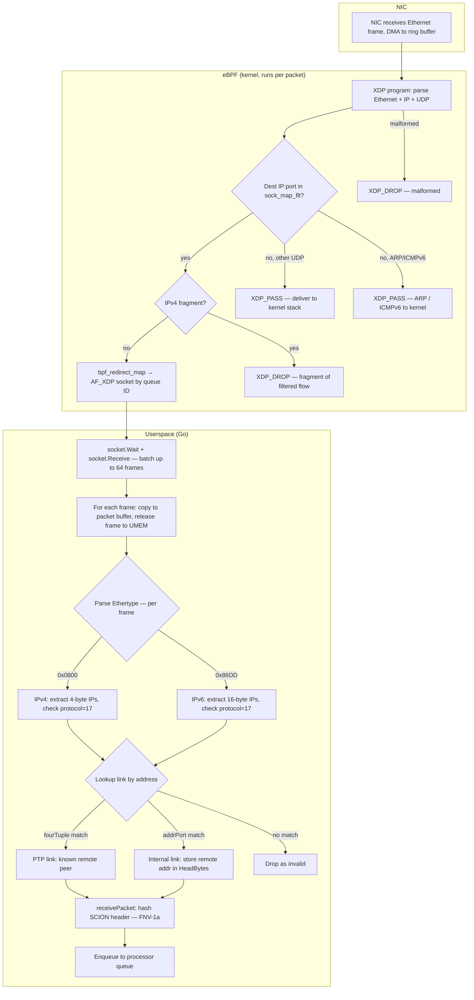
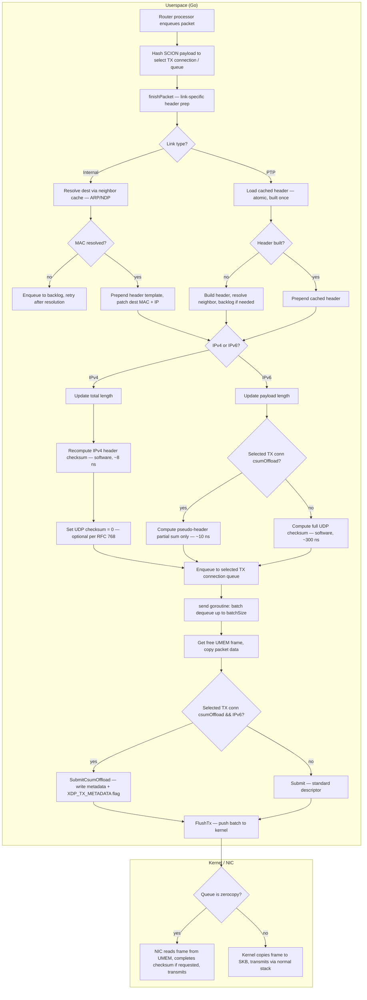
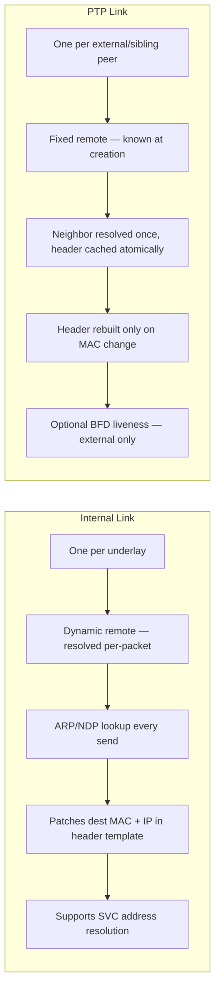

# afxdpudpip — AF_XDP UDP/IP Underlay

AF_XDP-based UDP/IP underlay implementation for the SCION router.
Carries SCION traffic over raw AF_XDP sockets with Ethernet/IP/UDP
encapsulation, binding queues in `XDP_ZEROCOPY` mode whenever the
driver supports it and falling back to copy mode otherwise. On
zerocopy queues, IPv6 UDP checksum offload is also enabled
automatically when the kernel and driver advertise AF_XDP
`tx-checksum`.

## Scope & Limitations

This underlay is intentionally specialized to the common
SCION use case. Specifically:

- **No IP fragmentation.** Outgoing IPv4 sets the DF flag per
  [RFC 791 §3.1](https://www.rfc-editor.org/rfc/rfc791#section-3.1)
  and IPv6 never emits a Fragment extension header per
  [RFC 8200 §4.5](https://www.rfc-editor.org/rfc/rfc8200#section-4.5).
  On ingress, IPv4 fragments (MF=1 or nonzero fragment offset)
  destined to a filtered AF_XDP flow are dropped in the XDP filter
  (`XDP_DROP`) before reaching userspace; IPv6 fragments are
  passed to the kernel (their `NextHeader=44` ≠ UDP makes them
  take the non-UDP branch), where no socket is bound to our ports
  and the kernel discards them. Either way, fragments never reach
  the SCION router's userspace RX path. SCION negotiates path MTU
  end-to-end, so fragmentation here indicates a misconfigured peer
  or a non-conforming sender.
- **MTU** is capped by the configured UMEM `frame_size`. The default
  accommodates standard Ethernet MTU 1500; jumbo frames are not
  supported. For per-link tuning options see
  [doc/manuals/router.rst](../../../doc/manuals/router.rst) under
  *AF_XDP Per-Link Options*.

Any other L2 transport for IP/UDP is out of scope; use the `inet`
udpip underlay for those.

## Packet Lifecycle

### RX Path

### TX Path

### Internal vs PTP Links

## Checksum Offload

- IPv4 TX never uses AF_XDP checksum offload here. The IPv4 header checksum is always recomputed in software, and the IPv4 UDP checksum is left as zero.
- IPv6 TX uses checksum offload automatically when the selected TX connection reports `csumOffload=true`. In that case userspace writes only the IPv6 UDP pseudo-header seed (the NIC sums the UDP header + payload but has no visibility into the pseudo-header fields, so the CPU must precompute that part) and submits AF_XDP TX metadata so the NIC finishes the checksum.
- `csumOffload=true` requires all of the following:
  1. The running kernel accepted UMEM TX metadata registration (`XDP_UMEM_TX_METADATA_LEN`).
  2. The bound AF_XDP queue is operating in zerocopy mode.
  3. The netdevice advertises AF_XDP `xsk-features: tx-checksum` via the `netdev` generic-netlink family.
- If any of those checks fail, IPv6 falls back to a full software UDP checksum. This avoids emitting only the pseudo-header seed on queues that would not complete the checksum.
- The checksum decision is per selected TX connection, not per link. A multi-queue link can mix queues with different capabilities without corrupting packets.
- TX metadata headroom may still be reserved in UMEM even when checksum offload is disabled. That keeps descriptor addressing consistent; it does not imply checksum offload is active.

## Test Validation

- `testdata/*.bin` contains golden Ethernet/IP/UDP frames captured from the Linux network stack on a veth pair, with kernel-variable fields normalized before committing them, i.e. rewritten to the fixed canonical values this implementation intentionally emits so the files stay deterministic across runs.
- The ordinary package tests compare both `finishPacket` output and the lower-level `internal/headers` + `internal/checksum` builders against those golden frames byte-for-byte.
- IPv6 checksum-offload seeding is covered separately: the golden files validate the finalized software-checksum packets, while a dedicated unit test checks that the AF_XDP offload path writes the expected pseudo-header seed.
- Golden files are regenerated explicitly with `go run ./router/underlayproviders/afxdpudpip/cmd/packetgolden`; this is a maintainer workflow, not a CI requirement.
